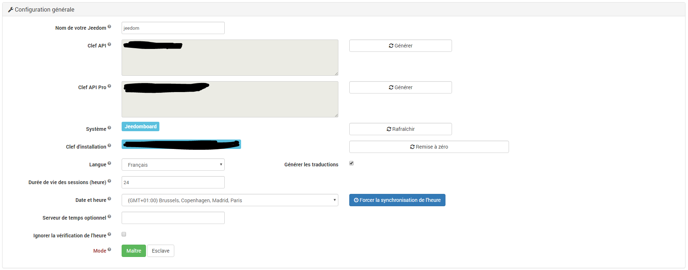
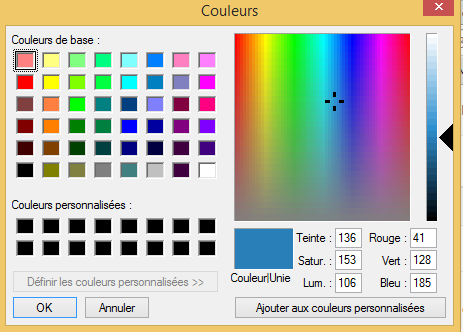

Hier befindet sich die Mehrheit der Konfigurationsparameter. Obwohl viele standardmäßig vorkonfiguriert sind.

Die Seite ist über Einstellungen → Konfiguration erreichbar :

> **Important**
>
> Wenn sie nicht im Experten-Modus sind, sind möglicherweise einige Parameter nicht sichtbar.

Hauptkonfiguration
==================

Diese Registerkarte enthält allgemeine Informationen zu Jeedom :

-   **Nom de votre Jeedom** : peut être réutilisé dans les scénarios ou permettre d’identifier un backup

-   **API Schlüssel** : Ihr API-Schlüssel, wird verwendet für jede Anfrage zur Jeedom-API

-   **Clef API Pro** : utilisée pour communiquer avec le système de gestion de parc

-   **Systeme** : Zeigt den Hardwaretyp an

-   **Clef d’installation** : clef hardware de votre Jeedom sur le market. Si votre Jeedom n’apparaît pas dans la liste de vos Jeedom sur le market il est conseillé de cliquer sur ce bouton

-   **Sprache** : Ihre Sprache in Jeedom

-   **Cache Verfallszeit (Stunde)** : Lebensdauer der PHP-Sitzungen es wird er geraten, dort nicht zu ändern

-   **Datum und Uhrzeit** : Ihre Zeitzone

-   **Zeitserver optional** : fügt einen optionalen Zeitserver hinzu (für Experten reserviert)

-   **Ignorer la vérification de l’heure** : indique à Jeedom de ne pas vérifier si l’heure est cohérente. Utile par exemple si vous ne connectez pas Jeedom à Internet et qu’il n’a pas de pile RTC

-   **Mode** : Mode de votre Jeedom maître ou esclave, attention lors du passage en esclave : tous vos équipements, scénarios, designs… seront supprimés.

Jeedom Komponenten
==================

In diesem Abschnitt können sie einige Komponenten des Jeedom Kerns aktivieren/deaktivieren :

-   **Droits avancés** : permet de désactiver la gestion des droits avancés (si vous ne vous en servez pas cela peut rendre Jeedom plus réactif)

-   **Anti-Piraterie-Sicherheit** : ermöglicht das Aktivieren der Anti-Piraterie-Sicherheit von Jeedom (Brute-Force das Passwortes).

Datenbank
=========

-   **Accès à l’interface d’administration** : permet d’accèder à une interface d’administration de la base, les informations à renseigner sont en dessous

-   **Geräte (hostname)** : Datenbank Standort

-   **Benutzer** : von Jeedom verwendeter Benutzername

-   **Mot de passe** : mot de passe d’accès à la base utilisée par Jeedom

Netzwerkkonfiguration
=====================

Partie très importante dans Jeedom, il faut absolument la configurer correctement sinon beaucoup de plugins risquent d'être non fonctionnels.

-   **Interner Zugriff** : Daten, zum verbinden von Jeedom mit einem anderen Gerät in demselben Netzwerk

-   **Protokolle** : Das zu verwendende Protokoll, meistens HTTP

    -   **URL oder IP Adresse** : Die Jeedom IP-Adresse eintragen

    -   **Complément (exemple : /jeedom)** : le fragment d’URL complémentaire (type /jeedom). Pour savoir si vous avez besoin de définir une valeur ici, regardez si quand vous vous connectez à Jeedom vous devez renseigner /jeedom après l’IP

    -   **Port** : Der Port, im allgemeinen 80. Achtung, den Port hier zu ändern, ändert tatsächlich nicht den Jeedom Port, der wird derselbe bleiben

    -   **Statut** : indique si la configuration réseau interne est correcte

-   **Accès externe** : information pour joindre Jeedom de l’extérieur. À ne remplir que si vous n’utilisez pas le DNS Jeedom

    -   **Protokolle** : verwendetes Protokoll für den Zugriff von außen

    -   **Adresse URL ou IP** : adresse ou IP externe si fixe

    -   **Complément (exemple : /jeedom)** : le fragment d’URL complémentaire (type /jeedom). Pour savoir si vous avez besoin de définir une valeur ici, regardez si quand vous vous connectez à Jeedom vous devez renseigner /jeedom après l’IP

-   **Erweiterte Verwaltung** : abhängig von der Kompatibilität ihrer Hardware kann es möglicherweise nicht angezeigt werden

    -   **Désactiver la gestion du réseau par Jeedom** : indique à Jeedom de ne pas monitorer le réseau (à activer si Jeedom n’est connecté à aucun réseau)

-   **Markt Proxy** : erlaubt einen entfernten Zugang zu Ihrem Jeedom ohne ein DNS, eine feste IP oder offene Ports auf Ihrem System

    -   **Die Jeedom DNS benutzen** : aktive Jeedom DNS (Achtung, das erfordert mindestens ein Servicepack)

    -   **Statut DNS** : statut du DNS HTTP

    -   **Verwaltung** : ermöglicht das Beenden und Neustarten des DNS Dienstes

> **Tip**
>
> Wenn Sie den HTTPS-Port haben, ist der Port 443 (Standard) und der HTTP-Port ist standardmäßig 80

> **Important**
>
> Cette partie est juste là pour expliquer à Jeedom son environnement : une modification du port ou de l’IP ici ne changera pas le port ou l’IP de Jeedom. Pour cela il faut se connecter en SSH et éditer le fichier /etc/network/interfaces pour l’IP et les fichiers etc/nginx/sites-available/default et etc/nginx/sites-available/default\_ssl (pour le HTTPS). En cas de mauvaise manipulation de votre Jeedom, l'équipe Jeedom ne pourra être tenue pour responsable et pourra refuser toute demande de support.

> **Note**
>
> Vous pouvez voir [ici](http://blog.domadoo.fr/2014/10/15/acceder-depuis-lexterieur-jeedom-en-https) un tutoriel pour mettre en place un certificat HTTPS auto-signé.

> **Important**
>
> Si vous n’arrivez pas à faire fonctionner le DNS Jeedom, regardez la configuration du pare-feu et filtre parental de votre box (sur livebox il faut par exemple le pare-feu en moyen).

Farbeinstellungen
=================

La colorisation des widgets est effectuée en fonction de la catégorie d’appartenance du widget qui est définie dans la configuration de chaque module (voir plugin Z-Wave, RFXCOM… etc). Parmi les catégories on retrouve le chauffage, les lumières, les automatismes etc…

Pour chaque catégorie, on pourra choisir une couleur différente entre la version desktop et la version mobile. Il y a également 2 types de couleurs, les couleurs de fond des widgets et les couleurs des commandes lorsque le widget est de type graduel, par exemple les lumières, les volets, les températures.

Durch Klick auf die Farbe öffnet sich ein Fenster, in dem Sie die Farbe wählen können.

Vous pouvez aussi configurer ici la transparence des widgets de manière globale (qui sera la valeur par défaut, il est possible ensuite de modifier cette valeur widget par widget).

> **Tip**
>
> N’oubliez pas de sauvegarder après toute modification.

Befehle Konfigurieren
=====================

-   **Chronik** : siehe [hier](https://jeedom.com/doc/documentation/core/fr_FR/doc-core-history.html#_configuration_général_de_l_historique)

-   **drücken**

    -   **Globale Push URL** : Erlaubt eine URL hinzuzufügen, die bei Aktualisierung eines Befehls aufzurufen ist. Sie können die folgenden Tags benutzen : \#value\# für den Wert des Befehls, \#cmd\_name\# für den Namen des Befehls, \#cmd\_id\# für die eindeutige Kennung des Befehls, \#humanname\# für den vollständigen Namen des Befehls (z.B. \#[Bad][Hydrometrie][Feuchtigkeit]\#)

Configuration des interactions
==============================

Siehe [hier](https://jeedom.com/doc/documentation/core/fr_FR/doc-core-interact.html#_configuration_2)

Logs & Nachrichten Konfiguration
================================

Siehe [hier](https://jeedom.com/doc/documentation/core/fr_FR/doc-core-log.html#_configuration)

LDAP Konfiguration
==================

-   **LDAP-Authentifizierung aktivieren** : aktiviert die Authentifizierung über AD (LDAP)

-   **Host** : Server-Host des AD

-   **Domaine** : Ihr AD-Domaine

-   **Basis-DN** : Basis-DN ihres AD

-   **Benutzername** : Benutzernamen für die Verbindung von Jeedom mit dem AD

-   **Passwort** : Passwort für die Verbindung von Jeedom mit dem AD

-   **Filter (optional)** : Filter auf dem AD (zum Beispiel für Gruppenmanagement)

-   **REMOTE\_USER zulassen** : REMOTE\_USER aktivieren (zum Beispiel verwendet in SSO)

Geräte Konfiguration
====================

-   **Anzahl der Fehler vor dem Deaktivieren der Geräte** : Anzahl von Kommunikationsausfällen der Geräte bevor sie Deaktiviert werden (eine Nachricht wird Sie warnen, wenn dies geschieht)

-   **Batterien Schwellenwerte** : erlaubt, die globalen Alarmschwellen für die Batterien zu verwalten

Update und Dateien
==================

-   Update Quelle :

-   Eine Sicherung vor der Aktualisierung erstellen

-   Vérifier automatiquement s’il y a des mises à jour

Das Depot
---------

Les dépôts sont des espaces de stockage (et de service) pour pouvoir mettre des backups, récupérer des plugins, récupérer le core de jeedom….

### Markt

Dépôt servant à relier Jeedom au market, il est vivement conseillé d’utiliser ce dépôt. Attention toute demande de support pourra être refusée si vous utilisez un autre dépôt que celui-ci.

-   **Adresse** : adresse du Market

-   **Nom d’utilisateur** : votre nom d’utilisateur sur le Market

-   **Mot de passe** : votre mot de passe du Market

### Dateien

Dépôt servant à activer l’envoi de plugins par des fichiers.

### Github

Dépôt servant à relier Jeedom à Github.

-   **Token** : token pour l’accès au dépôt privé

-   **Utilisateur ou organisation du dépôt pour le core Jeedom**

-   **Name vom Aufbewahrungsort für den den Jeedom Kern**

-   **Zweig für den Jeedom Kern**

### Samba

Dépôt permettant d’envoyer automatiquement un backup de Jeedom sur un partage Samba (ex NAS Synology).

-   **[Backup] IP** : IP des Samba Servers

-   **[Backup] Utilisateur** : nom d’utilisateur pour la connexion (les connexions anonymes ne sont pas possibles)

-   **[Backup] Mot de passe** : mot de passe de l’utilisateur

-   **[Backup] Partage** : chemin du partage (attention à bien s’arrêter au niveau du partage)

-   **[Backup] Chemin** : chemin dans le partage (à mettre en relatif), celui-ci doit exister

> **Note**
>
> Si le chemin d’accès à votre dossier de sauvegarde samba est : \\\\192.168.0.1\\Sauvegardes\\Domotique\\Jeedom Alors IP = 192.168.0.1 , Partage = //192.168.0.1/Sauvegardes , Chemin = Domotique/Jeedom

> **Important**
>
> Il vous faudra peut-être installer le package smbclient pour que le dépôt fonctionne.

> **Important**
>
> Jeedom doit être le seul à écrire dans ce dossier et il doit être vide par défaut (c’est à dire avant la configuration et l’envoi du premier backup, le dossier ne doit contenir aucun fichier ou dossier).

### URL

-   **Jeedom Core URL**

-   **Jeedom Core Version URL**

