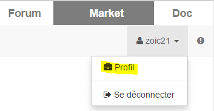

Die Sicherung und Wiederherstellen von Jeedom erlaubt, diese zu speichern und sie auf sich selbst oder auf einem anderen Jeedom wiederherzustellen.

Konfiguration
=============

Erreichbar unter Verwaltung → Sicherungen :

Diese Seite ermöglicht die Verwaltung von Backups :

Auf dieser Seite haben sie auf der linken Seite die Parameter und Aktionsschaltflächen, und rechts ist der Echtzeitstatus der aktuellen Aktion (Sicherung oder Wiederherstellung), wenn sie etwas gestartet haben.

Auf der linken Seite haben wir :

-   **Sicherungen**

    -   **Sauvegarde** : permet de lancer une sauvegarde immédiatement (utile si vous voulez faire un changement critique, cela vous permettra de revenir en arrière). Vous avez aussi un bouton pour lancer une sauvegarde sans envoyer l’archive sur le cloud (nécessite un abonnement voir plus bas), l’envoi de l’archive peut prendre du temps cela permet donc d’en gagner un peu.

    -   **Emplacement des sauvegardes** : endroit où Jeedom met les sauvegardes, il est recommandé de ne pas le changer. Si vous êtes en chemin relatif, alors son origine est l’endroit ou Jeedom est installé (/usr/share/nginx/www/jeedom).

    -   **Nombre de jour(s) de mémorisation des sauvegardes** : nombre de jours de sauvegarde à garder. Une fois ce délai passé les sauvegardes sont supprimées. Attention à ne pas mettre un nombre de jours trop élevé, sinon vous pouvez remplir votre système de fichiers.

    -   **Taille totale maximale des backups (Mo)** : Permet de limiter la taille totale des sauvegardes. Si cette valeur est dépassée alors Jeedom va supprimer les sauvegardes les plus vieilles jusqu'à retomber en-dessous de la taille maximale.

    -   **Envoyer les sauvegardes dans le cloud** : indique à Jeedom d’envoyer les sauvegardes au Market, attention il faut avoir pris l’abonnement.

-   **Lokale Sicherung**

    -   **Verfügbare Sicherungen** : Liste der verfügbaren Sicherungen

    -   **Sicherung wiederherstellen** : startet die Wiederherstellung der oben ausgewählten Sicherung

    -   **Sicherung löschen** : Entfernt die oben ausgewählte Sicherung

    -   **Envoyer une sauvegarde** : vous permet d’envoyer à Jeedom une archive de sauvegarde (permet par exemple de restaurer une archive précédemment récupérée sur un nouveau Jeedom ou une réinstallation)

    -   **Sicherungskopie herunterladen** : Damit können sie das oben ausgewählte Archiv der Sicherung abrufen.

-   **Cloud Sicherungskopie**

    -   **Verfügbare Sicherungen** : Liste der verfügbaren Cloud Sicherungen

    -   **Sicherung wiederherstellen** : Startet die Wiederherstellung einer Cloud Sicherung.

> **Tip**
>
> Lors d’une réinstallation de Jeedom et en ayant pris l’abonnement de sauvegarde cloud, vous avez juste sur votre nouveau Jeedom à renseigner votre compte Market puis à venir ici pour lancer la restauration.

> **Tip**
>
> Es ist möglich, im Falle von Schwierigkeiten, unter der Komandozeile zu sichern : sudo php /usr/share/nginx/www/jeedom/install/backup.php\`

> **Tip**
>
> Il est possible aussi de restaurer un backup en ligne de commandes (par défaut Jeedom restaure le backup le plus récent présent dans le répertoire de backup) : `sudo php /usr/share/nginx/www/jeedom/install/restore.php`

Was wird gespeichert ?
======================

Lors d’une sauvegarde, Jeedom va sauvegarder tous ses fichiers et la base de données. Cela contient donc toute votre configuration (équipement, commande, historique, scénario, design…).

Au niveau des protocoles, seul le Z-Wave (OpenZwave) est un peu différent car il n’est pas possible de sauvegarder les inclusions. Celles-ci sont directement incluses dans le contrôleur, il faut donc garder le même pour tout retrouver.

Cloud Sicherung
===============

La sauvegarde dans le cloud permet à Jeedom d’envoyer vos sauvegardes directement sur le Market. Cela vous permet de les restaurer facilement et d'être sûr de ne pas les perdre. Le Market conserve les 14 dernières sauvegardes. Pour vous abonner il suffit d’aller sur votre page profil sur le Market :

Dann in der Registerkarte meine Backups :

Auf dieser Seite können Sie eine Sicherung abrufen oder Sie erwerben ein Abonnement (für 1, 3, 6 oder 12 Monate).

> **Tip**
>
> Vous pouvez mettre un nom de sauvegarde plus sympa à partir de l’onglet "Mes Jeedoms" en donnant un nom à ceux-ci.

Häufigkeit der Sicherungen
==========================

Jeedom effectue une sauvegarde tous les jours.Vous pouvez modifier cette heure à partir du "Moteur de tâches" (la tâche est nommée *Jeedom backup*) mais ce n’est pas recommandé car cette heure est calculée par rapport à la charge et l’heure de la sauvegarde du Market.

Slave Beispiel
==============

Le cas d’un esclave est un peu particulier, car il va après chaque sauvegarde envoyer celle-ci sur son maître (et sur le Market si vous avez un abonnement au service de sauvegarde cloud). Vous pouvez donc à partir du maître récupérer une sauvegarde de l’esclave pour l’installer sur un autre esclave par exemple.

