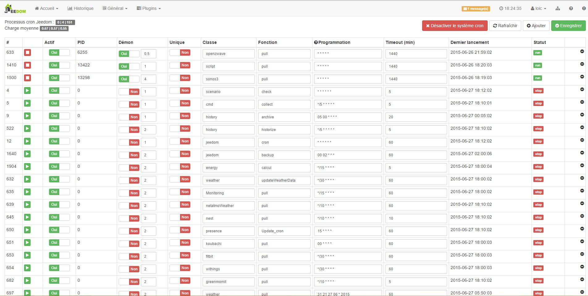

Die Task Engine Menü ist nur im Expertenmodus zur Verfügung. Es informiert über alle Jeedom Anwendungsaufgaben die auf dem Server ausgeführt werden.

Bei unsachgemäßer Handhabung auf dieser Seite kann ihnen jede Support-Anfrage verweigert werden.

Um dorthin zu gelangen muss man auf Einstellungen → Task Engine gehen

Sobald sie darauf sind, sehen sie :

En haut à droite vous retrouvez un résumé des processus Jeedom. Le premier chiffre indique le nombre de tâches principales (doit toujours être égal à 0 ou 1), le second le nombre de tâches secondaires et le dernier le nombre de tâches totales sur le système (Jeedom et hors Jeedom). En-dessous vous avez les chiffres de la charge moyenne de votre système, il est recommandé que ce chiffre soit inférieur au nombre total de coeurs du processeur de la machine.

A droite, vous avez un bouton pour désactiver ou réactiver toutes les tâches (si vous les désactivez toutes, plus rien ne sera fonctionnel sur votre Jeedom), un bouton pour rafraîchir le tableau des tâches (juste en-dessous), un bouton pour ajouter une tâche et un bouton pour enregistrer vos modifications.

Enfin, en-dessous vous avez le tableau de toutes les tâches existantes (attention certaines tâches peuvent lancer des sous-tâches, il est donc vivement recommandé de ne jamais modifier d’informations sur cette page). Dans ce tableau on retrouve :

-   **\#** : ID de la tâche, peut être utile pour faire le lien entre un processus qui tourne et ce qu’il fait vraiment

-   **Action** : Ist eine Schaltfläche zum Starten oder Beenden der Aufgabe abhängig von seinen Status.

-   **Aktiv** : zeigt an ob der Task aktiv ist (kann durch Jeedom gestartet werden) oder nicht

-   **PID** : zeigt die aktuelle Prozess-ID

-   **Démon** : si cette case est à "oui" alors la tâche doit toujours être en cours. A coté vous retrouvez la fréquence du démon, il est conseillé de ne jamais toucher cette valeur et surtout de ne jamais la diminuer

-   **Unique** : wenn das "Ja" aktiviert ist, dann wird der Task einmalig ausgeführt und danach gelöscht

-   **Klasse** : PHP Klasse aufgerufen, um den Task auszuführen (kann leer sein)

-   **Fonction** : fonction PHP appelée dans la classe appelée (ou non si la classe est vide)

-   **Auszeit** : Maximale Betriebsdauer der Aufgabe. Wenn die Aufgabe ein Dämon ist, dann wird sie automatisch beendet und wird am Ende der Auszeit neu gestartet.

-   **Letzter Start** : Datum des letzten Aufgaben Starts

-   **Status** : aktueller Status des Tasks (zur Erinnerung eines Dämons Aufgabe ist noch auf "run")

-   **Entfernen** : Löscht die Aufgabe

