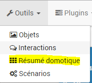
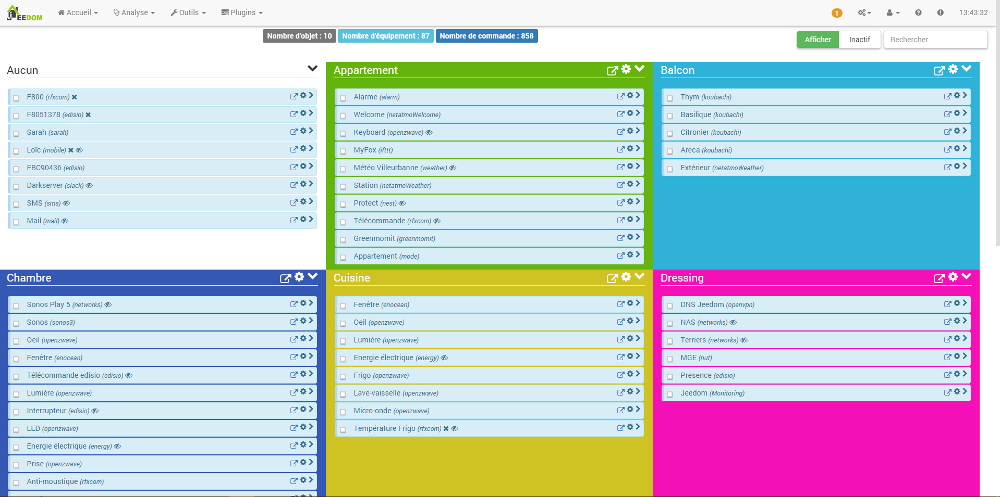
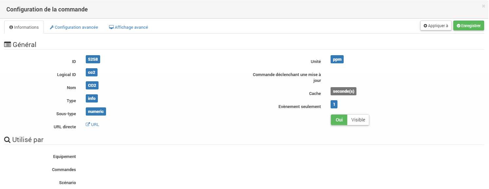
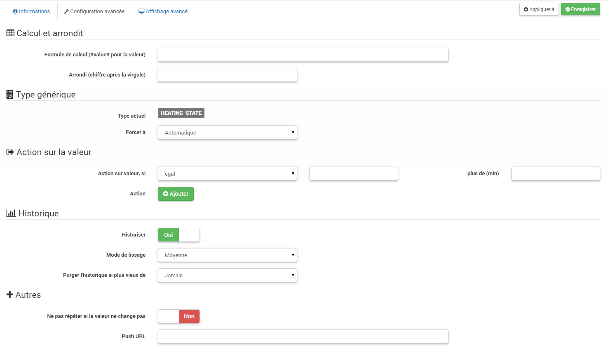

Cette page permet d’avoir un résumé sur sa domotique et donne aussi accès à des fonctions d’organisation des équipements et des commandes, à la configuration avancée des équipements et des commandes ainsi qu'à des possibilités de configuration d’affichage. Elle se décompose en un onglet "Ma domotique" et un un onglet "Configuration de l’affichage".

Diese Seite ist über Werkzeuge → Übersicht Haus-Automatisierung erreichbar :

Le premièr onglet permet d’organiser les différents équipements, les commandes, d’avoir accès à la configuration avancée ainsi qu'à la configuration de masse. Voila celui-ci :

On retrouve tout en haut un résumé du nombre d’objets existants, du nombre d'équipements et du nombre de commandes. Sur la droite se trouve un bouton pour masquer tous les équipements inactifs et un champ de recherche pour par exemple chercher un équipement, une commande ou tous les équipements d’un certain type (plugin, par exemple il suffit de taper rfxcom pour avoir tous les équipements rfxcom)

En dessous on retrouve un cadre par objet. Dans chaque cadre se trouve la liste des équipements (en bleu) contenus dans l’objet. Vous avez sur la ligne du nom de l’objet jusqu'à 3 boutons, dans l’ordre :

-   le premier sert à ouvrir la page de configuration de l’objet dans un nouvel onglet

-   le deuxième donne un résumé sur l’objet

-   le dernier permet de masquer la liste des équipements (en dessous en bleu)

> **Tip**
>
> La couleur de fond des cadres objets dépend de la couleur mise dans la configuration de l’objet

A partir de là vous pouvez en cliquant/maintenant un équipement changer l’ordre dans l’objet ou même l’affecter à un autre objet.

> **Tip**
>
> C’est à partir de cet ordre là qu’est calculé l’ordre d’affichage sur le dashboard

Sur chaque équipement on retrouve :

-   une coche pour sélectionner l'équipement (vous pouvez en sélectionner plusieurs), si au moins un équipement est sélectionné vous avez des boutons d’action qui apparaissent pour supprimer, désactiver, activer, rendre visible ou invisible les équipements sélectionnés

-   Gerätename

-   le type de l'équipement (identifiant du plugin auquel il appartient)

-   une croix signifie que l'équipement est inactif (si elle n’y est pas alors l'équipement est actif)

-   un oeil barré signifie que l'équipement est invisible (s’il n’y est pas alors l'équipement est visible)

-   lien externe : permet d’ouvrir dans un nouvel onglet la page de configuration de l'équipement

-   configuration avancée (petit roue crantée) : permet d’ouvrir la fenêtre de configuration avancée

> **Tip**
>
> Un double clic sur l'équipement permet aussi d’ouvrir la fenêtre de configuration avancée

-   liste des commandes (la flèche) : permet de déplier la liste des commandes

Wenn Sie die Liste der Befehle entfalten erhalten Sie :

Chaque bloc jaune correspond à une commande de votre équipement (un nouveau clic sur la petite flèche de l'équipement permet de les masquer). Si vous faites un double clic sur la commande ou que vous cliquez sur la petite roue crantée cela fera apparaitre la fenêtre de configuration

Erweiterte Geräte Konfiguration
===============================

La fenêtre de configuration avancée d’un équipement est composée de 2 onglets : Informations et Affichages avancés.

En haut vous retrouvez aussi un bouton sauvegarder et un bouton de suppression d'équipement

> **Tip**
>
> Il est possible d’accéder (si le plugin le supporte) directement à cette fenêtre à partir de la page de configuration de l'équipement en cliquant sur les 3 petites roues crantées (souvent placées tout en haut à coté du titre "Général")

Information
-----------

L’onglet information contient les informations générales de l'équipement :

-   **ID** : identifiant unique dans la base de données

-   **Name** : Gerätename

-   **ID logique** : identifiant logique de l'équipement (peut être vide)

-   **ID de l’objet** : identifiant unique de l’objet père (peut être vide)

-   **Date de création** : date de création de l'équipement

-   **Activer** : permet d’activer ou non l'équipement (n’oubliez pas de sauvegarder)

-   **Visible** : permet de rendre visible ou non l'équipement (n’oubliez pas de sauvegarder)

-   **Type** : identifiant du plugin auquel il appartient

-   **Tentative échouée** : nombre de tentatives de communications consécutives avec l'équipement qui ont échoué

-   **Dernière mise à jour** : date de dernière communication avec l'équipement

Erweiterte Anzeige
------------------

Dans cette partie vous allez pouvoir configurer certains comportements d’affichage de la tuile sur le dashboard, les vues, le design et en mobile.

Sie können :

-   **Visible** : permet de masquer ou non l'équipement en desktop ou mobile

-   **Afficher le nom** : permet de masquer le nom de l'équipement sur la tuile en fonction du contexte (dashboard et design, vue ou mobile)

-   **Afficher le nom de l’objet** : uniquement sur les vues cela permet de ne pas afficher le nom de l’objet à coté du nom de l'équipement

-   **Afficher le niveau de batterie** : uniquement pour le dashboard, les designs et les vues, cette option permet de masquer le niveau de la batterie de l'équipement (s’il est sur batterie bien sûr)

En-dessous, on retrouve des paramètres optionnels d’affichage que l’on peut passer à l'équipement. Ces paramètres sont composés d’un nom et d’une valeur. Pour les équipements, seule la valeur "style" est pour le moment utilisée, elle permet d’insérer du code CSS sur l'équipement en question. Exemple ici pour arrondir les angles :

> **Tip**
>
> Vergessen Sie nicht, nach jeder Veränderung zu speichern.

Batteries
---------

Cet onglet permet d’avoir les informations sur la batterie de l'équipement : type de pile, dernière remontée de l’information, niveau restant (si bien sûr votre équipement fonctionne sur pile). Vous pourrez aussi à partir de celui-ci configurer les seuils spécifiques pour cet équipement.

Configuration avancée d’une commande
====================================

La fenêtre de configuration avancée d’une commande est composée de 3 onglets : Informations, Configuration avancée et Affichage avancé.

Elle a aussi 2 boutons, un pour sauvegarder et un pour appliquer les mêmes paramètres de configuration à une autre commande

Information
-----------

L’onglet information contient les informations générales sur la commande :

-   **ID** : identifiant unique dans la base de données

-   **Logical ID** : identifiant logique de la commande (peut être vide)

-   **Name** : Name des Befehls

-   **Type** : type de la commande (action ou info)

-   **Sous-type** : sous type de la commande (binaire, numérique…)

-   **URL directe** : fournit une URL (clic droit copier l’addresse du lien) pour, en fonction du type de la commande, déclencher l’action ou récupérer sa valeur (si c’est une commande de type info)

-   **Unité** : unité de la commande

-   **Commande déclenchant une mise à jour** : donne l’identifiant d’une autre commande qui, si cette autre commande change, va forcer la mise à jour de la commande visualisée

-   **Cache** : durée de vie de la valeur de la commande en mémoire (une fois ce délai passé Jeedom redemandera sa valeur). Attention si vous êtes en événement alors ce paramètre est ignoré car la durée de vie est infinie. Si vous n’avez aucune valeur et que vous n'êtes pas en événement alors la durée de vie est celle définie dans la configuration de Jeedom (par defaut 300s)

-   **Evènement seulement** : indique à Jeedom qu’il ne peut pas demander la valeur de la commande (c’est l'équipement ou le plugin qui le lui transmet)

-   **Visible** : définit si la commande est visible ou non

En-dessous, vous retrouvez la liste des différents équipements, commandes, scénarios ou interactions qui utilisent cette commande. Un clic dessus permet d’aller directement sur leur configuration respective

Erweiterte Konfiguration
------------------------

Pas mal d’options ici (elles peuvent varier en fonction du type et du sous-type de la commande).

Pour une commande de type info :

-   **Calcul et arrondit**

    -   **Formule de calcul (\#value\# pour la valeur)** : vous pouvez ici faire une opération sur la valeur de la commande avant le traitement par Jeedom, exemple : \#value\# - 0.2 pour retrancher 0.2 (offset sur un capteur de température)

    -   **Arrondi (chiffre après la virgule)** : permet d’arrondir la valeur de la commande, exemple : mettre 2 pour tranformer 16.643345 en 16.64

-   **Type générique** : cette partie permet de configurer le type générique de la commande (Jeedom essaie de le trouver par lui-même en mode auto). Cette information est utilisée par l’application mobile.

-   **Action sur la valeur** : cette partie permet de faire des sortes de mini scénarios, vous pouvez par exemple dire que si la valeur vaut plus de 50 pendant 3 minutes alors il faut faire telle action. Cela permet par exemple d'éteindre une lumiere X minutes après que celle-ci se soit allumée

-   **Historique** : voir [ici](https://jeedom.com/doc/documentation/core/fr_FR/doc-core-history.html#_configuration_spécifique_par_commande)

-   \* Sonstige\*

    -   **Ne pas répéter si la valeur ne change pas** : Si la commande remonte 2 fois la même valeur d’affilée alors Jeedom ne prend pas en compte la 2eme remontée (évite de déclencher plusieurs fois un scénario par exemple si la valeur ne change pas)

    -   **Push URL** : permet de rajouter une URL à appeler en cas de mise à jour de la commande. Vous pouvez utiliser les tags suivant : \#value\# pour la valeur de la commande, \#cmd\_name\# pour le nom de la commande, \#cmd\_id\# pour l’identifiant unique de la commande, \#humanname\# pour le nom complet de la commande (ex : \#[Salle de bain][Hydrometrie][Humidité]\#)

Si vous êtes sur une commande type action vous avez :

-   **Confirmer l’action** : lors d’une action à partir de l’interface sur cette commande Jeedom demandera une confirmation

-   **Code d’accès** : lors d’une action à partir de l’interface sur cette commande Jeedom demandera le code

Erweiterte Anzeige
------------------

Dans cettre partie vous allez pouvoir configurer certains comportements d’affichage du widget sur le dashboard, les vues, le design et en mobile.

Sie können :

-   **Widget** : permet de choisir le widget sur dekstop ou mobile (à noter qu’il faut le plugin widget et que vous pouvez le faire aussi à partir de celui-ci)

-   **Visible** : permet de masquer ou non la commande en desktop ou mobile

-   **Afficher le nom** : permet de masquer le nom de la commande en fonction du contexte (dashboard et design, vue ou mobile)

-   **Afficher les statistiques** : permet de ne pas afficher les statistiques en fonction du contexte (dashboard et design, vue ou mobile). Attention, il faut avoir activé les statistiques dans la configuration de Jeedom pour que cette option ait un impact

-   **Retour à la ligne forcé avant le widget** : permet d’ajouter un retour à la ligne avant ou après le widget (pour forcer par exemple un affichage en colonne des différentes commandes de l'équipement au lieu de lignes par defaut)

En-dessous, on retrouve des paramètres optionnels d’affichage que l’on peut passer au widget. Ces paramètres dependent du widget en question, il faut donc regarder sa fiche sur le Market pour les connaitre.

> **Tip**
>
> Vergessen Sie nicht, nach jeder Veränderung zu speichern.

