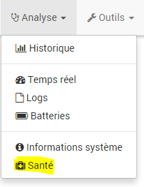
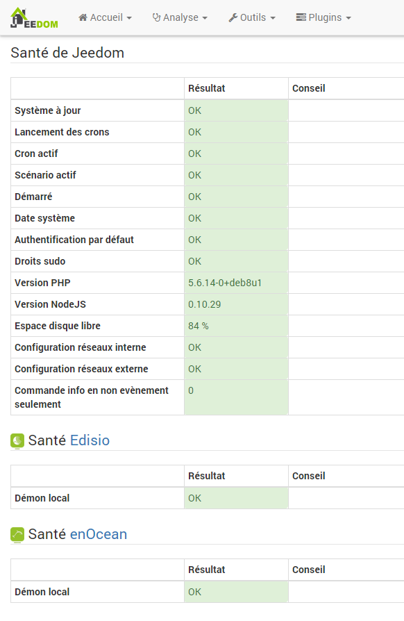

Die Jeedom Gesundheits Seite gibt Ihnen einen schnellen Überblick über Ihre Jeedom Gesundheit. Sie zeigt auch (wenn Plugins verwendet werden), den Gesundheitszustand von Plugins.

Sie ist über das Menü Analyse → Gesundheit erreichbar.

Einmal darauf sehen sie hier folgendes :

Vous retrouvez ici un tableau qui donne une description de ce que Jeedom vérifie et du statut de celle-ci dans la 2ème colonne, enfin la dernière colonne peut vous donner des conseils de résolution si la vérification n’est pas OK

Nachfolgend finden sie die gleiche Tabelle, aber für Plugins (wenn das Plugin kompatibel ist). Mit einem Klick auf den Plugin-Namen gelangen sie auf dessen Konfigurations-Seite.

Hilfe zur Lösung
================

PHP Version
-----------

Für den Moment ist die Php-Version 5.5 nicht erforderlich, sie können vorerst alles so belassen. Am Tag das die Version 5.5 obligatorisch wird, werden sie benachrichtigt.

Nginx Konfiguration
-------------------

Meine Nginx-Konfiguration ist NOK, das ist normal, wenn Sie die Datei /etc/nginx/sites-available/defaut geändert haben, sonst in SSH machen :

-   Wenn Sie sich auf einem mini/mini+ befinden oder sie wollen /jeedom nicht :

<!-- -->

    sudo su -
    cp /usr/share/nginx/www/jeedom/install/nginx_default_without_jeedom /etc/nginx/sites-available/defaut
    service nginx restart

-   Sie wollen /jeedom

<!-- -->

    sudo su -
    cp /usr/share/nginx/www/jeedom/install/nginx_default /etc/nginx/sites-available/defaut
    service nginx restart
