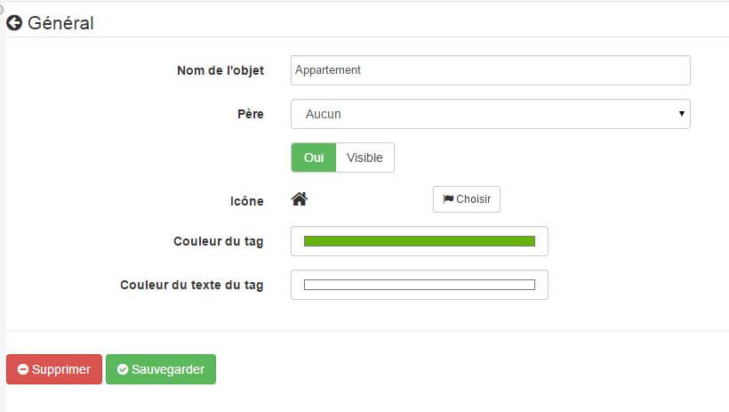

Le sous-menu Objets, permet de définir l’arborescence de sa domotique. Elle se fait en créant des objets. Accessible à partir de là :

Um freie Wahl für die Personalisierung zu haben, können Sie diese Objekte benennen, wie Sie wollen. Aber meistens wird man dort die verschiedenen Bereiche seines Hauses definieren, wie der Name der Räume (es ist im Übrigen die empfohlene Konfiguration).

Auf der Seite angekommen, bekommt man folgende Seite (Hier bereits mit einigen Objekten) :

> **Tip**
>
> Wie an vielen Orten auf Jeedom, wenn man die Maus ganz nach links bewegt ermöglicht es, ein Schnellzugangsmenü sichtbar zu machen (Sie können es in ihrem Profil immer sichtbar machen).

Sobald Ihr Objekt hinzugefügt wurde, oder nach einem Klick auf ein vorhandenes Objekt, bekommen Sie folgendes :

Hier haben Sie verschiedene Optionen :

-   **Objektname** : der Name des Objekts

-   **Vater** : das übergeordnete Objekt des aktuellen Objekts, es ermöglicht eine Hierarchie zu definieren, z.B. das Wohnzimmer, ist der Sohn der Wohnung. Ein Objekt kann nur einen Vater haben, aber er kann so viele Söhne haben wie er will.

-   **Sichtbar** : ermöglicht, festzulegen ob das Objekt auf dem Armaturenbrett sichtbar ist oder nicht

-   **Symbol** : Damit können Sie ein Symbol für das Objekt festlegen

-   **Tag Farbe** : Hier können Sie die Farbe des Objekts wählen (diese Farbe wird zum Beispiel in der Home-Automation-Übersichtsseite verwendet)

-   **Tag Farbe** : Hier können Sie die Textfarbe des Objekts wählen (diese Textfarbe wird zum Beispiel in der Home-Automation-Übersichtsseite verwendet)

Wenn Sie Ihre Maus ganz nach links bewegen, können Sie das folgende Menü erscheinen lassen :

Mit ihm können Sie die Reihenfolge Ihrer Objekte ändern, klicken und halten Sie am Anfang der Zeile den Doppelpfeil und ziehen das Objekt an die gewünschte Position.

