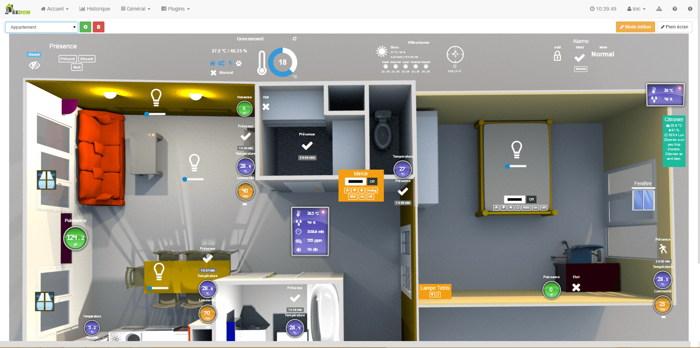
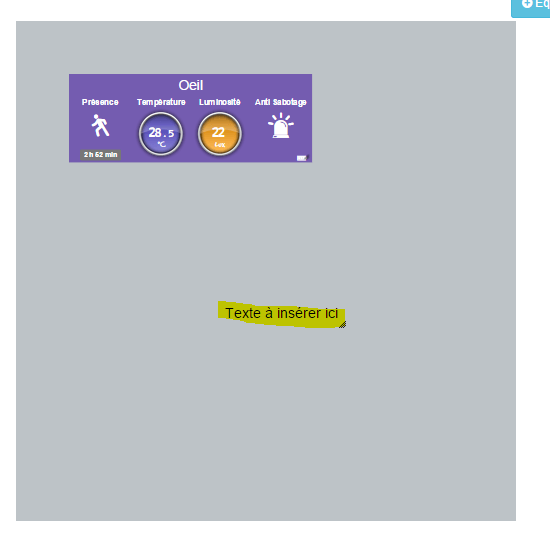
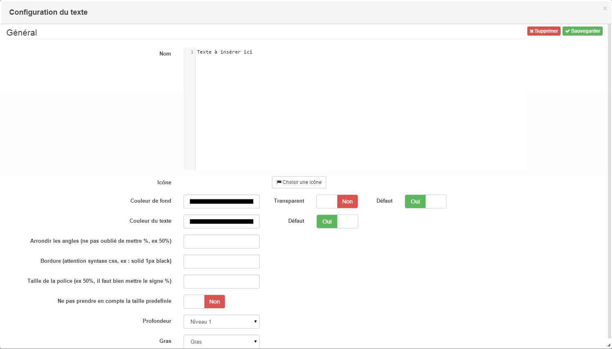
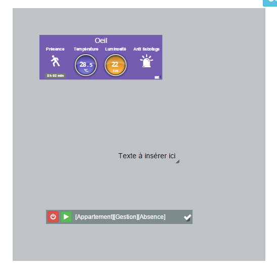
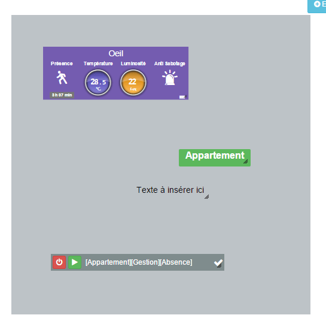
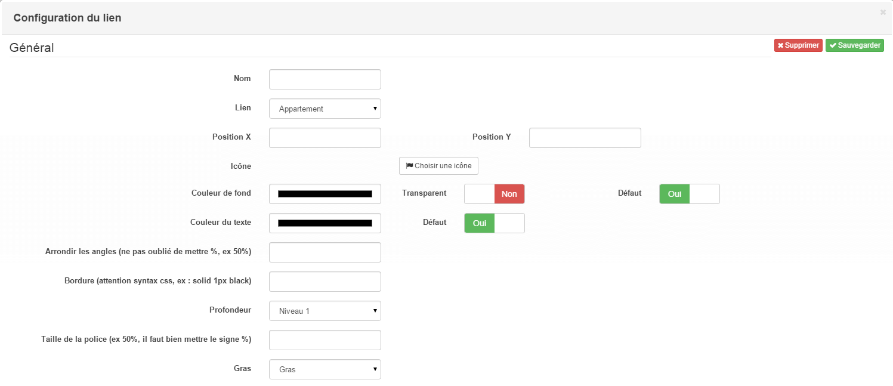
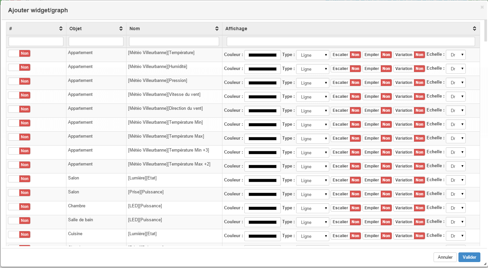

Auf dieser Seite können sie die Anzeige der gesamten Haustechnik ganz genau konfigurieren. Dies braucht Zeit, aber die einzige Grenze ist Ihre Vorstellungskraft.

Er ist erreichbar über :

> **Tip**
>
> Comme vous pouvez le voir sur la capture il est possible d’aller directement sur un design grâce au sous-menu

Hier ist ein Beispiel für ein Design :

Sur cette page on retrouve, en haut (et dans l’ordre) :

-   ein Menü, um das Design zu wechseln

-   eine Schaltfläche, um ein neues Design zu erstellen

-   eine Schaltfläche zum Löschen

-   eine Schaltfläche, um das aktuelle Design zu bearbeiten

-   eine Schaltfläche, um in den Vollbildmodus zu wechseln

Zum Erstellen eines neuen Designs müssen sie nur auf die Schaltfläche + klicken, es erscheint ein Fenster in dem der Namen eingegeben werden muß :

Sie bekommen dann ein leeres Design :

Nun müssen sie auf die Schaltfläche Bearbeitungsmodus klicken, um das Design zu bearbeiten :

Comme on peut le voir il y a un peu plus de boutons maintenant, ainsi que le cadre du design (que l’on peut changer bien sûr).

Oben links gibt es 2 Schaltflächen, zum bearbeiten der Eigenschaften und zum kopieren, des aktuellen Entwurfs.

> **Tip**
>
> Vergessen Sie nicht, nach jeder Veränderung zu speichern.

Design Eigenschaften editieren
==============================

Hier haben wir :

-   **Allgemein**

    -   **Name** : Der Name Ihres Designs

    -   **Symbol** : Ein Symbol dafür (erscheint im Menü der Designwahl)

    -   **Verfügbar auf Telefon** : Macht dieses Design sichtbar, in der Design Liste der mobilen Version

    -   **Bild**: erlaubt, ein Hintergrundbild zum Design hinzuzufügen

    -   **Den Zurück-Pfeil in dem Vollbild-Layout anzeigen** : im Vollbildschirm Modus kann diese Option die Rückkehr Schaltfläche zum Fenstermodus anzeigen(Ideal für ein Wand Tabblet)

-   **Größe**

    -   **Größe (LxH)** : Erlaubt, die Größe Ihres Designs festzulegen (grauer Rahmen in Bearbeiten-Modus)

    -   **Proportion Tablet (z.B.: 0,7)** : Erlaubt, die Proportion des Designs auf Tablet zu ändern (um es zum Beispiel zu reduzieren, indem man noch die Größe beherrscht)

    -   **Proportion Telefon (z.B.: 0,5)** : Erlaubt, die Proportion des Designs auf Telefon zu ändern (um es zum Beispiel zu reduzieren, indem man noch die Größe beherrscht)

Widget hinzufügen
=================

Dann müssen sie Widgets zu ihrem Design hinzufügen, dafür müssen sie auf die Schaltfläche "+ Gerät" klicken :

Sobald sie darauf geklickt haben können sie das Widget wählen :

Nun sehen sie ihr Widget :

> **Tip**
>
> Sie können das Widget durch klicken/ziehen bewegen.

Sie gelangen zur erweiterten Konfiguration des angezeigten Widget durch doppelklicken :

Hier haben wir :

-   **Allgemein**

    -   **Größe des Widgets** : ermöglicht ein Widget Größenverhältnis, zum Beispiel wird hier die Größe mit nur 65% definieren

    -   **Couleur de fond** : permet de changer la couleur de fond ou de le mettre transparent, ne pas oublier de passer "Défaut" sur NON

    -   **Couleur des icônes et textes** : permet de changer la couleur des icônes et des textes (attention à bien passer Défaut sur Non)

    -   **Runde Ecken (vergessen Sie nicht das % einzugeben, bsp. 50%)** : wird verwendet, um die Ecken abzurunden, vergessen sie nicht das % Zeichen einzugeben

    -   **Bordure (attention syntaxe css, ex : solid 1px black)** : permet d’ajouter une bordure, attention la syntaxe est HTML

    -   **Tiefe** : erlaubt das Niveau der Tiefe zu wählen, zum Beispiel um ein Widget mit einem andern zu überdecken

    -   **Gerätename anzeigen** : zum verstecken des Widget Namen, bezieht sich nur auf das Design

-   **Speziele** : erlaubt, einige Befehle des Widget auf dem Design zu verstecken

> **Important**
>
> En fonction des plugins certaines options peuvent ne pas fonctionner

> **Tip**
>
> Sie können rechts unten die Größe der Widgets ändern

Text/html hinzufügen
====================

Ermöglicht einen Text oder HTML/Javascript Code hinzuzufügen, einmal oben anklicken bekommen sie :

Ein Doppelklick darauf dann gelangen sie zum Konfigurations Fenster :

-   **Name** : Sie können Text oder HTML/JavaScript eingeben

-   **Symbol** : Sie können ein Symbol anstelle von Text einsetzen

-   **Couleur de fond** : permet de changer la couleur de fond ou de le mettre transparent, ne pas oublier de passer "Défaut" sur NON

-   **Couleur du textes** : permet de changer la couleur des icônes et des textes (attention à bien passer Défaut sur Non)

-   **Runde Ecken (vergessen Sie nicht das % einzugeben, bsp. 50%)** : wird verwendet, um die Ecken abzurunden, vergessen sie nicht das % Zeichen einzugeben

-   **Rand (Achtung css syntax, bsp.: solid 1px black)** : um einen Rand hinzuzufügen, Achtung es ist die HTML Syntax zu verwenden

-   **Schriftgröße (z.B. 50%, das % -Zeichen muß eingegeben werden)** : ermöglicht die Schriftgröße zu ändern

-   **Die vorgegebene Größe nicht berücksichtigen** : ermöglicht die Voreinstellung der Widget Größe zu ignorieren

-   **Tiefe** : erlaubt das Niveau der Tiefe zu wählen

-   **Fett** : macht den Text fett

> **Tip**
>
> Sie können unten rechts die Größe ändern

Ein Szenario hinzufügen
=======================

Klicken sie oben und Jeedom wird sie nach dem Szenario fragen :

Einmal gewählt erscheint dieses auf dem Design

Ein Doppelklick darauf dann gelangen sie auf die Konfiguration des Szenarioelementes :

-   **Allgemein**

    -   **Größe des Widgets** : ermöglicht ein Widget Größenverhältnis, zum Beispiel wird hier die Größe mit nur 65% definieren

    -   **Couleur de fond** : permet de changer la couleur de fond ou de le mettre transparent, ne pas oublier de passer "Défaut" sur NON

    -   **Couleur des icônes et textes** : permet de changer la couleur des icônes et des textes (attention à bien passer Défaut sur Non)

    -   **Runde Ecken (vergessen Sie nicht das % einzugeben, bsp. 50%)** : wird verwendet, um die Ecken abzurunden, vergessen sie nicht das % Zeichen einzugeben

    -   **Bordure (attention syntaxe css, ex : solid 1px black)** : permet d’ajouter une bordure, attention la syntaxe est HTML

    -   **Tiefe** : erlaubt das Niveau der Tiefe zu wählen, zum Beispiel um ein Widget mit einem andern zu überdecken

-   **Speziele** : ermöglicht, den Aktions Befehl im Szenario zu verstecken

> **Tip**
>
> Sie können unten rechts die Größe ändern

Einen Link hinzufügen
=====================

Erlaubt, einen Link zu einer Ansicht oder einem anderen Design hinzuzufügen :

Celui-ci apparaît ensuite sur le design :

Ein Doppelklick darauf, dann gelangen sie auf die erweiterte Konfiguration :

Hier haben wir :

-   **Name** : Hier können Sie den Namen des Links ändern

-   **Link** : Ziel Verknüpfung

-   **Position** : ermöglicht, die Lage des Links auf dem Ziel sehr genau einzustellen (um zum Beispiel direkt auf die Küche zu kommen)

-   **Symbol** : Sie können ein Symbol anstelle von Text einsetzen

-   **Couleur de fond** : permet de changer la couleur de fond ou de le mettre transparent, ne pas oublier de passer "Défaut" sur NON

-   **Couleur du textes** : permet de changer la couleur des icônes et des textes (attention à bien passer Défaut sur Non)

-   **Runde Ecken (vergessen Sie nicht das % einzugeben, bsp. 50%)** : wird verwendet, um die Ecken abzurunden, vergessen sie nicht das % Zeichen einzugeben

-   **Rand (Achtung css syntax, bsp.: solid 1px black)** : um einen Rand hinzuzufügen, Achtung es ist die HTML Syntax zu verwenden

-   **Tiefe** : erlaubt das Niveau der Tiefe zu wählen

-   **Schriftgröße (z.B. 50%, das % -Zeichen muß eingegeben werden)** : ermöglicht die Schriftgröße zu ändern

-   **Die vorgegebene Größe nicht berücksichtigen** : ermöglicht die Voreinstellung der Widget Größe zu ignorieren

-   **Fett** : macht den Text fett

> **Tip**
>
> Sie können unten rechts die Größe ändern

Einen Graph hinzufügen
======================

Einmal oben geklickt erhalten Sie :

Ein Doppelklick darauf, dann gelangen sie zur Diagramm Konfiguration

Hier haben wir :

-   **Periode** : Hier können Sie die Anzeigeperiode wählen

-   **Bordure (attention syntaxe css, ex : solid 1px black)** : permet d’ajouter une bordure, attention la syntaxe est HTML

-   **Tiefe** : erlaubt das Niveau der Tiefe zu wählen

-   **Beschriftung anzeigen** : ermöglicht, das Anzeigen der Beschriftung

-   **Navigator** : ermöglicht, das Anzeigen oder Ausblenden eines Navigators (etwas unterhalb des Diagramms)

-   **Perioden Selektor anzeigen** : oben links den Perioden Selektor anzeigen oder ausblenden

-   **Bildlaufleiste anzeigen** : zum anzeigen oder ausblenden der Bildlaufleiste

-   **Transparenter Hintergrund** : macht den Hintergrund transparent

Pour choisir les données à afficher il faut cliquer sur les 3 roues crantées :

Sie erhalten (es brauch möglicherweise etwas lange zu laden) :

-   **Aktivieren** : Die erste Schaltfläche ist zum aktivieren oder deaktivieren der Anzeige, des graphischen Datenelementes

-   **Farbe** : die Farbe der Kurve

-   **Typ** : der Typ des Diagramms (Fläche, Linie oder Säule)

-   **Treppe**: zeigt die Kurve in Form einer Treppe, die ununterbrochene wiedergegeben wird

-   **Stapeln** : erlaubt, die Werte der Kurven zu stapeln (siehe das Ergebnis darunter)

-   **Wertänderung** : Zeigen den Unterschied der Werte im Vergleich zu dem vorherigen Punkt an.

-   **Maßstab** : Weil sie mehrere Diagramme (Daten) in der gleichen Grafik anzeigen können, ist es mit der Einstellung möglich, den Maßstab (rechts oder links) zu unterscheiden.

> **Tip**
>
> Sie können unten rechts die Größe ändern

