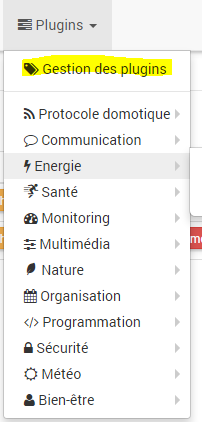
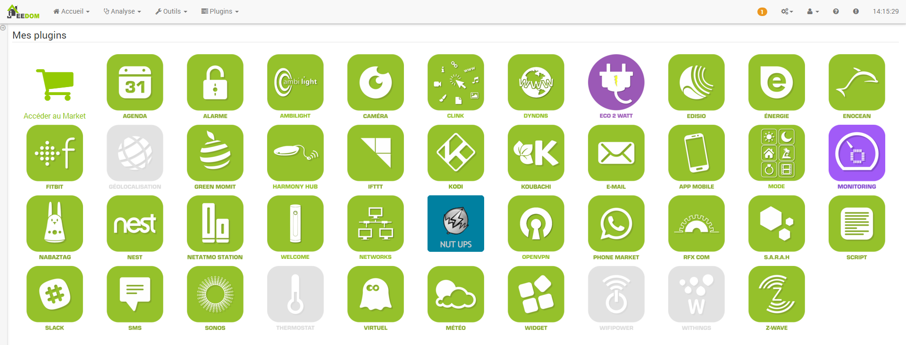
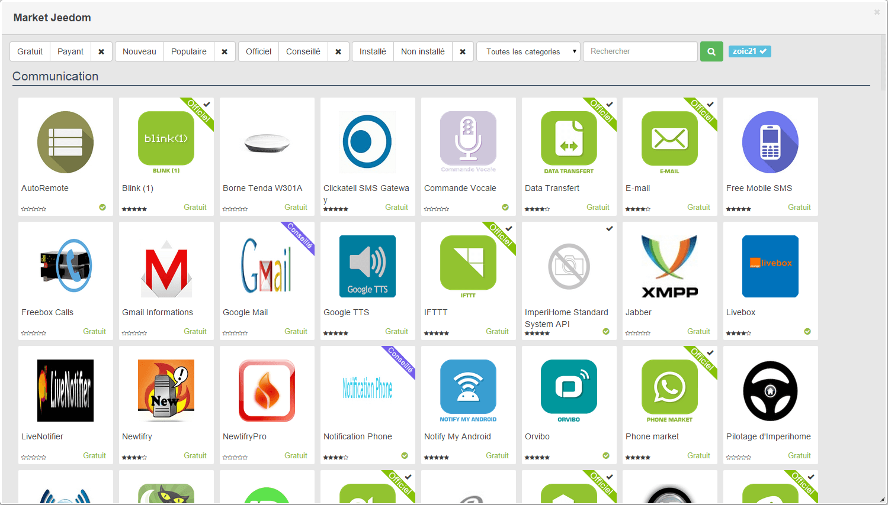
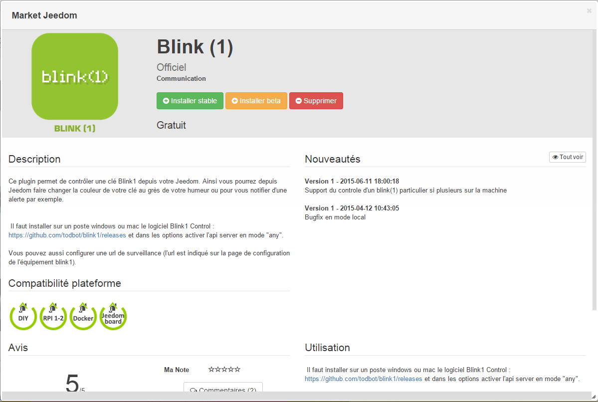

Das Untermenü Plugins, ermöglicht seine Plugins zu Verwalten : sie hochladen, sie auf den neuesten Stand bringen und sie zu aktivieren.

Plugin Verwaltung
=================

Sie können auf die Plugin-Seite über das Menü Plugin → Plugin Verwaltung zugreifen :

Wenn man darauf geklickt hat, findet man sich auf der Seite wieder, die uns eine Liste der Plugins anzeigt :

> **Tip**
>
> Wie an vielen Orten auf Jeedom, wenn man die Maus ganz nach links bewegt ermöglicht es, ein Schnellzugangsmenü sichtbar zu machen(Sie können es in ihrem Profil immer sichtbar machen).

Auf dieser Seite finden Sie alle Plugins die auf Ihrem Jeedom sind wieder. Diejenigen in rot, sind die, die nicht aktiviert sind. Wenn auf ein Plugin geklickt wird, gelangt man auf dessen Konfiguration Seite :

Oben sehen Sie die ID und Name des Plugins sowie die installierte Version (hier die Beta). Darunter haben Sie die Schaltfläche zum Aktiviern/Deaktivieren eines Plugins.

> **Important**
>
> Nach dem Herunterladen eines Plugin ist dieses nicht aktiviert, sodas sie es anschließend aktivieren müssen.

Unten finden Sie 4 Schaltflächen :

-   **Im Markt sehen** : erlaubt, das Datenblatt des Plugin zu sehen

-   **Auf den Markt senden** : ermöglicht, das Plugin auf den Markt zu senden (nur verfügbar, wenn Sie der Autor sind)

-   **Löschen** : Das Plugin wird von Jeedom entfernt. Achtung, dies entfernt auch dauerhaft die Geräte des Plugin

-   **Dokumentation** : Ermöglicht den direkten Zugriff auf die Dokumentationsseite vom Plugin

> **Tip**
>
> Einige Plugin haben einen Konfiguration-Teil, es ist in diesem Fall notwendig in der Dokumentation des Plugins die Frage zu finden, wie es zu konfigurieren ist.

Die Installation eines Plugins
==============================

Zum Installieren eines neuen klicken Sie einfach auf die Schaltfläche "Zum Markt gehen" :

Nach einer kurzen Ladezeit sehen sie :

Im oberen Teil auf dem Markt haben Sie Filter :

-   **Kostenlos/Gebührenpflichtig** : Sie können den Filtern auf kostenlose oder gebührenpflichtig einstellen, das kleine Kreuz erlaubt den Filter zurückzusetzen.

-   **Neue/Populäre** : Die neuesten Plugins oder die meisten Downloads anzeigen, das kleine Kreuz erlaubt den Filter zurückzusetzen.

-   **Installiert/Nicht installiert** : Es ermöglicht ihnen, nur installierte oder nicht installierte Plugins anzuzeigen, das kleine Kreuz erlaubt den Filter zurückzusetzen

-   **Kategorie** : erlaubt, nur einige Plugin Kategorien anzuzeigen

-   **Suchen** : um ein Plugin zu suchen (Namen oder eine Beschreibung davon)

-   **Benutzername** : Zeigt den Benutzernamen, mit dem man auf dem Markt verbunden ist sowie den Status der Verbindung an (hier Ok)

Sobald das gewünschte Plugin gefunden wurde klicken Sie einfach auf das Plugin, um es zu öffnen :

Diese Karteikarte gibt Ihnen die volle Information über das Plugin, unter anderen :

Wenn es offizielle/registriert oder veraltete ist (Sie müssen wirklich alte Plugin Installationen vermeiden) \* 3 Schaltflächen : ****Stabile Installation** : installiert das Plugin in einer stabilen Version** **Beta Installation** : installiert das Plugin in einer Beta Version (nur für die Betatester) **\* \*Löschen** : Wenn das Plugin aktuell installiert ist, wird es mit dieser Schaltfläche gelöscht.

Unten finden Sie auf der linken Seite die Beschreibung des Plugins, die Kompatibilität (wenn Jeedom einen Konflikt erkennt wird es gemeldet), Bewertung zum Plugin (hier können sie eine Bewertung abgeben), Kommentar zu diesem und weitere Informationen (Autor, die Person die das letzte Update entwickelt hat, einen Link zu der Doc, die Anzahl der Downloads). Auf der rechten Seite finden Sie die Liste der Aktualisierungen (Die Schaltfläche "Alle anzeigen" ermöglicht es ihnen, die ganze Geschichte anzuzeigen), eine schnelle Benutzerdokumentation (es wird empfohlen, dass Sie immer noch die vollständige Dokumentation lesen) und schließlich der Typ (Plugin, Widgets…), die Sprache und verschiedene Informationen über das Datum der letzten stabilen Version.

> **Important**
>
> Es ist wirklich nicht empfehlenswert, ein Beta Plugin auf ein Beta Jeedom zu installieren, das kann zu viele Probleme im Betrieb führen.

> **Important**
>
> Einige Plugins sind gebührenpflichtig, in diesem Fall bietet die Seite das Plugin zum kaufen an, sobald dies erledigt ist, etwa zehn Minuten (Zeit der Bestätigung der Zahlung), dann kehrt man zur Plugin-Seite zurück, um es normalerweise zu installieren.

> **Tip**
>
> Vous pouvez aussi ajouter un plugin à Jeedom à partir d’un fichier ou depuis un repository Github. Pour cela, il faut, dans la configuration de Jeedom, activer la fonction adéquate dans la partie "Mises à jour et fichiers". Il sera ensuite possible, en mettant la souris tout à gauche, et en faisant apparaitre le menu de la page plugin, de cliquer sur "Ajout depuis une autre source". Vous pourrez ensuite choisir la source "Fichier". Attention, dans le cas de l’ajout par un fichier zip, le nom du zip doit être le même que l’id du plugin et dès l’ouverture du ZIP un dossier plugin\_info doit être présent.

Der Abschnitt Dämon des Plugins
===============================

Einige Plugins haben Dämonen, hier finden Sie den Status der Jeedom Dämonen (Master oder Slave)

Sie befinden sich hier :

-   **Nom** : jeedom en question (local veut dire celui sur lequel vous êtes)

-   **Statut** : indique le statut du démon

-   **Configuration** : indique si tout est bon niveau configuration pour que le démon tourne

-   **(Re)Démarrer** : permet de redémarrer le démon

-   **Arrêter** : permet d’arreter le démon (disponible seulement si la gestion automatique est désactivée)

-   **Debug** : permet de lancer le démon en debug (une icône sur le statut vous indiquera que vous êtes en debug)

-   **Log** : permet d’afficher la log du démon

-   **Gestion automatique** : autorise Jeedom à démarrer et à relancer le démon en cas de soucis. Elle est à désactiver quand vous êtes en déporté et que par exemple sur le maître vous n’avez pas besoin que le démon tourne

-   **Dernier lancement** : date de démarrage du démon

Der Abschnitt Abhängigkeiten
============================

Certains plugins ont des dépendances, vous trouverez ici le statut des dépendances par jeedom (maître ou esclave)

-   **Nom** : jeedom en question (local veut dire celui sur lequel vous êtes)

-   **Statut** : indique si les dépendances sont bien installées

-   **Installation** : lance l’installation des dépendances

-   **Log** : permet de voir la log d’installation des dépendances

-   **Dernière installation** : donne la date à laquelle les dépendances ont été lancées pour la derniere fois

