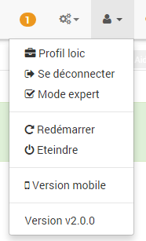
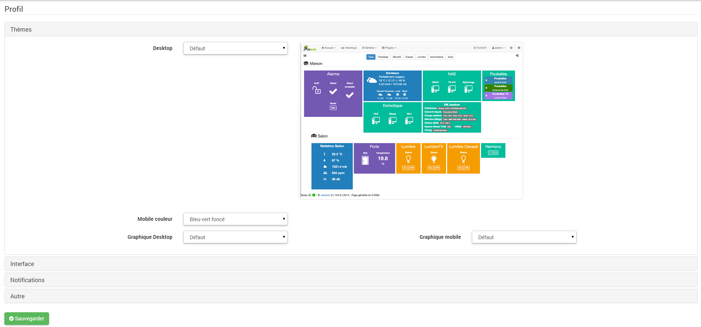
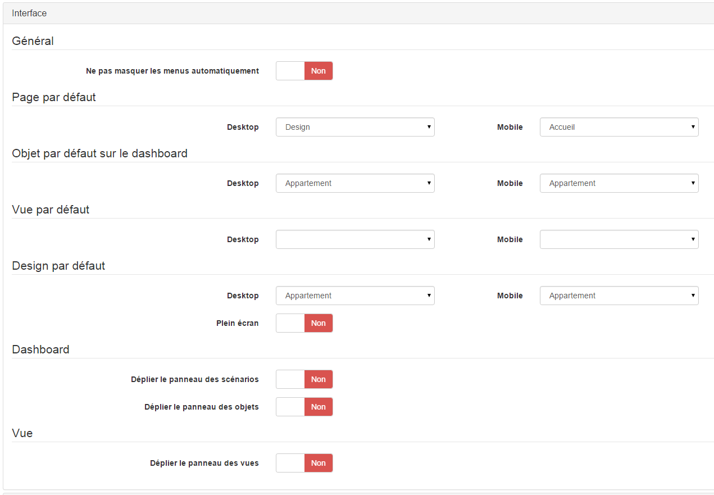

La page profils vous permet de configurer certains comportements de Jeedom spécifiques à l’utilisateur : page d’accueil, thèmes de la version desktop, de la version mobile, des graphiques… Elle permet aussi de changer votre mot de passe et de passer en mode expert permettant une configuration plus poussée de Jeedom.

Das Menü Profil
===============

Vous retrouvez en haut à droite sur chaque page de Jeedom le menu Profil :

Vous retrouvez à coté de ce menu Profil, une information sur le nombre de messages dans le centre de messages (ces messages sont importants sinon Jeedom ne vous les remonterait pas), l’heure Jeedom (attention c’est bien l’heure de Jeedom et non de votre PC), le menu Profil, une icône indiquant la connexion (ici filaire, mais il est possible si vous êtes en wifi d’avoir celle-ci), l’icône pour l’accès à l’aide de la page en cours et l’icône pour faire une demande de support.

Si vous cliquez sur le menu Profil vous obtenez :

A partir de ce menu vous avez accès à la page Profil, à l’activation ou non du mode expert, au redémarrage de Jeedom, à l’arrêt de Jeedom, au passage en version mobile et un bouton pour se déconnecter.

> **Important**
>
> En DIY les actions de redémarrage et d’arrêt ne fonctionnent que si vous avez bien réalisé les actions visudo, voir link:https://jeedom.com/doc/documentation/installation/fr\_FR/doc-installation.html\#\_etape\_4\_définition\_des\_droits\_root\_à\_jeedom[ici]

Page Profil
===========

La page Profil ressemble à ca :

Hier finden sie unterschiedliche Felder wieder, die es ihnen ermöglicht Jeedom zu konfigurieren, alle diese Einstellungen sind nur mit ihrem Benutzer verbunden, sie sind also nur für sie

Themen
------

Auf dem Themen-Feld können sie die Schnittstellenparameter einstellen :

-   **Desktop** : Themen zum verwenden im Desktop-Modus, Achtung nur das Standard-Theme wird offiziell von Jeedom unterstützt

-   **Mobile** : permet de légèrement configurer le thème mobile (ici tout est supporté), soit clair soit sombre, ainsi que la couleur dominante de celui-ci

-   **Graphique Desktop** : permet de définir le thème par défaut des graphiques en mode desktop

-   **Graphique Mobile** : permet de définir le thème par défaut des graphiques en mode mobile

Schnittstelle
-------------

Sie können hier bestimmte Verhaltensweisen der Schnittstelle einstellen :

-   **Allgemein**

    -   **Ne pas masquer les menus automatiquement** : indique à Jeedom de ne pas masquer le panneau de gauche, lorsqu’il existe, pour rappel ce panneau est disponible sur la plupart des pages des plugins, ainsi que la page des scénarios, des interactions, des objets….

-   **Standard Seite**

    -   **Desktop** : Desktop Standardseite die angezeigt wird wenn man sich verbindet

    -   **Mobil** : Mobile Standardseite die angezeigt wird wenn man sich verbindet

-   **Standardobjekt auf dem Armaturenbrett** : Objekt, das standardmäßig beim öffnen des Armaturenbretts angezeigt wird

-   **Standardansicht** : Ansicht, die standardmäßig beim öffnen des Armaturenbretts angezeigt wird

-   \* Standard Design\* : Design, das standardmäßig beim öffnen des Armaturenbretts angezeigt wird

    -   **Vollbild** : Standardmäßig in Vollbild anzeigen, beim öffnen des Design

-   **Amaturenbrett**

    -   **Das Szenarien-Panel anzeigen** : erlaubt standardmäßig, das Szenario Menü (rechts) auf dem Armaturenbrett sichtbar zu machen

    -   **Das Objekt-Panel anzeigen** : erlaubt standardmäßig, das Objekt Menü (inks) auf dem Armaturenbrett sichtbar zu machen

-   **Ansicht**

    -   **Das Ansichten-Panel anzeigen** : erlaubt standardmäßig, das Ansichten Menü (links) auf der Ansichts-Seite sichtbar zu machen

Benachrichtigungen
------------------

Hier können Sie die Farbe der Meldungen einstellen, die in der Schnittstelle angezeigt wird

Sicherheit
----------

C’est ici que vous pouvez changer votre mot de passe ainsi que la clef de sécurité pour les appareils enregistrés (ordinateur,téléphone…). Un changement de cette clef obligera tous les péripheriques se connectant automatiquement avec votre compte à se réauthentifier

