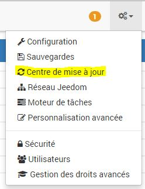
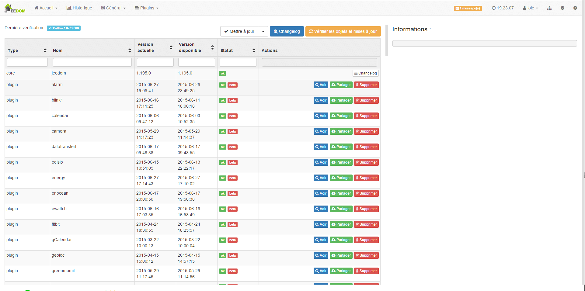
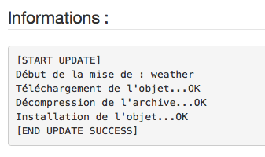

Update Center
=============

Das Aktualisierungszentrum zentralisiert die Gesamtheit der Funktionen von Jeedom und ermöglicht, alle Funktionalitäten von Jeedom auf den neuesten Stand zu bringen, die Grundsoftware, die Plugins, die Widgets, u. s. w. .

Es ist über das Menü Administration → Update Center erreichbar :

Sobald sie darauf sind, sehen sie :

Es zeigt alle installierte Elemente von Jeedom, in tabellarischer Form

> **Tip**
>
> Im Experten-Modus werden alle Elemente angezeigt, ansonsten zeigt es nur Elemente die aktualisiert werden können.

Es gibt insgesamt bis zu 5 Knöpfe, die von Element verfügbar sein können:

-   **sehen** : Ermöglicht, auf der entsprechenden Seite des Marktes das Element einzusehen

-   **Teilen** : Ermöglicht, wenn Sie ein Element geschaffen haben, es auf dem Market zu teilen.

-   **Löschen** : Ermöglicht Elemente zu löschen.

-   **Update** : Ermöglicht Elemente zu aktualisieren.

> **Tip**
>
> Beachten Sie, dass "core:jeedom" das Update der Basissoftware bedeutet.

En haut du tableau se trouvent les boutons de commande. Jeedom se connecte périodiquement avec le Market pour voir si des mises à jour sont disponibles (la date de dernière vérification est indiquée tout en haut du tableau à gauche). Si vous voulez réaliser une vérification manuelle, vous pouvez appuyer sur le bouton "Vérifier les mises à jour".

Die Schaltfläche "Update", um alles von Jeedom zu aktualisieren.

> **Tip**
>
> Sur la branche beta le numéro de version n’est pas toujours mis à jour après chaque modification, il faut donc cliquer sur "Mettre à jour" régulièrement pour être sur d’avoir la dernière version. Ce n’est le cas bien sûr que sur la branche beta.

> **Important**
>
> Vor der Aktualisierung wird Jeedom standardmäßig eine Sicherungskopie erstellen. Bei Problemen beim Anwenden eines Updates wird Jeedom automatisch die zuvor erstellte Sicherung wiederherstellen. Dieses Prinzip gilt natürlich nur für Jeedom Updates, nicht für Plugins.

Durch Klicken auf den Pfeil neben der Schaltfläche "Update" gibt es eine Reihe von Optionen zum Aktualisieren.

-   **Tout forcer** : met à jour Jeedom et les plugins en mode forcé c’est-à-dire que même s’il y a une erreur Jeedom continue et ne restaurera pas la sauvegarde

-   **Plugins seulement** : met à jour seulement les plugins

-   **Plugins seulement forcés** : met à jour seulement les plugins en mode forcé (continue en cas d’erreur)

-   **Jeedom seulement** : met à jour seulement Jeedom

-   **Jeedom seulement forcés** : met à jour seulement Jeedom en mode forcé c’est-à-dire que même s’il y a une erreur Jeedom continue et ne restaurera pas la sauvegarde

-   **Réappliquer une mise à jour** : permet de réappliquer une mise à jour. Toutes les mises à jour ne peuvent être réappliquées. En cliquant dessus vous obtenez cette fenêtre :

Ici vous choisissez d’abord la mise à jour à réappliquer, si c’est en mode forcé ou non (vivement conseillé dans ce cas là) et s’il faut aussi appliquer les mises à jour suivantes (vivement conseillé aussi).

Schließlich auf der rechten Seite der Seite, die "Informationen", um den Status der Aktualisierung zu verfolgen. Diese Informationen sind, im Falle eines Problems der Mannschaft mitzuteilen.

Update Einstellungen
====================

Es ist möglich im Menü Administration → Konfiguration und dann im Teil "Markt und Updates" bestimmte Parameter für die Updates zu konfigurieren :

Hier haben wir :

-   **Adresse** : Adresse des Marktes, sie darf nicht geändert werden, außer das Support-Team fordert sie auf, es zu tun.

-   **Benutzername** : Markt Benutzername

-   **Mot de passe** : mot de passe du Market

-   **Installer automatiquement les widgets manquants** : indique à Jeedom d’installer automatiquement les widgets dont il a besoin (attention à bien avoir installé le plugin Widget)

-   **Voir les modules en beta (à vos risques et périls)** : Permet de voir les plugins, widgets… qui sont en beta et de les installer

-   **Eine Sicherung vor der Aktualisierung machen** : Sagt Jeedom, eine Sicherung vor jeder Aktualisierung zu machen (sehr empfohlen)

-   **Mettre à jour automatiquement** : indique à Jeedom d’installer automatiquement les mises à jour (non recommandé)

-   **Zweig** : Sagt Jeedom welche Version zu benutzen ist, die Stabile oder Entwickler Version (beta)

> **Important**
>
> Vermeiden sie die Beta-Plugins mit einem stabilem Jeedom und umgekehrt zu mischen. Viele Fehler werden dem Support-Team gemeldet, weil diese Regel nicht eingehalten wird.

> **Important**
>
> Il n’est pas possible de choisir l’heure de la vérification des mises à jour ou le moment de la mise à jour en automatique, cela pour permettre une répartition des demandes sur le Market. A noter toutefois que ces deux actions ont forcément lieu entre 6h00 et 7h59.

Update in der Kommandozeile
===========================

Es ist möglich, ein Jeedom Update direkt in SSH zu erstellen, so wird es gemacht :

    sudo php /usr/share/nginx/www/jeedom/install/install.php

Dies sind die möglichen Einstellungen :

-   **mode** : erzwingen, um eine Aktualisierung im Zwangs Modus in Gang zu bringen (berücksichtige keine Fehler)

-   **version** : Versionsnummer, die Änderungen seit dieser Version erneut anwenden

Zum Beispiel kann ein Zwangs Update erneut angewendet werden seit der Änderungen 1.188.0 :

    sudo php /usr/share/nginx/www/jeedom/install/install.php mode=force version=1.188.0

Achtung nach einem Update auf der Komandozeile müssen Sie die Rechte an den Jeedom Ordner erneut anwenden :

    chown -R www-data:www-data /usr/share/nginx/www/jeedom
