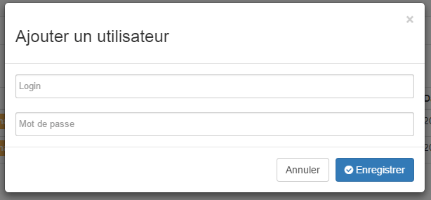

Hier ist die Seite, wo man die Liste der Benutzer definieren kann, die befugt sind, sich in Jeedom einzuloggen und auch ihre Administratorrechte definieren kann.

Erreichbar unter Einstellungen → Benutzer :

Sobald sie darauf sind, sehen sie :

Oben, haben Sie eine Schaltfläche zum hinzufügen eines temporären Kontos (z. B. um Zugang zu unterstützen). Sobald Sie darauf klicken, erhalten Sie eine URL, die Sie an die Person senden, die es benutzen will. Dieses Konto hat eine Lebensdauer von 24 Stunden. Sie haben auch eine Schaltfläche zum Hinzufügen eines Benutzers. Wenn Sie darauf klicken, bittet Jeedom Sie das Kennwort und den Anmeldenamen des Benutzers einzugeben :

Darunter haben Sie eine Tabelle :

-   **Benutzername** : der Anmeldename des Benutzers

-   **Aktion** : Dort besteht die Möglichkeit, das Kennwort des Benutzers zu ändern oder sein Konto zu löschen

-   **Aktiv** : die Möglichkeit, das Konto zu deaktivieren

-   **Rechte** : die Möglichkeit das der Benutzer in den Administrator-Modus wechseln kann oder nicht (Ermöglicht den Zugriff auf alles, Jeedom Konfiguration, Erstellung von Szenarien, Plugin Management, Konfiguration der Geräte, Design, Ansichten …)

-   **API-Schlüssel** : der persönlichen Benutzer API-Schlüssel

-   **Datum der letzten Verbindung** : Datum der letzten Anmeldung des Benutzers. Achtung hier ist die eigentliche Verbindungszeit ; also, wenn Sie Ihren Computer registrieren, wird die Verbindung Datum jedes Mal aktualisiert wenn Sie zurückkommen.

-   **Direkter Zugang** : zeigt eine URL an, um sich direkt mit dem betreffenden Jeedom Konto zu verbinden

> **Tip**
>
> Im Falle einer Änderung, vergessen Sie nicht auf "Speichern" zu klicken.

