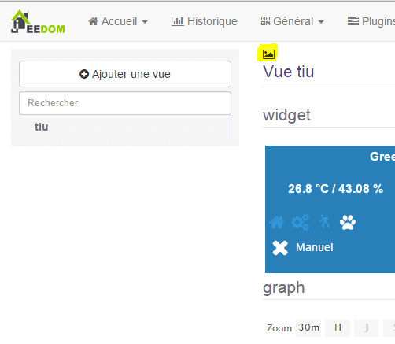
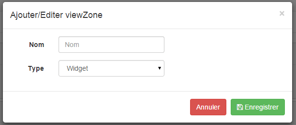

In der Ansicht können einfache persönliche Ansichten erstellt werden, sie sind nicht so fortgeschritten wie die im Design, aber es erlaubt in wenigen Minuten eine eigene Anzeige zu haben.

Die Ansichten sind über das Menü Mein Haus → Ansicht erreichbar :

> **Tip**
>
> Wie Sie auf der Aufnahme sehen können, ist es möglich, direkt zu einer Ansicht über das Untermenü zu gehen.

> **Tip**
>
> Sie können ein Profil in der Standardansicht wählen, wenn sie auf das Menü Ansichten klicken.

Die Ansichten
=============

Dies ist ein Beispiel einer Ansicht :

Wie das Bildschirmfoto von der Ansicht zeigt, kann man ebenso gut Widgets sowie grafische Darstellungen (die aus mehreren Daten zusammengestellt sein können) anzeigen lassen.

Auf dieser Seite finden wir oben links eine Schaltfläche zum ein- oder ausblenden der Ansichten Liste, sowie die Schaltfläche zum hinzufügen (Jeedom wird Sie nach einen Namen fragen und Sie auf die Bearbeitungsseite schicken) :

> **Tip**
>
> Sie können in Ihrem Profil diese Option ändern, damit die Liste der Ansichten standardmäßig sichtbar ist.

Mit der Schaltfläche oben rechts können Sie die aktuelle Ansicht bearbeiten.

Ansicht hinzufügen/bearbeiten
=============================

Hier ist die Seite zum hinzufügen/bearbeiten von Ansichten :

Prinzip  
Das Prinzip ist ganz einfach : eine Ansicht ist aus mehreren Bereichen zusammengesetzt, (Sie können so viele einsetzen, wie Sie möchten). Jeder Bereich ist ein Diagramm- oder Widget-Typ : Entsprechend dem Typ können Sie Widgets oder Diagramme in den Bereichen einsetzen.

> **Tip**
>
> Es ist möglich, die Reihenfolge der Bereiche zu verschieben, indem sie Ziehen/Ablegen.

Auf der linken Seite befindet sich die Liste der Ansichten sowie eine Schaltfläche zum hinzufügen.

Im Zentrum haben Sie eine Schaltfläche, zum umbenennen einer Ansicht, eine Schaltfläche Bereich hinzufügen, eine Schaltfläche zum Speichern (vergessen Sie nicht zu speichern, bevor Sie auf "Ergebnis sehen" klicken) und eine Schaltfläche zum löschen der Ansicht.

Nachdem die Taste "Bereich hinzufügen" geklickt wurde, bittet Sie Jeedom einen Namen und den Typ einzugeben :

Bereich Widget-Typ
------------------

Der Bereich vom Widget-Typ ermöglicht es Widgets hinzuzufügen, der hat auf der Rechten Seite 4 Schaltflächen :

-   **Breite** : definiert die Breite des Bereiches (nur im Desktop-Modus)

-   **Widget hinzufügen** : zum hinzufügen von Widgets, die in dem Bereich angezeigt werden sollen

-   **Bearbeiten** : erlaubt den Namen den Bereich zu ändern

-   **Löschen** : um den Bereich zu löschen

> **Tip**
>
> Sie können ein Widget direkt löschen, indem sie auf den Mülleimer vor diesem klicken.

> **Tip**
>
> Sie können durch Ziehen/Ablegen die Reihenfolge der Widgets im Bereich ändern.

Wurde die Schaltfläche zum hinzufügen von einem Widget einmal angeklickt, erscheint folgendes Fenster :

In diesem Fenster müssen Sie nur die Objekte/Geräte zum hinzufügen für den Bereich auswählen und Bestätigen.

Bereich Diagramm-Typ
--------------------

Der Bereich vom Diagramm-Typ, erlaubt es Ihnen Diagramme zu Ihrer Ansicht hinzuzufügen, er besitzt die folgenden Optionen :

-   **Periode** : Sie ermöglicht es, die Anzeigeperiode von Diagrammen (30 min, 1 Tag, 1 Woche, 1 Monat, 1 Jahr oder alle) zu wählen

-   **Breite** : definiert die Breite des Bereiches (nur im Desktop-Modus)

-   **Widget hinzufügen** : zum hinzufügen von Diagrammen , die in dem Bereich angezeigt werden sollen

-   **Bearbeiten** : erlaubt den Namen den Bereich zu ändern

-   **Löschen** : um den Bereich zu löschen

> **Tip**
>
> Sie können ein Diagramm direkt löschen, indem sie auf den Mülleimer vor diesem klicken.

> **Tip**
>
> Sie können durch Ziehen/Ablegen die Reihenfolge der Diagramme im Bereich ändern.

Wurde die Schaltfläche zum hinzufügen von einem Diagramm einmal angeklickt, erscheint folgendes Fenster :

Einmal hinzugefügt, haben Sie Zugang zu Konfigurationsoptionen : die verschiedenen Optionen werden [hier](https://jeedom.com/doc/documentation/core/fr_FR/doc-core-history.html#_graphique_sur_les_vues_et_les_designs) erklärt.

