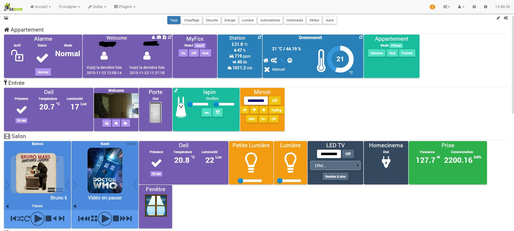
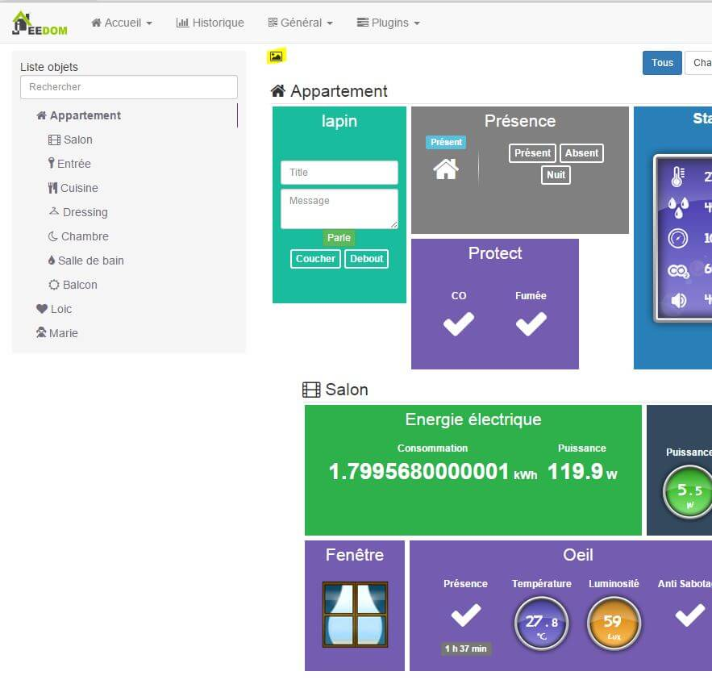

Une des pages principales de Jeedom affiche un compte-rendu de toute votre domotique. Ce compte-rendu (contrairement aux vues et design) est auto-généré par Jeedom.

It is accessible by clicking on Main → Dashboard

> **Tip**
>
> Comme vous pouvez le voir sur la capture il est possible d’aller directement sur un objet de votre domotique. Cela permet de n’avoir que les équipements qui vous intéressent et donc de charger la page plus rapidement

Voici un exemple de dashboard

Vous avez en haut à gauche une petite icône pour faire afficher/masquer l’arbre des objets :

Au milieu vous pouvez choisir de ne filtrer que sur certains types d'équipements :

A droite un premier bouton pour passer en mode édition, pour par exemple modifier l’ordre des widgets (à l’aide d’un cliqué déposé sur le widget), vous pouvez aussi dans ce mode édition redimensionner certains widgets et réorganiser l’ordre des commandes à l’intérieur de celui-ci

Puis un bouton pour afficher/masquer les scénarios :

> **Tip**
>
> Il est possible à partir de votre profil de configurer Jeedom pour que l’arbre des objets et/ou les scénarios soit visible par défaut lorsque vous arrivez sur le Dashboard

