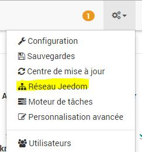

Page permettant d’interconnecter plusieurs Jeedom en mode maître/esclave. Cette possibilité permet par exemple de déporter le zwave, le rfxcom, l’enOcean ou le GSM sur d’autres raspberry pi ou Jeedom Mini. Vous pourrez aussi à partir de cette page avoir un statut de vos Jeedom esclave, consulter leurs logs, les mettres à jour, les arrêter…

Le réseaux Jeedom
=================

Accessible depuis Général → Administration → Réseaux Jeedom :

Une fois dessus, vous avez :

Cette page liste tous vos esclaves et permet de voir en details chacun d’entre eux avec certaines possibilités de configuration et un accès direct à ceux-ci.

> **Important**
>
> Cette documentation ne décrit pas volontairement tous les menus disponible car ils ne sont qu’un report des menus existants sur le maître pour centraliser la configuration. Il faut donc se reporter aux docs existantes pour avoir le détail de fonctionnement.

Configuration
=============

La configuration est assez simple, il faut tout d’abord décider le systeme maître et esclave. Ensuite, sur l’esclave, il faut aller dans Général → Administration → Configuration puis dans la partie "Configuration réseaux" et cliquer sur esclave :

Il faut ensuite installer les plugins voulus en déportés (attention tous les plugins ne sont pas forcément compatibles), les activer et les configurer.

Ensuite, du coté du maître, vous devez aller dans Général → Administration → Configuration puis dans la partie "Configuration réseaux", remplir la partie "Accès interne" :

Voici le detail :

-   **Protocole** : protocole utilisé (en générale HTTP)

-   **Adresse/IP** : IP (ou adresse mais en interne c’est assez rare) du maître (en général de la forme 192.168.xxx.xxx)

-   **Complement** : si vous avez une Mini, Center ou Pro vous n’avez rien a mettre sinon vous devez mettre /jeedom (si présent dans l’adresse après l’IP)

-   **Port** : 80 si vous n’avez pas modifié la configuration nginx

Ensuite, toujours sur le maître, aller sur Général → Administration → Réseaux Jeedom et faites "Ajouter un Jeedom" :

-   donnez-lui un nom

-   indiquez l’IP de l’esclave

-   indiquez le complément si nécessaire (ex : /jeedom si vous n’avez pas une Mini/Center/Pro et que vous utilisez le /jeedom pour vous connecter sur l’esclave)

-   la clef API de l’esclave (elle se trouve sur l’esclave dans Général → Administration → Configuration)

-   Save

Si vous avez un message vous disant que c’est OK, alors tout est lié, normalement le maître devrait détecter automatiquement les plugins de l’esclave.

> **Important**
>
> En cas de souci avec un plugin en mode deporté, reportez-vous à sa documentation.

Troubleshooting
===============

Erreur 404 lors de la sauvegarde  
C’est qu’il y a une erreur sur la configuration réseau du maître (en général).

