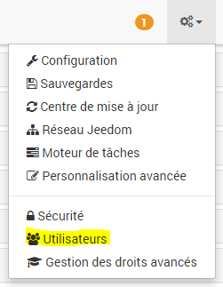

C’est ici que l’on va pouvoir définir la liste des utilisateurs autorisés à se connecter à Jeedom, mais également leurs droits d’administrateur

Accessible par Administration → Utilisateurs :

Once above, you get:

En haut vous avez un bouton pour ajouter un compte temporaire (pour par exemple fournir un accès au support). Une fois que vous cliquez dessus, vous allez avoir une URL à envoyer à la personne devant l’utiliser. Ce compte a une durée de vie de 24h. Vous avez aussi un bouton pour ajouter un utilisateur. Si vous cliquez dessus, Jeedom vous demandera le mot de passe et le login de l’utilisateur :

Below there is a board :

-   **User name** : user login

-   **Actions** : La possibilité de changer le mot de passe de l’utilisateur ou de supprimer son compte

-   **Actif** : la possibilité de désactiver le compte

-   **Droits** : la possibilité de passer ou non l’utilisateur en mode administrateur (permet d’avoir accès à tout ce qui est configuration de Jeedom, création des scénarios, gestion des plugins, configuration des équipements, des designs, des vues…)

-   **Clef API** : clef API personnelle de l’utilisateur

-   **Date de dernière connexion** : date de dernière connexion de l’utilisateur. Attention, ici c’est la date de connexion réelle; ainsi si vous enregistrez votre ordinateur, la date de connexion n’est pas mise à jour à chaque fois que vous y retournez.

-   **Accès direct** : donne une URL pour se connecter directement à Jeedom avec le compte en question

> **Tip**
>
> En cas de changement, n’oubliez pas de cliquer sur "sauvegarder".

