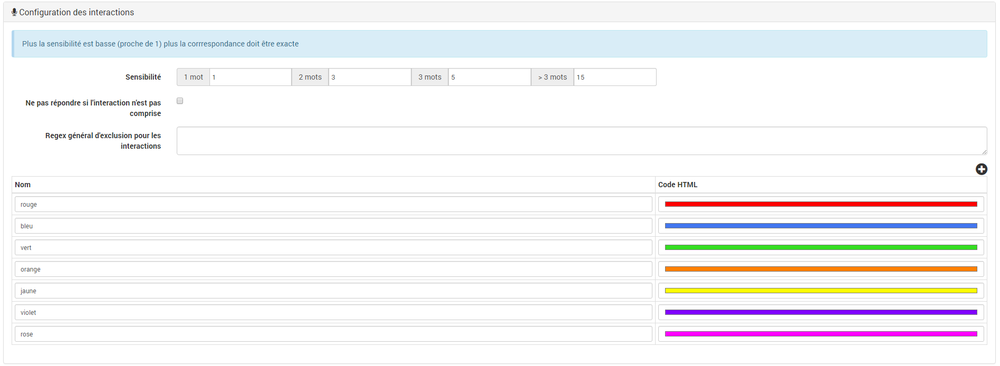
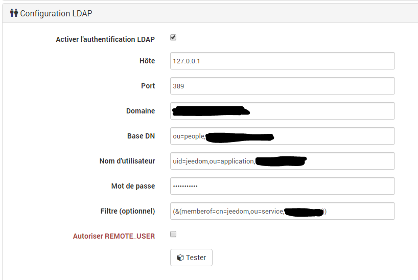
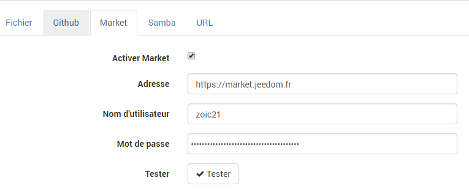
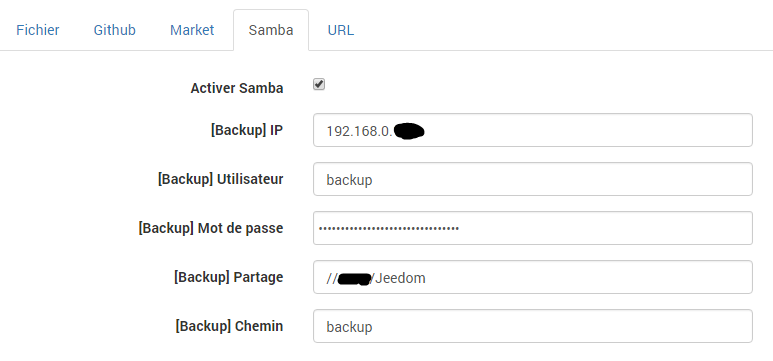

Aquí están la mayoría de los ajustes de configuración. Muchos de ellos vienen pre configurados de manera predeterminada.

Puede acceder a través de Administración → Configuración

Algunos parámetros pueden no ser visibles si no ha seleccionado el modo experto,

Configuraciónn general
======================

En esta ficha, encontrará información general sobre Jeedom:

-   \* Nombre de Jeedom\* : se puede reutlizar en los escenarios o permite identificar un backup

-   \* \* Clave API: la clave de la API a utilizar para cualquier aplicación en la API de Jeedom

    -   Clave de API de Pro \*: utilizado para conectar con el sistema de gestión de Parque

-   **Sistema**: modelo de hardware

-   **Clave de instalación** : clave de hardware de su Jeedom en el market. Si tu Jeedom no aparece en la lista de tus Jeedom en el market, es recomendable hacer clic en este botón

-   **Idioma** : Idioma de su Jeedom

-   **Duración de sesión (tiempo)**: Duración de la sesión en PHP; se aconseja no modificar este valor

-   **Fecha y hora**: Su zona horaria

-   **Servidor de tiempo opcional** : permite añadir un servidor de tiempo opcional (reservado para expertos)

-   \* Ignorar la verificación horario \* : indica a Jeedom que no verifique si la hora es coherente. Útil por ejemplo si no conecta Jeedom a Internet y no dispone de ninguna batería RTC

-   **Modo**: Modo de Jeedom, maestro o esclavo. Atención, al pasar a esclavo, todos los dispositivos, escenas, diseños… serán eliminados

==Componentes de Jeedom

Esta sección le permite activar o desactivar algunos componentes del nucleo de Jeedom

-   \* \* Permisos avanzados: desactiva la gestión de permisos avanzado (su uso incorrecto puede hacer Jeedom mas vulnerable)

-   \* Seguridad\*: Habilitar o no la seguridad contra la piratería (Acceso mediante fuerza bruta).

Base de datos
=============

-   **Acceso al interface de administración**: Permite acceder al interface de administración de la base de datos. La información a completar está más abajo

-   **Máquina (hostname)**: Ubicación de la base de datos

-   **Usuario**: Nombre de usuario utilizado por Jeedom

-   **Contraseña**: Contraseña de accesso a la base de datos utilizada por Jeedom

Configuración de red
====================

Parte muy importante en Jeedom, debe ser capaz de configurarlo correctamente, de lo contrario una gran cantidad de plugins pueden no ser no funcionales.

-   **Acceso a internet**: Información para acceder a Jeedom desde un equipo de la misma red

    -   **Protocolo**: El protocolo a utilizar, normalmente HTTP

    -   **Dirección URL o IP**: IP de Jeedom para informar

    -   **Complemento (por ejemplo: /jeedom)**: ruta adicional de la URL (escriba /jeedom). Para saber si debe definir este valor, vea si necesita añadir /jeedom después de la IP.

    -   **Puerto**: El puerto, generalmente 80. Atención, cambiar el puerto aquí no cambia el puerto real de Jeedom, que seguirá siendo el mismo.

    -   **Estado** : indica si la configuración de la red interna es correcta

    -   Acceso externo\* : información para conectar a Jeedom desde el exterior. Rellenar sólo si no utilizas el DNS Jeedom

    -   **Protocolo**: Protocolo a utilizar para el acceso desde el exterior

    -   **Dirección URL o IP**: Dirección o IP externa si es fija

    -   **Complemento (por ejemplo: /jeedom)**: ruta adicional de la URL (escriba /jeedom). Para saber si debe definir este valor, vea si necesita añadir /jeedom después de la IP.

-   \*Administracion avanzada: puede no aparecer dependiendo de la compatibilidad con el hardware

    -   **Desactivar la gestión de redes en Jeedom**: Jeedom no supervisará la red (deberá ser activado si Jeedom no está conectado a ninguna red)

-   **Proxy market** : permite el acceso remoto a su Jeedom sin necesidad de un servidor DNS, una IP fija o puertos abiertos en su dispositivo

    -   **Usar DNS Jeedom**: Activars DNS Jeedom (se requiere disponer de un service pack)

    -   Estado DNS\* : estado de http DNS

    -   **Gestión**: Permite detener y reiniciar el servicio DNS

> **Tip**
>
> Si accede a través de HTTPS, el puerto por defecto es el 443 y si lo hace a través de HTTP, el puerto por defecto es el 80

Esta parte es para mostrar el entorno Jeedom: un cambio en el puerto o IP, no va a cambiar el puerto y la IP de Jeedom. Para ello debe conectarse por SSH y editar el archivo/etc/network/interfaces para la IP y los archivos etc/nginx/sitios-disponible/default y etc/nginx/sitios-disponible/default\_ssl (para HTTPS). En caso de manipulación inadecuada de su configuración, el equipo de Jeedom no será responsable y podrá denegar cualquier solicitud de soporte.

Puede ver el [aquí](http://blog.domadoo.fr/2014/10/15/acceder-depuis-lexterieur-jeedom-en-https) un tutorial para instalar un certificado auto firmado

Si no le es posible hacer funcionar DNS Jeedom, revise la configuración del firewall y el filtro parental de su router

Configuración de colores
========================

El ajuste de color de los widgets se realiza en función de la categoría a la que pertenece el widget que se define en la configuración de cada módulo (ver plugin de Z-Wave, RFXCOM… etc). Las categorías incluyen calefacción, luces, automatización etc …

Para cada categoría se puede elegir un color diferente para la versión de escritorio y la versión móvil. También hay 2 tipos de colores, los colores de fondo de los widgets y colores de comandos color cuando el widget es de tipo gradual, por ejemplo, las luces, persianas, temperaturas.

Al hacer clic en el color, se abre una ventana que le permite seleccionar el color.

También puede ajustar la transparencia de los widgets en una forma global (que será el valor por defecto, es posible cambiar este valor widget por widget)

> **Tip**
>
> No olvide guardar los cambios después de hacer modificaciones

Configuración de comandos
=========================

-   **Histórico**: Ver [aquí](https://jeedom.fr/doc/documentation/core/fr_FR/doc-core-history.html#_configuration_général_de_l_historique)

-   **Push**

    -   **URL global de push**: le permite añadir una dirección URL para invocarla en caso de actualización de un comando. Puede utilizar la etiqueta: \#valor\# para el valor del comando, \#cmd\_name\# para el nombre del comando, \#cmd\_id\# para el identificador único del comando, \#humanname\# para el nombre completo del comando (por ejemplo \#[Salle de bain][Hydrometrie][Humidité]\#)

Configuración de interacciones
==============================

Ver [aquí](https://jeedom.fr/doc/documentation/core/es_ES/doc-core-interact.html#_configuration_2)

Configuración de logs y mensajes
================================

Ver [aquí](https://jeedom.fr/doc/documentation/core/fr_FR/doc-core-log.html#_configuration)

Configuración LDAP
==================

-   **Activar autentificaación LDAP**: Activar la autentificación a través de Active Directory (LDAP)

-   **Anfitrión**: Servidor de Active Directory

-   **Dominio**: Dominio de Active Directory

-   **Base DN**: Base DN de Active Directory

-   **Nombre de usuario**: Nombre de usuario para que Jeedom se conecte a Active Directory

-   **Contraseña**: Contraseña para que Jeedom se conecte a Active Directory

-   **Filtro (opcional)**: Filtro de Active Directory (para la gestión de grupos por ejemplo)

-   **Permitir REMOTE\_USER**: Activar REMOTE\_USER (Utilizado en SSO por ejemplo)

Configuración de dispositivos
=============================

-   **Número de fallos antes de la desactivación del dispositivo**: Número de errores de comunicación con el dispositivo antes de su desactivación (un mensaje le avisará si esto ocurre)

    -   Umbrales de batería \*: le permite administrar los umbrales de alertas globales sobre las baterías

Actualización y ficheros
========================

-   Fuente de actualización :

-   Hacer una copia de seguridad antes de la actualización

-   Comprueba automáticamente si hay actualizaciones

Depósitos
=========

Los repositorio son espacios de almacenamiento (y servicio) para poder poner copias de seguridad, obtener plugins, recuperar la base de jeedom…

Market
------

Servidor de repositiorios conectados al market de Jeedom, es recomendable utilizar este repositorio. Atención cualquier solicitud de soporte podrá ser denegada si usted utiliza otro repositorio diferente a este.

-   **Dirección**: Dirección del market

-   **Nombre de usuario**: Su nombre de usuario para el market

-   **Contraseña**: Su contraseña para el market

Archivo
-------

Repositorio para activar el envio de ficheros de plugin

Github
------

Repositiorio utilizado para conectar Jeedom a Github

-   **Token** : Token para el acceso al repositorio privado

-   \*Usuario u organización del repositorio para el core de Jeedom \*.

-   \*Nombre del repositorio para el core de Jeedom \*.

-   **Branch para el core de jedoom**

Samba
-----

Repositorio para enviar un backup automático de jeedom en un recurso compartido de samba (ej. NAS Synology)

-   **[Backup] IP** : IP del servidor Samba

-   \*[Usuario backup] \*: Nombre de usuario para la conexión (conexiones anónimas no son posibles)

-   **[Contraseña backup]** : contraseña del usuario

-   **[Backup] recurso** : La ruta del recurso compartido (Asegúrese de indicar la ruta compartida correcta)

-   \*[Ruta Backup] \*: Ruta para compartirr (para ser relativa), debe existir

Si le chemin d’accès à votre dossier de sauvegarde samba est : \\\\192.168.0.1\\Sauvegardes\\Domotique\\Jeedom Alors IP = 192.168.0.1 , Partage = //192.168.0.1/Sauvegardes , Chemin = Domotique/Jeedom

Tal vez necesite instalar el paquete smbclient para que el repositorio funcione

Jeedom debe poder escribir en esta carpeta, y debe estar vacía por defecto (es decir, que antes de hacer la configuración y enviar el primer Backup, la carpeta no puede contener ningún archivo o carpeta)

URL
---

-   **URL core Jeedom**

-   **URL version core Jeedom**

