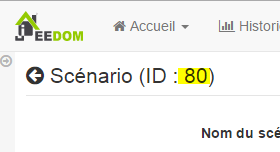

Jeedom proporciona a los desarrolladores y usuarios una API completa para poder controlar cualquier objeto conectado.

Hay 2 APIs disponibles: una piloto orientada a desarrollado en JSON RPC 2.0 y otra vía URL y HTTP.

Esta API se utiliza muy fácilmente a través de solicitudes HTTP vía URL. Para simplificarla al máximo, la API solo utiliza 2 tipos de solicitudes HTTP.

Atención si su versión es DIY es necesario añadir /jeedom después de las direcciones ip.

Manejo de las escenas
=====================

La primera consulta se utiliza sólo para activar una escena

Aquí le damos la URL = [http://IP\_JEEDOM/core/api/jeeApi.php?apikey=\#APIKEY\#&type=scenario&id=\#ID\#&action=\#ACCIÓN](http://IP_JEEDOM/core/api/jeeApi.php?apikey=#APIKEY#&type=scenario&id=#ID#&action=#ACCIÓN)\#

\\\#IP\_JEEDOM \# corresponde a la url de acceso a Jeedom. Es la dirección de internet que utilizas para acceder a Jeedom desde fuera (a menos que estés conectado a tu red local).

\#API\_KEY \# corresponde a tu API key, es único para su instalación. Para saber cual es, debe activar el modo experto. Ir a Menú superior, luego *Administración* y en *Configuración General*, verá una línea con la clave API.

\#ID \# es el id de una escena. El ID se encuentra en la página de escenas… (No olvides activar el modo experto)

\#ACCIÓN \# corresponde a la acción que desea aplicar a una escena. Las ordenes disponibles son: "start" comenzar una escena, "stop" para detener una escena, "desactivar" para deshabilitar una escena, "activar" para activar una escena.

Manejo de ordenes
=================

La segunda consulta permite simplemente controlar todos los otros módulos de Jeedom (módulo domotica/plugin etc.).

Aquí le damos la URL = [http://\#IP\_JEEDOM\#/jeedom/core/api/jeeApi.php?apikey=\#APIKEY\#&type=cmd&id=\#ID](http://#IP_JEEDOM#/jeedom/core/api/jeeApi.php?apikey=#APIKEY#&type=cmd&id=#ID)\#

\#IP\_JEEDOM\# y \#API\_KEY\# se utilizan en la misma forma que antes.

\#ID\# es el id que desea manejar o recibir información.

La forma más sencilla de obtener esta dirección URL es ir la página de resumen de domótica, buscar el comando y a continuación, abrir configuración avanzada y ahí podrás ver una dirección URL que contiene todo la cadena de ejecución en función del tipo y subtipo del comando. Ver [ici](https://jeedom.com/doc/documentation/core/fr_FR/doc-core-display.html#_informations_2)

