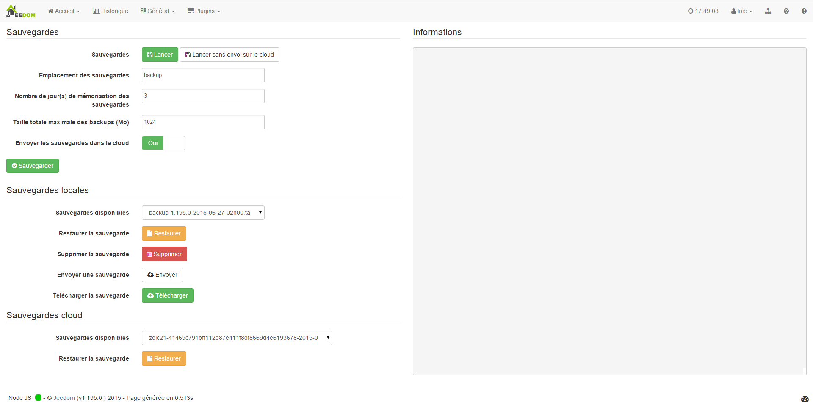

La copia de seguridad y restauración de Jeedom permite guardar y restaurar en local o en otros Jeedom.

Configuración
=============

Acceso desde Administración → copia de seguridad:

Esta página permite la gestión de copias de seguridad:

En esta página puede encontrar a la izquierda la configuración y botones de acción y a la derecha el estado en tiempo real de la acción en curso (backup o restore), si se ha iniciado alguna.

A la izquierda:

-   Copias de seguridad \*.

-   Copia de seguridad \*: permite iniciar una copia de seguridad inmediatamente (útil si usted quiere hacer un cambio crítico, esto le permitirá volver atrás). También tiene un botón para iniciar una copia de seguridad sin enviar el archivo a la nube (requiere un suscripción, ver más abajo). El envío del archivo puede llevar tiempo, por lo tanto esto puede acelerar el proceso un poco.

-   Ubicación de copias de seguridad \*: lugar donde Jeedom pone las copias de seguridad, se recomienda no cambiar. Si usted está en la ruta de acceso relativa, así que su origen es el lugar donde Jeedom está instalado (/ usr/share/nginx/www/jeedom).

-   Número de día (s) de respaoldo de copias de seguridad \*: número de días de respaldo a mantener. Una vez finalizado este período se eliminan copias de seguridad anteriores. PRECAUCIÓN No coloque un número de días demasiado alto, de lo contrario usted puede llenar el sistema de archivos.

-   Tamaño máximo total de copias de seguridad (MB) \*: permite limitar el tamaño total de las copias de seguridad. Si se supera este valor Jeedom eliminará los anteriores. Asegúrese de estar por debajo del tamaño máximo de copias de seguridad.

-   Enviar backups en la nube \*: Indica a Jeedom que envie los Backups al Market, debe haber abonado la suscripción.

-   Copia de seguridad local \*.

-   **Copias de seguridad Disponibles**: lista de copias de seguridad disponibles

-   Restaurar desde copia de seguridad \*: lanza la restauración seleccionando una copia de seguridad anterior

-   \*Eliminar copia de seguridad \*: elimina las copias de seguridad seleccionados, realizadas con anterioridad

-   Enviar una copia de seguridad \*: le permite a Jeedom cargar un archivo de copia de seguridad (permite por ejemplo, restaurar desde un archivo previamente salvado, en un nuevo Jeedom o tras una reinstalación)

-   \*Descargar backup \*: le permite descargar el archivo de una copia de seguridad anterior

    -   \* Nube de backups \*.

-   \*Copias de seguridad disponibles \*: lista de copias de seguridad disponibles ne la nube

-   \*Restaurar desde copia de seguridad \*: inicia la restauración de una copia de seguridad de en la nube

> **Tip**
>
> Durante una reinstalación de Jeedom y habiendo abonado la suscripción de copia de seguridad en la nube, usted tiene derecho en su nuevo Jeedom introducir su cuenta del Market y luego venir aquí para iniciar la restauración.

> **Tip**
>
> Es posible, en caso de problemas, realizar una copia de seguridad en línea de comandos: *sudo php usr/share/nginx/www/jeedom/install/backup.php*

> **Tip**
>
> También puede restaurar una copia de seguridad desde la línea de comandos (por defecto Jeedom restaura la copia de seguridad más reciente en el directorio de copia de seguridad): *sudo php usr/share/nginx/www/jeedom/install/restore.php*

¿Que es lo que se salva?
========================

Durante una copia de seguridad, Jeedom guardará todos sus archivos y la base de datos. Contiene por lo tanto de su configuración (equipo, ordenes, historial, escenas, diseño…).

A nivel de los protocolos, sólo Z-Wave (OpenZwave) es un poco diferente porque no es posible guardar las inclusiones. Estos se incluyen directamente en el controlador, por lo tanto, mantener el mismo para todo.

Copia de seguridad en la nube
=============================

El backup en la nube permite a Jeedom enviar copias de seguridad directamente al Market. Esto le permite restaurar fácilmente y asegurarse de no perderlos. El Market mantiene las últimas 14 copias de seguridad. Para suscribirse ir a tu perfil en la página de Market:

Entonces en la pestaña mis copias de seguridad:

Desde esta página, usted puede recuperar una copia de seguridad o comprar una suscripción (para 1, 3, 6 o 12 meses).

> **Tip**
>
> Puedes poner un nombre más adecuado a tus de copia de seguridad en la pestaña "My Jeedoms" indicando un nombre.

Frecuencia de los backups
=========================

Jeedom realiza una copia de seguridad cada día a las 2:00 de la mañana. Puede modificarse (esta es la copia de seguridad Jeedom) pero no es recomendable porque este horario se calcula en relación con la carga de trabajo y el tiempo de la copia de seguridad del Market.

Caso de un esclavo
==================

El caso de un esclavo es algo especial, porque él enviará cada backup al maestro (y en el Market si tienes una suscripción para el servicio de cloud backup). Usted puede por lo tanto desde el maestro recuperar una copia de seguridad del esclavo que se instale en otro esclavo por ejemplo.

