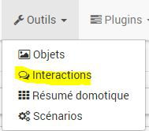
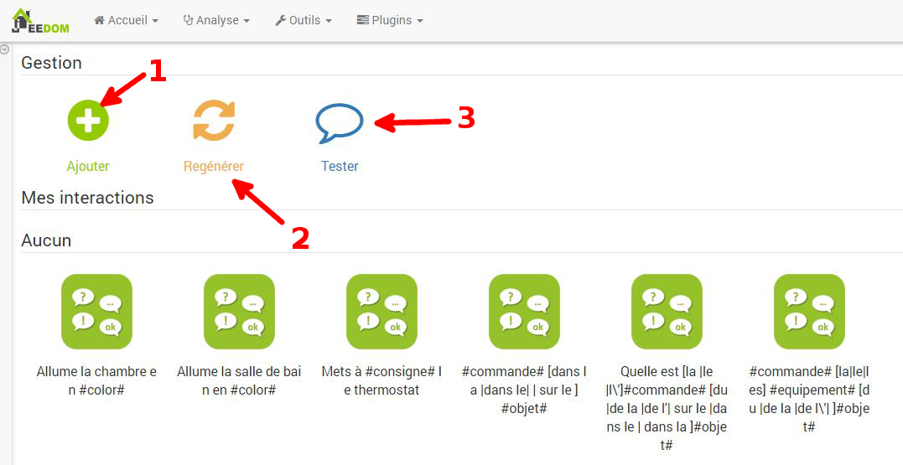
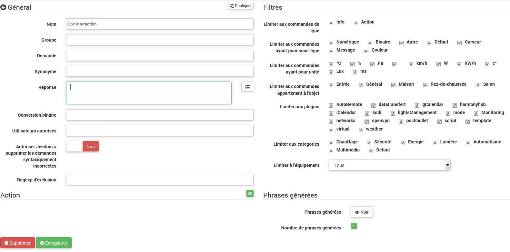
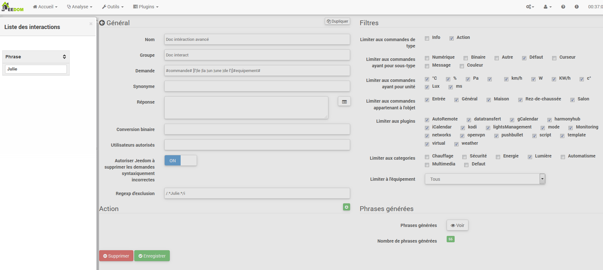
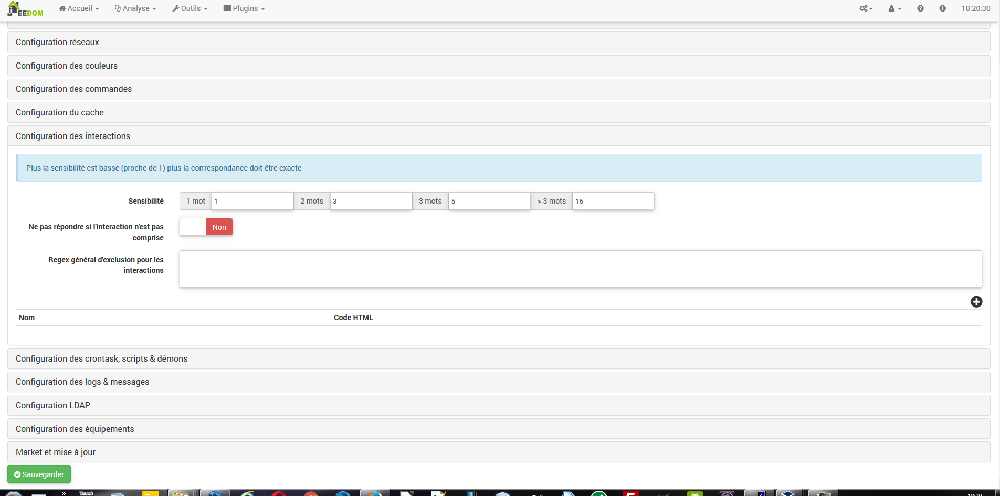
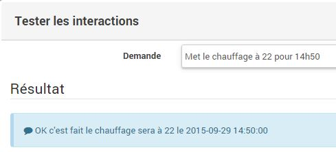
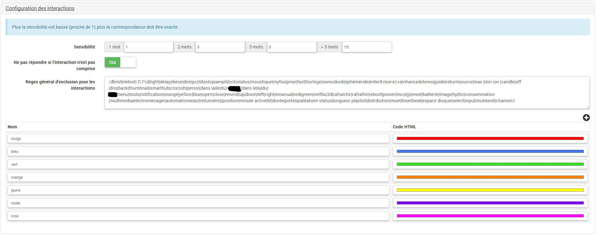

Le système d’interaction dans Jeedom permet de réaliser des actions à partir de commandes textes ou vocales.

Tipo de comandos:

-   acción: ejecutar un comando ejemplos: activar o desactivar una lámpara, alarma, calefacción, etc….

-   Info : interroger Jeedom avec une commande info pour connaître, par exemple la température du salon, l'état d’un appareil.

Estos comandos pueden obtenerse por:

-   SMS: enviar un SMS para ejecutar comandos (acción) o una pregunta (info).

-   Vocal: dictar una sentencia con Siri, Google Now, SARAH, etc…. Para ejecutar comandos (acción) o una pregunta (info).

-   HTTP: lanzar una dirección URL HTTP que contiene el texto (por ejemplo, Tasker, Slack) para ejecutar comandos (acción) o una pregunta (info).

La importancia de las interacciones se encuentran en la integración simplificada en otro sistema como smartphones, tabletas, otro sistema domótico, ect…

Con un único mecanismo en otro sistema, por tanto, puede controlar cualquier Jeedom, lo que permite una gran flexibilidad y evita errores al cambiar las configuraciones de sus dispositivos como sería el caso con acceso directo a través de la url de cada comando.

Primer paso
===========

Página inicial de interacciones
-------------------------------

Pour accéder à la page d’interaction il faut aller sur Outils → Interactions:

Liste des interactions et action générale :

> **Tip**
>
> Al igual que en muchos lugares en Jeedom, situar el ratón en la zona la izquierda mostrará un menú de acceso rápido (se puede mostrar como "siempre visible" desde la configuración de su perfil).

-   En el la parte superior de la página, hay 3 botones:

    -   1 \* el botón "Añadir" que permite crear una nueva interacción.

    -   **2** Le bouton "Régénérer" qui va recréer toutes les interactions (peut être très long \> 5mn).

    -   **3** Le bouton "Tester" qui permet d’ouvrir un boîte de dialogue pour écrire et tester une phrase.

> **Tip**
>
> Si vous avez une interaction qui génère les phrases pour les lumières par exemple, et que vous ajoutez un nouveau module de commande de lumière, il vous faudra soit régénérer toutes les interactions, soit aller dans l’interaction en question et la sauvegarder de nouveau pour créer les phrases de ce nouveau module.

Crear-editar una interacción
----------------------------

El principio de creación es bastante sencillo, definiremos una oración modelo con el generador, que permitirá a Jeedom crear uno o varios cientos de frases ,que son combinaciones del modelo.

definir la misma forma de las respuestas con un modelo (permite a Jeedom tener respuestas múltiples a una sola pregunta).

También se define un comando a ejecutar si por ejemplo la interacción no está relacionada con una acción, si no con información o si desea realizar una acción particular después (también es posible ejecutar un escenario, revisar varias órdenes…).

Interfaz de configuración
-------------------------

Cette page permet de configurer toutes les interactions orales (via le module SARAH, ou tasker (+ autovoice), voir [ici](https://jeedom.fr/doc/documentation/howto/fr_FR/doc-howto-android.autovoice.html)) ou écrites ( les SMS ou le plugin Slack par exemple…) que l’on peut trouver sur le Market Jeedom.

Una vez creada la interacción, haga clic en una interacción existente para modificarla, se abrirá la página de configuración de la interacción:

Aquí puedes encontrar 2 zonas con varios elementos entre ellos:

-   **General**

    -   **Nombre** : nombre de la interacción (puede estar vacía, el nombre reemplaza el texto de la aplicación en la lista de interacciones).

    -   **Grupo** : grupo de interacción, esto permite organizarlos (puede estar vacio, por lo que pertenecerán al grupo "ninguno").

    -   Aplicación \*: la frase modelo generada (obligatorio).

    -   **Sinónimos** : permite definir sinónimos de los nombres de los comandos.

    -   **Respuesta** : la respuesta a dar.

    -   Conversión Binaria\* : permite convertir los valores binarios en abierto/cerrado por ejemplo (sólo para comandos de tipo información binaria).

    -   **Usuarios autorizados** : limita la interacción a ciertos usuarios (separados por un |).

-   **Filtros (limitar el alcance de la plantilla a los elementos seleccionados)**

    -   **Limitar a órdenes de tipo** : permite utilizar sólo los tipos acciones, información o los 2 tipos.

    -   \* Límita permanente el subtipo \*: permite limitar la generación de uno o más subtipos.

    -   Límitar los comandos por unidad \*: restringe la generación en una más unidades (Jeedom crea la lista automáticamente de las unidades definidas en sus comandos).

    -   **Limitar los comandos pertenecientes al objeto** : permite limitar la generación en uno o más objetos (Jeedom crea la lista automáticamente de los objetos que ha creado).

    -   Limitar el plugin \*: permite limitar la generación en uno o más plugins (Jeedom crea la lista automáticamente de los plugins instalados).

    -   **Limitar categoría** : permite limitar la generación en una o más categorías.

    -   **Límitar dispositivo** : permite limitar la generación a un solo equipo/módulo (Jeedom crea la lista automáticamente de componentes y módulos que tiene).

-   **Acción** : utilizar si quieres uno o más comandos específicos de destino o pasar parámetros específicos.

-   **Frases generadas**

    -   Frases generadas\* : botón que permite ver las frases generadas por frase modelo (debes guardar la interacción para construir o reconstruir las frases).

-   **Número de frases generadas** : número de frases generadas.

Interacción simple
------------------

La forma más sencilla de configurar una interacción es darle un modelo de generador rígido sin variación posible, este método enfocara específicamente con un comando o un script.

En el ejemplo que sigue, puede verse en el campo *Demande* la frase exacta para activar la interacción, para encender la luz del techo del salón.

Podemos ver esta captura la configuración para tener una interacción ligada a una acción específica, esta acción se define en el apartado Acción' de la página.

Puedes imaginar en hacer lo mismo con varias acciones, para encender varias luces en el salón como en el ejemplo que sigue:

En los 2 ejemplos anteriores, la frase modelo, es idéntica, pero las acciones resultantes varían dependiendo de lo que se configure en la parte "Acción", así que puedes con una simple frase de interacción única imaginar acciones combinadas entre varios comandos y varios escenarios (también puede desencadenar escenarios de acción por parte de las interacciones).

> **Tip**
>
> Para agregar un escenario, crear una nueva acción, escribir "scenario" sin acento, presiona tab en el teclado para que aparezca el selector de escenario.

### Interaction multiple commandes

Nous allons ici voir tout l’intérêt et toute la puissance des interactions, avec une phrase modèle nous allons pouvoir générer des phrases pour tout un groupe de commandes.

para mejorar lo que ha hecho anteriormente, eliminar las acciones que hayas agregado y en su lugar en "Aplicación", usaremos las etiquetas \* \#commande\#\* y \* \#equipement\#\*, Jeedom reemplazará estas etiquetas por el nombre de órden y el nombre del dispositivo (se puede ver la importancia de tener nombres de comandos/dispositivos coherentes).

Aquí puedes ver que jeedom ha generado 152 frases de nuestra frase, sin embargo no están muy bien construidas y tienen un poco de todo.

Para hacer la orden para todo, vamos a utilizar filtros (parte derecha de nuestra página de configuración). En este ejemplo queremos generar frases para encender las luces, así que puede desactivar el comando de tipo información (al guardar sólo quedam 95 frases generadas), luego en los subtipos puede mantener marcado por defecto la corresponde tecla de acción (por lo tanto quedan 16 frases).

Es mejor y más natural si tomamos como ejemplo "en la entrada", sería bueno poder transformar esta frase en "ilumina la entrada" o "iluminar la entrada". Para ello Jeedom en el campo de aplicación, podemos generar un campo de sinónimos que nos permitirá nombrar diferentemente el nombre de órdenes en nuestras frases, aquí, tengo incluso "on2" en módulos que pueden controlar 2 salidas.

En los sinónimos es donde vas a indicar el nombre del comando y el sinónimo(s) a utilizar :

On peut voir ici une syntaxe un peu nouvelle pour les synonymes, un nom de commande peut avoir plusieurs synonymes, ici "on" a comme synonyme "allume" et "allumer", la syntaxe c’est donc "nom de la commande" **=** "synonyme 1"**,** "synonyme 2" (on peut mettre autant de synonyme que l’on veut), puis pour ajouter des synonymes pour un autre nom de commande il suffit d’ajouter après le dernier synonyme une barre verticale "|" à la suite duquel vous pouvez à nouveau nommer la commande qui va avoir des synonymes comme pour la première partie.

Bueno, esto esta mejor pero todavía faltan para el comando "en" "entrar" en el "el" y otro "la" o "el" o "una" ect… Podría cambiar el nombre del dispositivo a agregar, sería una solución, de lo contrario puede utilizar cambios en la aplicación, se trata de una serie de posibles palabras a una ubicación en la frase de la lista, Jeedom por lo tanto generará frases con sus variaciones.

Comme vous pouvez le voir dans la liste à gauche, on a maintenant des phrases un peu plus correctes avec des phrases qui ne sont pas justes, pour notre exemple "on" "entrée", on trouve donc "Allume entrée", "Allume un entrée", "Allume une entrée", "Allume l’entrée" etc… On a donc toutes les variantes possibles avec ce que l’on a ajouté entre les "[ ]" et ceci pour chaque synonyme, ce qui génère rapidement beaucoup de phrases (ici 168).

Afin d’affiner et de ne pas avoir des choses improbables telles que "allume l’télé", on peut autoriser Jeedom à supprimer les demandes syntaxiquement incorrectes. Il va donc supprimer ce qui est trop éloigné de la syntaxe réelle d’une phrase. En nuestro caso pasamos de 168 oraciones a 130 oraciones.

Por lo tanto es importante construir bien sus frases modelos y sinónimos, así como seleccionar buenos filtros para no generar demasiadas frases innecesarias. Personalmente me parece interesante tener algunas incoherencias en el estilo *una entrada* porque si, si eres una persona extranjera que no habla correctamente el francés, las interacciones trabajarán de la misma forma.

### Función interacción avanzada

### Personalizar respuestas

Hasta ahora como respuesta a una interacción, tuvimos una simple frase que no indica mucho, excepto que algo ha sucedido. La idea es que Jeedom nos diga lo que ha hecho con más precisión. Aquí interve el campo de la respuesta en la que podremos personalizar la respuesta según el comando ejecutado.

Para ello utilizamos otra vez las etiqueta deJeedom Nuestras luces pueden utilizar una frase del estilo: iluminar \#equipement\# (ver captura a continuación).

También puede Agregar un valor a otro comando como una temperatura, un número de personas etc….

#### Conversión binaria

Las conversiones a binario se aplican a los comandos de tipo información, cuyo subtipo es binario (devuelve 0 o 1) por lo tanto debería activar buenos filtros, como se ve en la captura inferior (para categorías todos podemos comprobar, por ejemplo he guardado esa luz).

Como se ve aquí, mantuve casi la misma estructura de la aplicación (es voluntario para centrarse en los detalles), adapté los sinónimos para ser más coherentes, sin embargo, la respuesta es impératif \# poner solamente \\\#valeur que representa el 0 o 1, Jeedom reemplazará por la conversión binario que sigue.

El campo de conversión binaria debe contener 2 respuestas, primero la respuesta si el valor de la orden es 0, entonces para el comando de respuesta si, separar 1 con una barra vertical Aquí las respuestas son simplemente no y sí, pero podría poner una frase un poco más larga.

Las etiquetas no funcionan en las conversiones a binario.

====== Usuarios autorizados

El campo "usuarios autorizados" permite que sólo determinadas personas puedan ejecutar el comando, puedes poner varios usuarios separados por un "|".

Ejemplo: usuario1|usuario2

Uno puede imaginar que una alarma puede habilitarse o deshabilitarse por un niño o a un vecino que riegue las plantas en tu ausencia…

====== Exclusión Regexp

Fonction réservée aux connaisseurs ou téméraires qui savent utiliser Google.

Puesto que Jeedom V2.00 tiene la capacidad de crear exclusiones tipo [Regexp] <https://fr.wikipedia.org/wiki/Expression_rationnelle> , si una frase generada coincide con este Regexp se eliminarán. La intención es eliminar los falsos positivos, es decir una frase de Jeedom que permite algo que no coincide con lo que queremos o que puedan interferir con la interacción de otro que tenga una frase similar.

Hay 2 lugares para aplicar una Regexp:

-   en la misma interacción en el campo "Exclusión Regexp".

-   Dans le menu "Configuration"→"Configuration des interactions"→champ "Regexp général d’exclusion pour les interactions".

Pour le champ "Regex général d’exclusion pour les interactions", cette règle sera appliquée à toutes les interactions, qui seront créées ou sauvegarder de nouveau par la suite, si on veut l’appliquer à toutes les interactions existantes il faut régénérer les interactions. Generalmente se utiliza para eliminar frases mal formadas en interacciones más generadas.

Pour le champ "Regexp d’exclusion" dans la page de config de chaque interaction, on peut mettre une Regexp spécifique qui va agir uniquement sur ladite interaction, elle vous permet donc de supprimer plus précisément pour une interaction, cela peut aussi permettre d’effacer une interaction pour une commande spécifique pour laquelle on ne veut pas offrir cette possibilité dans le cadre d’une génération multiple commandes.

La capture d'écran qui suit montre l’interaction sans le Regexp. Dans la liste de gauche, je filtre les phrases pour ne vous montrer que les phrases qui vont être supprimées. En réalité il y a 76 phrases générées avec la configuration de l’interaction.

Como puedes ver en la siguiente imagen, he añadido una simple regexp que buscará la palabra "Julie" en las frases generadas y eliminarlas, sin embargo, se puede ver en la lista de la izquierda que aun hay frases con la palabra "julie", en expresiones regulares, Julie no es igual a julie, ésto se llama sensibilidad entre mayúsculas y minúsculas , en francés una letra mayúscula es diferente de una letra minúscula. Como se muestra en la siguiente pantalla, hay 71 frases, 5 con "Julie" se han eliminado.

Una expresión regular se compone como sigue:

-   Primero un delimitador, aquí es una barra "/" al principio y al final de la frase.

-   lo que sigue la barra representa cualquier carácter, espacio o numero.

-   El "\*" mientras tanto, indica que puede ser 0 o varias veces el carácter anterior que le precede, aquí un punto, así que en buen francés cualquier elemento.

-   Puis Julie, qui est le mot à rechercher (mot ou autre schéma d’expression), suivi à nouveau d’un point puis barre oblique.

Si traducimos esta expresión en una frase, sería "busca la palabra Julie que sea precedida por nada y seguida por nada".

C’est une version extrêmement simple des expressions régulièrse mais déjà très compliquée à comprendre, il m’a fallu un moment pour en saisir le fonctionnement. Comme exemple un peu plus complexe, une regexp pour vérifier une adresse url :

/\^(https?:\\/\\/)?([\\da-z\\.-]+)\\.([a-z\\.]{2,6})([\\/\\w \\.-]\*)\*\\/?\$/

Una vez que las escribas, usted entenderálas expresiones regulares.

Pour résoudre le problème de majuscule et minuscule, on peut ajouter à notre expression une option qui va la rendre insensible à la casse, ou autrement dit, qui considère une lettre minuscule égale à une majuscule; pour ce faire on doit simplement ajouter à la fin de notre expression un "i".

Añadiendo la opción "i" hay más que 55 frases generadas, en la lista de la izquierda con el filtro de julie para buscar las frases que contienen esta palabra, y hay más.

Comme c’est un sujet extrêmement complexe, je ne vais pas aller plus en détail ici, il y a suffisamment de tutos sur le net pour vous aider, et n’oubliez pas Google est votre ami aussi car oui, c’est mon ami, c’est lui qui m’a appris à comprendre les Regexp et même à coder. Donc s’il m’a aidé, il peut aussi vous aider si vous y mettez de la bonne volonté.

Enlace útil :

-   <http://google.fr>

-   <http://www.commentcamarche.net/contents/585-javascript-l-objet-regexp>

-   <https://www.lucaswillems.com/fr/articles/25/tutoriel-pour-maitriser-les-expressions-regulieres>

-   <https://openclassrooms.com/courses/concevez-votre-site-web-avec-php-et-mysql/les-expressions-regulieres-partie-1-2>

Ejemplos
========

Réponse compuesta con más informacion
-------------------------------------

También es posible poner multiples comandos info una respuesta, por ejemplo obtener un resumen de la situación.

En este ejemplo vemos una frase simple que devolverá una respuesta con 3 temperaturas diferentes, por lo que podemos obtener aquí una sistema de información de una sola vez.

¿Hay alguien en la sala?
------------------------

### Versión básica

-   La pregunta entonces es "*y* hay alguien en la habitación "

-   La respuesta será "no hay nadie allí en la sala" o "Si hay alguien en la habitación"

-   El comando a responder es "julie \\\#[Chambre] [FGMS-001-2] [presencia] \#"

Cette exemple cible précisément un équipement spécifique ce qui permet d’avoir une réponse personnalisée. On pourrait donc imaginer remplacer la réponse de l’exemple par "non il n’y a personne dans la chambre de julie|oui il y a quelqu’un dans la chambre de julie"

### Evolución

-   La pregunta entonces es "\#commande\# [dans la |dans le] \#objet\#"

-   La respuesta será "no hay nadie allí en la sala" o "Si hay alguien en la habitación"

-   Il n’y a pas de commande qui réponde à ça dans la partie Action vu que c’est une interaction Multiple commandes

-   Añadir una expresión regular que podremos limpiar los comandos que desea que no contengan las frases acerca de los comandos *Presencia*.

Sin la expresión aquí se obtiene 11 sentencias, sin embargo mi interacción está diseñada para generar frases sólo para preguntar si hay alguien en una habitación, por lo que no tengo necesidad de saber el estado de la lámpara ni de enchufes, que pueden ser solucionadas con el filtrado de regexp. Para hacerlo más flexible puedes agregar sinónimos, pero en este caso no te olvides de cambiar la expresión.

Connaître la température/humidité/luminosité
--------------------------------------------

### Versión básica

On pourrait écrire la phrase en dur comme par exemple "quelle est la température du salon", mais il faudrait en faire une pour chaque capteur de température, luminosité et humidité. Avec le système de génération de phrase Jeedom, on peut donc avec une seule interaction générer les phrases pour tous les capteurs de ces 3 types de mesure.

Aquí un ejemplo genérico que se utiliza para obtener la temperatura, humedad, luminosidad de las diferentes partes (objeto en el aspecto de Jeedom).

-   Puede hacer que una simple frase genérica tipo "Cuál es la temperatura de la habitación" o "Cual es el la luminosidad de la habitación" se puede convertir en: "quelle est [la |l']\#commande\# objet" (el uso de [palabra1 | palabra2] permite esta posibilidad o esta otra para generar todas las variantes posibles de la frase palabra1 o palabra2). " Con la generación de Jeedom generará todas las posibles combinaciones de frases con todos los comandos existentes (dependiendo del filtro) sustituyendo \#commande\# por el nombre del comando y \#objet\# por el nombre del objeto.

-   La respuesta será del tipo "21 ° C" o "200 lux" en pocas palabras: \#valeur\# \#unite\# (la unidad es configurable en la configuración de cada comando independientemente)

-   Este ejemplo por lo tanto genera una frase para todos los comandos de tipo información numérica que tiene una unidad, por lo tanto podemos desactivar las unidades en el filtro correspondiente para limitar al tipo que nos interesa.

### Evolución

Por lo tanto puedes agregar sinónimos en nombre de comando para obtener algo más natural, añadir una regexp para filtrar comandos que no tenga nada que ver con nuestra interacción.

Ajout de synonyme, permet de dire à Jeedom qu’une commande s’appellant "X" peut aussi s’appeler "Y" et donc dans notre phrase si on a "allume y", Jeedom sait que c’est allumer x. Cette méthode est très pratique pour renommer des noms de commande qui quand elles sont affichées à l'écran sont écrites d’une façon qui n’est pas naturelle vocalement ou dans une phrase écrite comme les "ON", un bouton écrit comme cela est totalement logique mais pas dans le contexte d’une phrase.

También puede Agregar un filtro de Regexp para quitar unos cuantos comandos. Usando el simple ejemplo que vemos "batería" o "latencia", frases que no tienen nada que ver con la interacción de la temperatura, humedad y luminosidad.

Por lo tanto, podemos ver una regexp:

**(batería|latencia|presión|velocidad|consumo)**

Esto permite eliminar todos los comandos que tengan una de estas palabras en su frase

La expresión aquí es una versión simplificada para un uso sencillo, por lo tanto ya sea para usar las expresiones tradicionales, utilice la expresión simplificada como en este ejemplo.

Control de un regulador o termostato (regulador)
------------------------------------------------

### Versión básica

Es posible controlar una lámpara en porcentaje (dimmer) o un termostato con interacciones. Este es un ejemplo para impulsar su atenuador en una lámpara con interacciones:

Como se ve, aquí en la solicitud de etiquetado \* \#consigna\#\* (puedes poner lo que quieras) que esté incluido en el control de la unidad para aplicar el valor deseado. Para hacer esto tienes 3 partes: \* Uso: en la cual creamos una etiqueta que representa el valor que se enviará a la interacción. \* Réponse : on réutilise le tag pour la réponse afin d'être sûr que Jeedom a correctement compris la demande. \* Action : on met une action sur la lampe que l’on veut piloter et dans la valeur on lui passe notre tag consigne.

On peut utiliser n’importe quel tag excepté ceux déjà utilisés par Jeedom, il peut y en avoir plusieurs pour piloter par exemple plusieurs commandes. A noter aussi que tous les tags sont passés aux scénarios lancés par l’interaction (il faut toutefois que le scénario soit en "Exécuter en avant plan").

### Evolución

On peut vouloir piloter toutes les commandes de type curseur avec une seule interaction. Avec l’exemple qui suit on va donc pouvoir commander plusieurs variateurs avec une seule interaction et donc générer un ensemble de phrases pour les contrôler.

Dans cette interaction, on n’a pas de commande dans la partie action, on laisse Jeedom générer à partir des tags la liste de phrases, on peut voir le tag **\#slider\#**. Il est impératif d’utiliser ce tag pour les consignes dans une interaction multiple commandes, il peut ne pas être le dernier mot de la phrase. On peut aussi voir dans l’exemple que l’on peut utiliser dans la réponse un tag qui ne fait pas partie de la demande, la majorité des tags disponibles dans les scénarios sont disponibles aussi dans les interactions et donc peuvent être utilisés dans une réponse.

El resultado de la interacción :

Se puede observar que la etiqueta \* \#equipement\#\* que no se utiliza en la orden, se completa correctamente en la respuesta.

Controlar el color de una tira LED
----------------------------------

Es posible controlar el color por comando desde las interacciones ,por ejemplo pidiendo a Jeedom encender la tira led en azul. Aquí la interacción:

Jusque là rien de bien compliqué, il faut en revanche avoir configuré les couleurs dans Jeedom pour que cela fonctionne; rendez-vous dans le menu → Configuration (en haut à droite) puis dans la partie "Configuration des interactions" :

Comme on peut le voir sur la capture, il n’y a pas de couleur configurée, il faut donc ajouter des couleurs avec le "+" à droite. Le nom de la couleur, c’est le nom que vous allez passer à l’interaction, puis dans la partie de droite (colonne "Code HTML"), en cliquant sur la couleur noire on peut choisir une nouvelle couleur.

Se pueden agregar tantos como nos parezca, es posible asignar un nombre cualquiera, por lo que podría imaginar en asignar un nombre de color para cada miembro de la familia.

Una vez configurado, dirás "Enceder el abeto verde" Jeedom búsca el color y lo aplicará al comando.

### Utilización en un escenario

### Versión básica

Es posible asociar una interacción a un escenario a fin de realizar acciones más complejas que ejecutar una simple acción o una solicitud de información.

Este ejemplo permite por tanto, que el escenario que está enlazado en la parte de la acción se lance, por supuesto, podemos tener varios.

Programación de una acción con las interacciones
------------------------------------------------

Las interacciones pueden hacer muchas cosas, en particular puedes programar dinámicamente una acción. Ejemplo: ' pon la calefacción a 22 por 14 h 50'. Esto es muy simple, sólo tiene que utilizar las etiquetas de \#time\# (si definimos un tiempo especificado) o \#duration\# (para X tiempo, ejemplo 1 hora):

tes darás cuenta que en la respuesta de la etiqueta \#value\# contiene en el caso de un tiempo de interacción programada de programación eficaz

Este es el resultado :

Probar una Interacción
======================

Le bouton Tester (en haut a gauche) vous permet de saisir une phrase pour tester son bon fonctionnement et l’exécuter :

En respuesta, Jeedom devolverá la respuesta que corresponde a la interacción (campo respuesta):

Configuración
=============

A la configuración se puede acceder desde el menú de configuración (arriba a la derecha) luego en "configuración de interacciones":

Aquí tienes 3 parámetros :

-   Sensibilidad \*: hay 4 niveles de correspondencia

-   para una 1 palabra: el nivel de correspondencia para las interacciones en una sola palabra

-   2 palabras: el nivel de correspondencia para las interacciones en dos palabras

-   3 palabras: el nivel de correspondencia para las interacciones en tres palabras

-   + 3 palabras: el nivel de correspondencia para las interacciones de más de tres palabras

La sensibilidad oscila entre 1 (correspondencia exacta) a 99 (lo que es aceptable para mi),.

-   \* No contesto si no se incluye la interacción \*: por defecto Jeedom respondió: "No entendí" si no se entiende la interacción, es posible deshabilitar esta función para que Jeedom no responda nada, ponga el botón en sí para desactivar la respuesta.

-   **Regex général d’exclusion pour les interactions** : permet de définir une regexp qui, si elle correspond à une interaction, supprimera automatiquement cette phrase de la génération (réservé aux experts). Pour plus d’infos voir les explications dans le chapitre **"Regexp d’exclusion"**

Puedes encontrar la parte de ajustes de color, que se describe en detalle en el capítulo \* "Controlar el color de una tira LED"\*

No te olvides de guardar, en la parte inferior de la página.

> **Tip**
>
> Si vous activez les logs au niveau debug vous avez un log interact qui vous donne la niveau de sensibilité pour chaque comparaison de phrases, cela peut permettre de régler celui-ci plus facilement.

Resumen
=======

Aplicación  
Puedes utilizar "\#commande\#" y "\#objet\#" (los 2 deben absolutamente ser usados conjuntamente ) para generar una lista de comandos (es posible filtrar la generación para reducir la lista). También es posible utilizar "\#equipement\#" (útil si varios comandos en el mismo objeto tienen el mismo nombre) Ejemplo: Qué es el "\#commande\# [de la |y |to la] \#objet\#" Durante la generación de las órdenes puedes usar el campo sinónimos (syn1 = syn2, syn3|syn4 = syn5) para reemplazar el nombre de objetos, equipos y comandos

Respuesta  
Puedes utilizar "\#valeur\#" y "\#unite\#" en la parte posterior (que se sustituirá por el valor y la unidad del comando). También tienes acceso a todas las etiquetas de los escenarios: "\#profile\#" ⇒ nombre de la persona que inició la ejecución (puede no estar disponible) Ejemplo: "\#valeur\# \#unite\#" Puedes utilizar el campo de conversión binaria para convertir valores binarios (0 y 1): Ejemplo: no|si

Persona  
El campo persona, permitirá sólo a ciertas personas ejecutar el comando, puedes poner varios perfiles separados por |. Ejemplo: usuario1|usuario2

