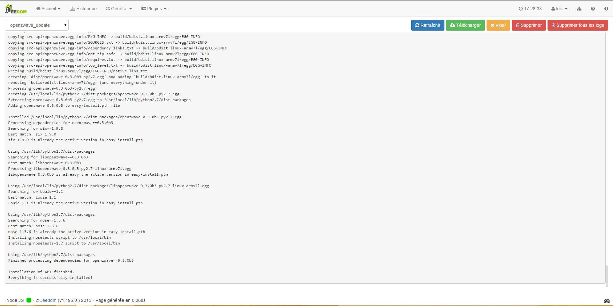
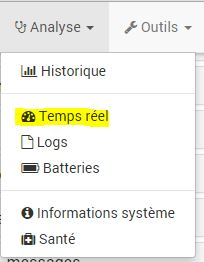
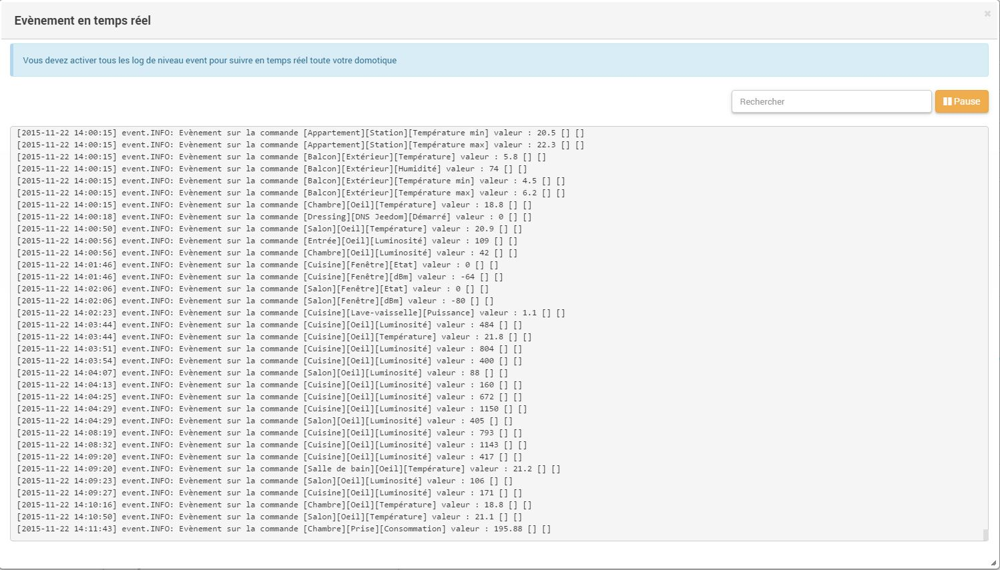

Visualización
=============

El menú de registros permite ver lo que está sucediendo en la Domótica. En la mayoría de los casos los registros son utilizados para realizar la depuración y solución de problemas por el equipo de soporte. Este menú sólo está disponible en modo experto.

Pour y accèder il faut aller dans Administration → Logs :

Se obtiene :

La página de registros es bastante sencilla, en la parte superior izquierda veras un menú desplegable que permite la elección del registro a consultar, en la parte superior derecha hay 5 botones:

-   Refrescar \*: permite actualizar el registro actual.

    -   **Descargar** : permite descargar el registro actual.

    -   \* Vacíar\* : le permite borrar el registro actual.

    -   \* Borrar\* : permite borrar el registro actual, si Jeedom lo necesita lo volverá a crear automáticamente.

    -   **Borrar todos los logs** : borra todos los logs presentes.

> **Tip**
>
> Tenga en cuenta que no se puede eliminar el registro de nginx.error. ¡ Es esencial! Si lo elimina (desde consola por ejemplo) no se volverá a generar hasta que reinicie Jeedom.

Configuración
=============

Hay algunas opciones de configuración de registro (accesible a través de la Administración → configuración y luego en "Configuración de registro y mensajes").

Aquí, tienes las siguientes opciones :

-   **Mensajes**

    -   Añadir un mensaje a cada error en los registros \*: Si un plugin o Jeedom escribe un mensaje de error en un registro, Jeedom agrega automáticamente un mensaje en el centro de mensajes (Al menos de que estés seguro, no los marques)

    -   **Ne pas autoriser les messages venant de** : permet d’interdire certains messages venant d’un plugin ou autre

    -   \*Información control de usuario \*: permite seleccionar una o más ordenes (separar con &&) de tipo mensaje que se utilizarán por los nuevos mensajes (pueden ser notificados de inmediato)

-   **Registro**

    -   \*Motor de registro \*: permite cambiar el motor de registro por ejemplo enviar a un demonio syslog(d)

    -   Número de lineas máximo de un archivo de registro \*: establece el número máximo de líneas en un archivo de registro, se recomienda no tocar este valor, ya que un valor demasiado grande puede llenar el sistema de archivos o hacer que Jeedom no pueda mostrar registros

    -   **Logs actifs** : permet de définir les niveaux de log actif. Attention : plus il y a de niveaux actifs, plus Jeedom peut être lent ! Cela entraîne aussi une usure prématurée de la carte SD. Il est conseillé de n’activer que le niveau "Error". "Event" peut être activé aussi car il est nécessaire pour voir en temps réel ce qui se passe sur sa domotique (bien sûr c’est seulement si vous en avez besoin).

Registro "Evento" y nivel de registro de "Evento"
=================================================

Le log "Event" est un peu particulier. Tout d’abord pour qu’il fonctionne, il faut activer le niveau de log "Info" ou plus, ensuite celui-ci recense tous les évènements ou actions qui se passent sur la domotique. Pour y accéder, il faut cliquer sur la petite icône "compteur" en bas à droite dans Jeedom :

Una vez hecho clic en él, sale una ventana que se actualiza cada segundo y muestra todos los eventos de la Domótica.

Arriba a la derecha tienes un campo de búsqueda (sólo funcional cuando este pausado) y un botón de pausa (útil para hacer un copy/paste por ejemplo).

Pour que cela fonctionne il faut absolument avoir activé le niveau de log "Info" ou plus (voir paragraphe précédent)

