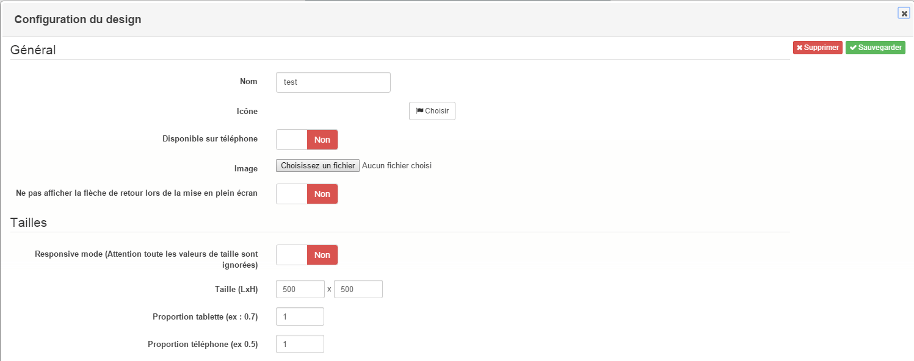
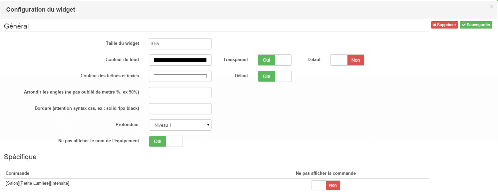
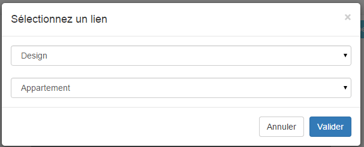
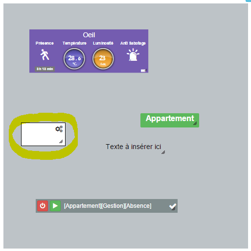

Utilice esta página para configurar la pantalla de la domótica de una forma muy fina. Toma tiempo pero su único límite es tu imaginación.

Es accesible por

> **Tip**
>
> Comme vous pouvez le voir sur la capture il est possible d’aller directement sur un design grâce au sous-menu

Aquí un ejemplo de diseño:

Sur cette page on retrouve, en haut (et dans l’ordre) :

-   menú para cambiar el diseño

-   un menú para crear un nuevo diseño

-   uno para borrar botón para editar el diseño actual

-   uno para entrar en modo de pantalla completa

Así que solo puedes crear uno haciendo clic en el botón Agregar, una ventana le pedirá el nombre del mismo:

Así que usted tiene en un diseño vacío :

Por lo tanto, haga clic en el botón Editar para cambiar el modo de edición:

Comme on peut le voir il y a un peu plus de boutons maintenant, ainsi que le cadre du design (que l’on peut changer bien sûr).

En la parte superior izquierda hay 2 botones, editar las propiedades del diseño actual y duplicarlo.

> **Tip**
>
> No te olvides de guardar los cambios tras la modificación

Edición de las propiedades de los diseños
=========================================

Encontrará aquí:

-   **General**

    -   **Nombre** : El nombre del diseño

    -   Icono \*: un icono para él (aparece en el menú de opciones de diseño)

    -   Disponible en el teléfono \*: hace este diseño visible en la lista de diseños en versión móvil

    -   Imagen \*: permite añadir una imagen de fondo en el diseño

    -   \*No se muestran las flechas trasera en pantalla completa \*: modo que oculta la opción de el botón "atrás" para volver al modo ventana (ideal para una tablet montada en pared)

-   \*Tamaños \*

    -   **Tamaño (LxA)** : permite ajustar el tamaño de su diseño (marco gris en modo de edición)

    -   \*Proporción tablet (ex: 0.7) \*: permite cambiar la proporción del diseño para tablet (para reducir por ejemplo todo el cuadro de mandos)

    -   \*Proporción Teléfono (ex 0.5) \*: permite cambiar la proporción del diseño en el teléfono (de la reducción por ejemplo mientras que el control de todo tamaño)

Agregar un widget
=================

Añadir widgets a su diseño, para esto usted deben hacer clic en el botón de añadir widget:

Una vez clicado, elija el widget :

Puedes ver tus widget :

> **Tip**
>
> Usted puede mover o arrastrar el widget haciendo clic o arrastrandolo

Acceder a la configuración avanzada del widget, haciendo doble clic en él :

Aquí tenemos :

-   **General**

    -   El tamaño de widget \*: permite definir una relación de tamaño del widget, por ejemplo aquí será sólo el 65% de su tamaño

    -   **Couleur de fond** : permet de changer la couleur de fond ou de le mettre transparent, ne pas oublier de passer "Défaut" sur NON

    -   **Couleur des icônes et textes** : permet de changer la couleur des icônes et des textes (attention à bien passer Défaut sur Non)

-   \*\* Redondear las esquinas (no olvide añadir %, ej. 50%) \*: utilizado para redondear las esquinas del widget, no olvides de poner el %

    -   **Bordure (attention syntaxe css, ex : solid 1px black)** : permet d’ajouter une bordure, attention la syntaxe est HTML

    -   Profundidad \*: permite elegir el nivel de profundidad, por ejemplo para superponer un widget con otro

    -   No mostrar el nombre del equipo \*: oculta el nombre del widget, se aplica solamente al diseño

-   \*Específica \*: esconde algunos comandos del widget, sólo en el diseño

En fonction des plugins certaines options peuvent ne pas fonctionner

> **Tip**
>
> En la parte inferior derecha, usted puede cambiar el tamaño de los widgets

Agregar texto/html
==================

Permite añadir un texto o código html/javascript, una vez que lo tienes hacer clic en:

Un doble clic abre la ventana de configuración :

-   **Nom** : permet de rentrer le texte ou le code html/javascript

-   **Icone** : permet de mettre une icône à la place du texte

-   **Couleur de fond** : permet de changer la couleur de fond ou de le mettre transparent, ne pas oublier de passer "Défaut" sur NON

-   **Couleur du textes** : permet de changer la couleur des icônes et des textes (attention à bien passer Défaut sur Non)

-   **Arrondir les angles (ne pas oublier de mettre %, ex 50%)** : permet d’arrondir les angles, ne pas oublier de mettre le %

-   **Bordure (attention syntax css, ex : solid 1px black)** : permet d’ajouter une bordure, attention la syntaxe est HTML

-   **Taille de la police (ex 50%, il faut bien mettre le signe %)** : permet de modifier la taille de la police

-   **Ne pas prendre en compte la taille prédéfinie** : permet d’ignorer la taille prédéfinie du widget

-   **Profondeur** : permet de choisir le niveau de la profondeur

-   **Gras** : met le texte en gras

> **Tip**
>
> Vous pouvez en bas à droite le redimensionner

Ajout d’un scénario
===================

Un clic dessus et Jeedom vous demandera le scénario en question :

Une fois choisi celui-ci apparait sur le design :

Un double clic dessus vous amènera à la configuration de cet élément scénario :

-   **General**

    -   El tamaño de widget \*: permite definir una relación de tamaño del widget, por ejemplo aquí será sólo el 65% de su tamaño

    -   **Couleur de fond** : permet de changer la couleur de fond ou de le mettre transparent, ne pas oublier de passer "Défaut" sur NON

    -   **Couleur des icônes et textes** : permet de changer la couleur des icônes et des textes (attention à bien passer Défaut sur Non)

-   \*\* Redondear las esquinas (no olvide añadir %, ej. 50%) \*: utilizado para redondear las esquinas del widget, no olvides de poner el %

    -   **Bordure (attention syntaxe css, ex : solid 1px black)** : permet d’ajouter une bordure, attention la syntaxe est HTML

    -   Profundidad \*: permite elegir el nivel de profundidad, por ejemplo para superponer un widget con otro

-   **Spécifique** : permet de masquer les commandes d’action sur le scénario

> **Tip**
>
> Vous pouvez en bas à droite le redimensionner

Ajout d’un lien
===============

Permet d’ajouter un lien vers une vue ou un autre design :

Celui-ci apparaît ensuite sur le design :

Un double clic dessus vous amène sur la configuration avancée :

Encontrará aquí:

-   **Nom** : permet de changer le nom du lien

-   **Lien** : destination du lien

-   **Position** : permet de régler finement la position du lien sur la destination (pour par exemple arriver directement sur la cuisine)

-   **Icone** : permet de mettre une icône à la place du texte

-   **Couleur de fond** : permet de changer la couleur de fond ou de le mettre transparent, ne pas oublier de passer "Défaut" sur NON

-   **Couleur du textes** : permet de changer la couleur des icônes et des textes (attention à bien passer Défaut sur Non)

-   **Arrondir les angles (ne pas oublier de mettre %, ex 50%)** : permet d’arrondir les angles, ne pas oublier de mettre le %

-   **Bordure (attention syntax css, ex : solid 1px black)** : permet d’ajouter une bordure, attention la syntaxe est HTML

-   **Profondeur** : permet de choisir le niveau de la profondeur

-   **Taille de la police (ex 50%, il faut bien mettre le signe %)** : permet de modifier la taille de la police

-   **Ne pas prendre en compte la taille prédéfinie** : permet d’ignorer la taille prédéfinie du widget

-   **Gras** : met le texte en gras

> **Tip**
>
> Vous pouvez en bas à droite le redimensionner

Ajout d’un graph
================

Une fois cliqué dessus vous obtenez :

Un double clic dessus vous amène à la configuration de l'élement graph

Ici on retrouve :

-   **Période** : permet de choisir la période d’affichage

-   **Bordure (attention syntaxe css, ex : solid 1px black)** : permet d’ajouter une bordure, attention la syntaxe est HTML

-   **Profondeur** : permet de choisir le niveau de la profondeur

-   **Afficher la légende** : permet d’afficher ou non la légende

-   **Afficher le navigateur** : permet d’afficher ou non le navigateur (deuxième graph plus léger en dessous du premier)

-   **Afficher le sélecteur de période** : affiche ou non le sélecteur de période en haut à gauche

-   **Afficher la barre de défilement** : affiche ou non la barre de défilement

-   **Fond transparent** : rend le fond transparent

Pour choisir les données à afficher il faut cliquer sur les 3 roues crantées :

Vous obtenez (ça peut être un peu long à charger) :

-   **Activer** : le premier bouton permet d’activer ou non l’affichage de la donnée sur le graphique

-   **Couleur** : la couleur de la courbe

-   **Type** : le type de graph (aire, ligne ou colonne)

-   **Escalier** : permet d’afficher la courbe sous la forme d’un escalier au d’un affichage continue

-   **Empiler** : permet d’empiler les valeurs des courbes (voir en dessous pour le résultat)

-   **Variation** : affiche la différence de valeur par rapport au point précédent

-   **Echelle** : vu que vous pouvez mettre plusieurs courbes (données) sur le même graphe il est possible de distinguer les échelles (droite ou gauche)

> **Tip**
>
> Vous pouvez en bas à droite le redimensionner

