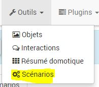
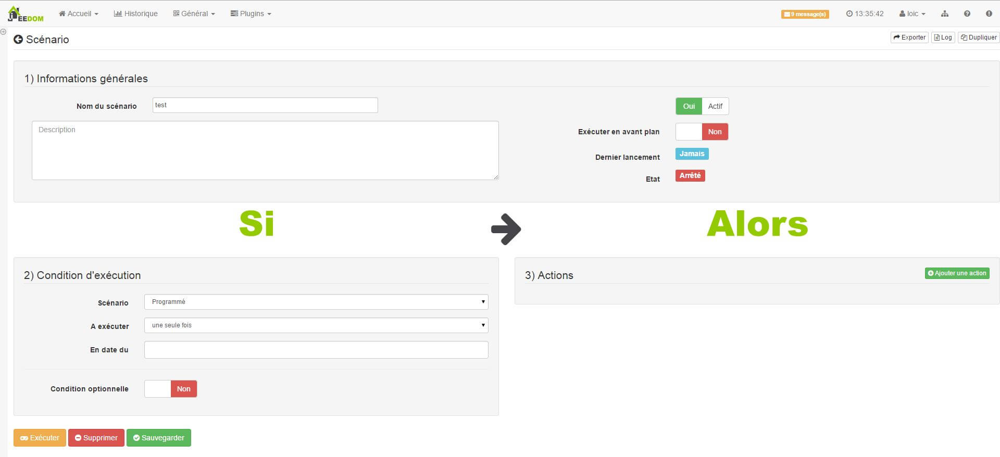
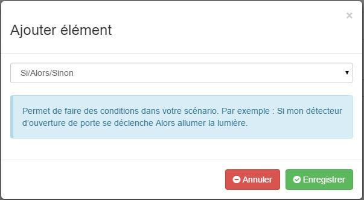
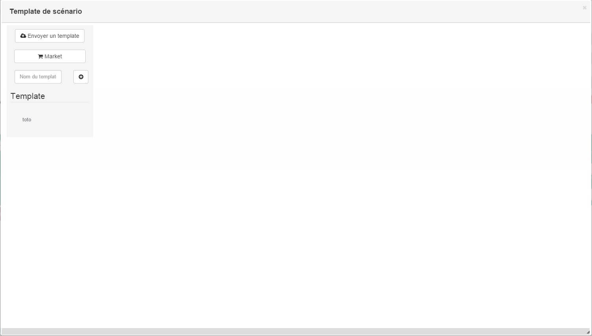
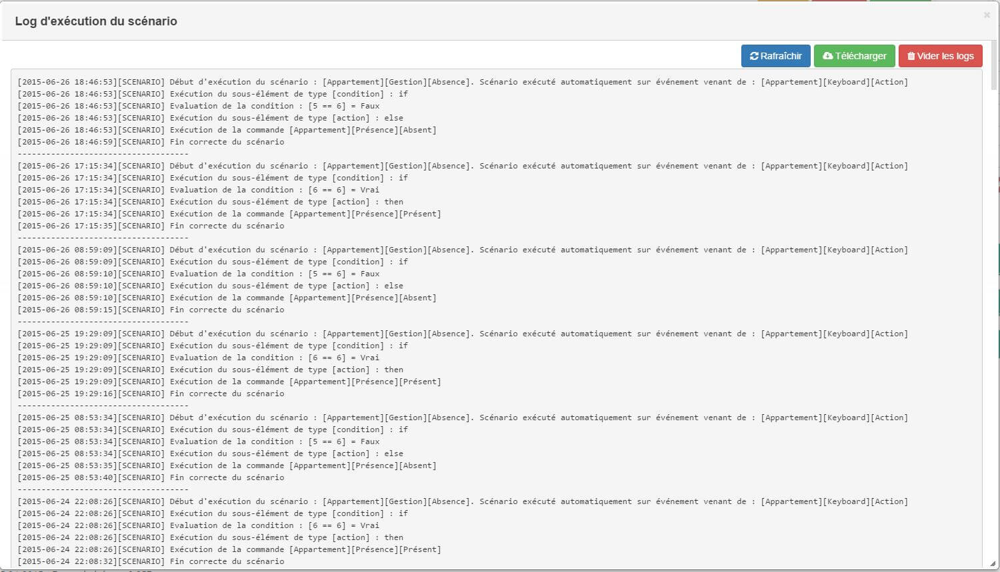

Ésta es la parte más importante de la domótica: las escenas Es el cerebro real de la automatización, lo que le permite interactuar con el mundo real de forma "inteligente".

La página escenas
=================

Pour y accéder rien de plus simple, il suffit d’aller sur Outils → Scénarios :

Una vez llega, obtendrá;

Arriba encontrará 3 botones:

-   **Añadir**: permite añadir una escena

-   **Desactivar escenas**: desactiva todas las escenas

-   \* Ver variables\* : Permite ver las variables, su valor actual y donde se estan usando,

> **Tip**
>
> Las escenas en rojo son aquéllas que están desactivadas

> **Tip**
>
> Al igual que en muchos lugares en Jeedom, situar el ratón en la zona la izquierda mostrará un menú de acceso rápido (se puede mostrar como "siempre visible" desde la configuración de su perfil).

Hay 2 modelos de escenarios:

-   **Simple** : permet de faire des scénarios très simples type SI ça ALORS fait ça

-   \* \* Avanzado: Permite un mayor control, pero se necesita más conocimiento

Es posible pasar de una escena en modo simple a una en modo avanzado, pero no al contrario

Cuando cree una escena, Jeedom le pedirá el tipo de escena:

Modo simple
===========

Esta es la interfaz del modo simple:

Encontrará:

-   **Nombre**: nombre de la escena

-   **Descripción**: descripción que se puede añadir para saber en qué consiste la escena o ejemplos de aplicación para la misma

-   **Actif** : définit si le scénario est actif ou non

-   **Exécuter en avant plan** : permet de lancer le scénario directement et non dans un fil d’exécution séparé. Attention cette option peut être dangereuse car elle met en pause toutes les autres actions du scénario. IL NE FAUT JAMAIS l’activer sur un scénario déclenché par une programmation horaire

-   **Dernier lancement** : la date de dernière exécution du scénario

-   **Estado**: el estado actual de la escena (ejecutándose, detenida…)

Arriba a la derecha se encuentran:

-   un bouton pour faire un export texte du scénario (pratique pour le montrer sur le forum ou à l'équipe support)

-   un bouton pour avoir le log du scénario

-   un botón para duplicar la escena

Abajo a la izquierda encontrará la configuración de la escena:

-   **Scénario** : permet d’indiquer si le scénario est programmé (à une date et heure précise) ou s’il est provoqué (comme par exemple la détection d’un mouvement)

-   **A exécuter** : en mode programmé permet de dire s’il doit être exécuté une fois ou de manière répétée

-   **En date du** : s’il n’est exécuté qu’une fois alors il faut indiquer la date et l’heure

-   **Frecuencia**: En modo repetición puede elegir la frecuencia de repetición

-   **Para**: En modo provocado debe elegir el comando de activación de la escena, haciendo clic en el pequeño botón a la izquierda

-   **Condition optionnelle** : permet d’activer ou non un test avant l’exécution du scénario.

-   **Si** : permet de choisir la commande sur laquelle s’applique la condition, en cliquant sur le petit bouton à gauche

-   **Est** : permet de choisir le statut que doit avoir la commande précédente pour que les actions soient exécutées (en fonction de la commande les options peuvent changer)

Enfin sur la droite vous avez les actions, ici très simple il suffit de cliquer sur "Ajouter une action"

Exemple allumer sur présence
----------------------------

Voila un scénario très simple qui allume la lumière en cas de présence

> **Tip**
>
> Ce scénario sera déclenché aussi bien lors de la détection d’une présence que lors du relâchement (fin de présence), il est donc nécessaire de tester la valeur de la présence (ici déclenchée)

Il ne faut pas oublier de faire le même genre de scénario mais pour éteindre la lumière lorsque plus personne n’est présent

Mode avancée
============

Voici un exemple de scénario en mode avancé :

En haut la partie générale où l’on retrouve :

-   **nom**

-   **groupe** : permet d’organiser les scénarios

-   **Actif** : Si le scénario est actif ou non

-   **Visible** : Si le scénario est visible ou non

-   **Objet parent** : Le choix d’affecter à un objet parent ou pas

-   **Timeout secondes (0 = illimité)** : La durée d’exécution maximum autorisée

-   **Déclencheurs** : Ensuite vient la partie des déclencheurs qui peuvent soit être un ou plusieurs événements et/ou une programmation (une heure donnée, une fréquence… Cette partie s’écrit à l’aide d’une syntaxe type crontab accessible via la touche, un assistant est disponible en cliquant sur ?. Attention vous pouvez avoir au maximum 28 déclencheurs sur un scénario.

-   **Action** : En haut à droite on retrouve quelques actions utiles comme le lancement forcé du scénario (pour test),la suppression du scénario, la sauvegarde, la génération d’un template (voir le chapitre dédié), l’export, l’arrêt forcé d’un scénario (si en cours), log des dernières exécutions (très pratique pour vérifier le déroulement exact du scénario), la duplication.

-   **Execution en avant plan** : permet de lancer le scénario directement et non dans un fil d’exécution séparé. Attention cette option peut être dangereuse car elle met en pause toute les autres actions du scénario. IL NE FAUT JAMAIS l’activer sur un scénario déclenché par une programmation horaire ou un scénario contenant des actions de type sleep

-   **Enchaîner les commandes sans attendre** : permet d’enchaîner les suites d’actions sans attendre le retour et donc la vérification de la bonne exécution (attention actuellement seuls les plugins openzwave et script sont compatibles)

-   **Pas de log** : indique au scénario de ne pas écrire dans les logs (permet de le rendre un peu plus rapide)

-   **Etat** : état actuel du scénario

Sur la partie basse vient le scénario en lui-même avec un bouton pour ajouter des blocs :

-   **Si/Alors/Sinon** : bloc de base permettant de réaliser des conditions.

-   **Action** : bloc permet de lancer une action simple sans aucune condition ou autre avant

-   **Boucle** : permet de réaliser des boucles de 1 jusqu’à un nombre défini (ou même une valeur d’un capteur, ou nombre aléatoire).

-   **Dans** : permet de lancer une action dans X minute(s) (0 est une valeur possible). La particularité c’est que les actions sont lancées en arrière plan, elles ne bloquent donc pas la suite du scénario. C’est donc un bloc non bloquant.

-   **A** : permet de dire à Jeedom de lancer les actions du bloc A à une heure donnée (sous la forme hhmm). Ce bloc est non bloquant

-   **Code** : permet d’écrire directement en code PHP (demande certaines connaissances et peut être risqué mais permet de n’avoir plus aucune contrainte).

-   **Commentaire** : permet d’ajouter des commentaires à son scénario

> **Tip**
>
> Devant chaque bloc (en dessous de la double flèche verticale qui permet de déplacer les blocs) vous avez un petit coche pour désactiver complètement le bloc sans pour autant supprimer celui-ci (permet de faire des tests pour le réactiver plus tard par exemple)

> **Note**
>
> Sur les blocs de type Si/Alors/Sinon vous avez devant des flèches circulaires, elles permettent d’activer ou non la répétition des actions si l'évaluation de la condition donne le même résultat que la précedente évaluation

Pour les conditions, Jeedom essaye de faire en sorte qu’on puisse les écrire le plus possible en langage naturel tout en restant souple. On a donc un bouton permettant de sélectionner un équipement puis on écrit la condition. Il existe une liste de tags permettant d’avoir accès à des variables issues du scénario ou d’un autre, à l’heure, à la date, à un nombre aléatoire….

Le premier bouton permet d’aller chercher une commande :

Une fois la commande trouvée, Jeedom vous demande ce que vous voulez tester :

En fonction du type vous aurez différentes possibilités, vous pouvez ensuite mettre d’autres tests et les lier avec un "ou" ou un "et". Ainsi avec cet assistant vous pouvez construire votre condition.

> **Tip**
>
> Si vous cliquez sur "Ne rien mettre" Jeedom va juste écrire la commande dans le champ condition en vous laissant la main pour la suite.

Le deuxième bouton quant à lui permet d’aller chercher un scénario pour, par exemple, tester si celui-ci est en cours (voir partie "Condition ou valeur d’une commande d’action")

Pour les actions, on peut exécuter soit une action d’une commande (les options de celle-ci apparaitront sur sa droite), soit une commande d’affectation de variable ou de pause(très pratique pour simuler la présence surtout couplée à la génération d’une durée aléatoire) ou même d’action sur un autre scénario (start, stop, activer, désactiver).

Vous retrouvez ici les possibilités suivantes :

Dans l’ordre :

-   un bouton pour déplacer l’action (les doubles flèches), il suffit de cliquer et maintenir le bouton puis de déplacer le bloc

-   un bouton pour supprimer l’action

-   un bouton pour désactiver temporairement l’action

-   un bouton pour rechercher une commande d’action

-   un bouton pour les actions spécifiques, avec à chaque fois la description de cette action

Déclencheurs
------------

Il existe des déclencheurs spécifiques (autre que ceux fournis par les commandes) :

-   **\#start\#** : déclenché au (re)démarrage de Jeedom,

-   **\#begin\_backup\#** : événement envoyé au début du backup.

-   **\#end\_backup\#** : événement envoyé à la fin du backup.

-   **\#begin\_update\#** : événement envoyé au début de la mise à jour.

-   **\#end\_update\#** : événement envoyé à la fin de la mise à jour.

-   **\#begin\_restore\#** : événement envoyé au début du restore.

-   **\#end\_restore\#** : événement envoyé à la fin du restore.

Vous pouvez aussi déclencher un scénario sur mise à jour d’une variable en mettant : variable(nom\_variable) ou en utilisant l’api http décrite ici : [https://github.com/jeedom/core/blob/beta/doc/fr\_FR/api\_http.asciidoc\#pilotage-des-scénarios](https://github.com/jeedom/core/blob/beta/doc/fr_FR/api_http.asciidoc#pilotage-des-scénarios)

> **Tip**
>
> Vous avez ici aussi un bouton pour aller chercher une commande

Condition ou valeur d’une commande d’action
-------------------------------------------

Vous pouvez utiliser n’importe lequel des symboles suivant pour les opérateurs :

-   == : égal,

-   \> : supérieur,

-   \>= : supérieur ou égal,

-   \< : inférieur,

-   \<= : inférieur ou égal,

-   != : différent,

-   matches : contient (ex : [Salle de bain][Hydrometrie][etat] matches "/humide/" ),

-   not ( … matches …) : ne contient pas (ex : not([Salle de bain][Hydrometrie][etat] matches "/humide/")),

Vous pouvez combiner n’importe quelle opération avec les opérateurs suivants :

-   && / ET / et / AND / and : et,

-   || / OU / ou / OR / or : ou,

-   |\^ / XOR / xor : ou.

Vous pouvez aussi utiliser les tags suivants :

> **Tip**
>
> Un tag est remplacé lors de l’exécution du scénario par sa valeur

-   **\#seconde\#** : seconde courante,

-   **\#heure\#** : heure courante (ex : 17 pour 17h15),

-   **\#minute\#** : minute courante (ex : 15 pour 17h15),

-   **\#jour\#** : jour courant,

-   **\#mois\#** : mois courant,

-   **\#annee\#** : année courante,

-   **\#time\#** : heure et minute courante (ex : 1715 pour 17h15),

-   **\#timestamp\#** : retourne le nombre de secondes depuis le 1er janvier 1970,

-   **\#date\#** : jour et mois courant (ex : 1215 pour le 15 décembre),

-   **\#semaine\#** : numéro de la semaine (ex : 51),

-   **\#sjour\#** : pour le nom du jour de la semaine (ex : Samedi),

-   **\#njour\#** : numéro du jour de 0 (dimanche) à 6 (samedi),

-   **\#smois\#** : pour le nom du mois (ex : Janvier),

-   **\#IP\#** : IP interne de jeedom,

-   **\#hostname\#** : nom de la machine Jeedom,

-   **\#trigger\#** : nom de la commande qui a déclenché le scénario.

Vous avez aussi les tags suivants en plus si votre scénario a été déclenché par une interaction :

-   **\#query\#** : interaction ayant déclenché le scénario,

-   **\#profil\#** : profil de l’utilisateur ayant déclenché le scénario (peut être vide).

Lorsqu’un scénario est déclenché par une interaction, celui-ci est forcément exécuté en mode rapide.

Plusieurs fonctions sont disponibles pour les équipements :

-   **average**(commande,période) et **averageBetween**(commande,start,end) : donnent la moyenne de la commande sur la période (period=[month,day,hour,min] ou [expression PHP](http://php.net/manual/fr/datetime.formats.relative.php)) ou entre les 2 bornes demandées (sous la forme Y-m-d H:i:s ou [expression PHP](http://php.net/manual/fr/datetime.formats.relative.php))

    -   Ex : average(\#[Salle de bain][Hydrometrie][Humidité]\#,1 hour) : renvoie la moyenne de la commande sur la dernière heure

    -   Ex : averageBetween(\#[Salle de bain][Hydrometrie][Humidité]\#,2015-01-01 00:00:00,2015-01-15 00:00:00) : renvoie la moyenne de la commande entre le 1 janvier 2015 et le 15 janvier 2015

-   **min**(commande,période) et **minBetween**(commande,start,end) : donnent le minimum de la commande sur la période (period=[month,day,hour,min] ou [expression PHP](http://php.net/manual/fr/datetime.formats.relative.php)) ou entre les 2 bornes demandées (sous la forme Y-m-d H:i:s ou [expression PHP](http://php.net/manual/fr/datetime.formats.relative.php))

    -   Ex : min(\#[Salle de bain][Hydrometrie][Humidité]\#,15 min) : renvoie le minimum de la commande sur les 15 dernières minutes

    -   Ex : minBetween(\#[Salle de bain][Hydrometrie][Humidité]\#,2015-01-01 00:00:00,2015-01-15 00:00:00) : renvoie le minimum de la commande entre le 1 janvier 2015 et le 15 janvier 2015

-   **max**(commande,période) et **maxBetween**(commande,start,end) : donnent le maximum de la commande sur la période (period=[month,day,hour,min] ou [expression PHP](http://php.net/manual/fr/datetime.formats.relative.php)) ou entre les 2 bornes demandées (sous la forme Y-m-d H:i:s ou [expression PHP](http://php.net/manual/fr/datetime.formats.relative.php))

    -   Ex : max(\#[Salle de bain][Hydrometrie][Humidité]\#,7 day) : renvoie le maximum de la commande sur les 7 derniers jours

    -   Ex : maxBetween(\#[Salle de bain][Hydrometrie][Humidité]\#,2015-01-01 00:00:00,2015-01-15 00:00:00) : renvoie le maximum de la commande entre le 1 janvier 2015 et le 15 janvier 2015

-   **duration**(commande, valeur, période) et **durationbetween**(commande,valeur,start,end) : donnent la durée en minutes pendant laquelle l'équipement avait la valeur choisie sur la période (period=[month,day,hour,min] ou [expression PHP](http://php.net/manual/fr/datetime.formats.relative.php)) ou entre les 2 bornes demandées (sous la forme Y-m-d H:i:s ou [expression PHP](http://php.net/manual/fr/datetime.formats.relative.php))

    -   Ex : duration(\#[Salon][Prise][Etat]\#,1,Today) : renvoie la durée en minutes pendant laquelle la prise était allumée depuis le début de la journée.

    -   Ex : durationBetween(\#[Salon][Prise][Etat]\#,0,Last Monday,Now) : renvoie la durée en minutes pendant laquelle la prise était éteinte depuis lundi dernier.

-   **statistics**(commande,calcul,période) et **statisticsBetween**(commande,calcul,start,end) : donnent le résultat de différents calculs statistiques (sum, count, std, variance, avg, min, max) sur la période (period=[month,day,hour,min] ou [expression PHP](http://php.net/manual/fr/datetime.formats.relative.php)) ou entre les 2 bornes demandées (sous la forme Y-m-d H:i:s ou [expression PHP](http://php.net/manual/fr/datetime.formats.relative.php))

    -   Ex : statistics(\#[Salle de bain][Hydrometrie][Humidité]\#,std,1 mois) : renvoi [l'écart-type](http://fr.wikipedia.org/wiki/%C3%89cart_type) de température sur un mois.

-   **tendance**(commande,période,seuil) : donne la tendance de la commande sur la période (period=[month,day,hour,min] ou [expression PHP](http://php.net/manual/fr/datetime.formats.relative.php))

-   Ex : tendance(\#[Salle de bain][Hydrometrie][Humidité]\#,1 hour,0.1) : renvoie 1 si en augmentation, 0 si constant et -1 si en diminution Le seuil permet de definir la sensibilité, attention le calcul du seuil utilise la calcul de [moindre carrés](http://fr.wikipedia.org/wiki/M%C3%A9thode_des_moindres_carr%C3%A9s)

-   **stateDuration**(commande,[valeur]) : donne la durée en secondes depuis le dernier changement de valeur. Retourne -1 si aucun historique n’existe ou si la valeur n’existe pas dans l’historique. Return -2 si la commande n’est pas historisée

    -   Ex : stateDuration(\#[Salle de bain][Hydrometrie][Humidité]\#) : renvoie 300 si cette valeur est la depuis 5min

-   **lastChangeStateDuration**(commande,valeur) : donne la durée en secondes depuis le dernier changement d'état à la valeur passée en paramètre.Attention, la valeur de l'équipement doit être historisée.

    -   Ex : lastChangeStateDuration(\#[Salle de bain][Hydrometrie][Humidité]\#,0) : renvoie 300 si cette valeur est passée à 0 la dernière fois il y a 5 minutes (même si depuis sa valeur a changé).

-   **lastStateDuration**(commande,valeur) : donne la durée en secondes pendant laquelle l'équipement a dernièrement eu la valeur choisie. Attention, la valeur de l'équipement doit être historisée.

    -   Ex : lastStateDuration(\#[Salle de bain][Hydrometrie][Humidité]\#,0) : renvoie 300 si la valeur 0 est là depuis 5 minutes ou si elle a été là pendant 5 minutes précédemment.

-   **stateChanges**(commande,[valeur], période) et **stateChangesBetween**(commande, [valeur], start, end) : donnent le nombre de changements d'état (vers une certaine valeur si indiquée, ou au total sinon) sur la période (period=[month,day,hour,min] ou [expression PHP](http://php.net/manual/fr/datetime.formats.relative.php)) ou entre les 2 bornes demandées (sous la forme Y-m-d H:i:s ou [expression PHP](http://php.net/manual/fr/datetime.formats.relative.php))

    -   Ex : stateChanges(\#[Salon][Prise][Etat]\#,1,Today) : renvoie le nombre d’allumages (passage à 1) de la prise aujourd’hui

    -   Ex : stateChangesBetween(\#[Salon][Prise][Etat]\#,0,2015-01-01 00:00:00,2015-01-15 00:00:00) : renvoie le nombre d’extinctions (passage à 0) de la prise entre le 1 janvier 2015 et le 15 janvier 2015

-   **lastBetween**(commande,start,end) : donne la dernière valeur enregistrée pour l'équipement entre les 2 bornes demandées (sous la forme Y-m-d H:i:s ou [expression PHP](http://php.net/manual/fr/datetime.formats.relative.php))

    -   Ex : lastBetween(\#[Salle de bain][Hydrometrie][Humidité]\#,Yesterday,Today) : renvoie la dernière température enregistrée hier.

-   **variable**(mavariable,valeur par défaut) : récupération de la valeur d’une variable ou de la valeur souhaitée par défaut

    -   Ex : variable(plop,10) renvoie la valeur de la variable plop ou 10 si elle est vide ou n’existe pas

-   **scenario**(scenario) : donne le statut du scénario

-   Ex : scenario(\#[Salle de bain][Lumière][Auto]\#) : renvoie 1 en cours, 0 si arreté et -1 si desactivé, -2 si le scénario n’existe pas et -3 si l'état n’est pas cohérent

-   **lastScenarioExecution**(scenario) : donne la durée en secondes depuis le dernier lancement du scénario

    -   Ex : lastScenarioExecution(\#[Salle de bain][Lumière][Auto]\#) : renvoie 300 si le scénario s’est lancé pour la dernière fois il y a 5 min

-   **collectDate**(cmd,[format]) : renvoie la date de la dernière donnée pour la commande donnée en paramètre, le 2ème paramètre optionel permet de spécifier le format de retour (détails [ici](http://php.net/manual/fr/function.date.php)). Un retour de -1 signifie que la commande est introuvable, et -2 que la commande n’est pas de type info

    -   Ex : collectDate(\#[Salle de bain][Hydrometrie][Humidité]\#) : renverra 2015-01-01 17:45:12

-   **valueDate**(cmd,[format]) : renvoie la date de la dernière donnée pour la commande donnée en paramètre, le 2ème paramètre optionel permet de spécifier le format de retour (détails [ici](http://php.net/manual/fr/function.date.php)). Un retour de -1 signifie que la commande est introuvable, et -2 que la commande n’est pas de type info

    -   Ex : valueDate(\#[Salle de bain][Hydrometrie][Humidité]\#) : renverra 2015-01-01 17:50:12

-   **eqEnable**(equipement) : renvoie l'état de l'équipement (actif ou non)

    -   Ex : eqEnable(\#[Aucun][Basilique]\#) : renvoie -2 si l'équipement est introuvable, 1 si l'équipement est actif et 0 s’il est inactif

-   **report** : permet d’exporter une vue au format (PDF,PNG, JPEG ou SVG) et de l’envoyer par le biais d’une commande de type message. Attention si votre accès internet est en https non signé cette fonctionalité ne marchera pas, il faut du http ou https signé.

Les périodes et intervalles de ces fonctions peuvent également s’utiliser avec [des expressions PHP](http://php.net/manual/fr/datetime.formats.relative.php) comme par exemple :

-   *Now* : maintenant

-   *Today* : 00:00 aujourd’hui (permet par exemple d’obtenir des résultats de la journée si entre *Today* et *Now*)

-   *Last Monday* : lundi dernier à 00:00

-   *5 days ago* : il y a 5 jours

-   *Yesterday noon* : hier midi

-   Etc.

Voici un exemple pratique pour comprendre les valeurs retournées par ces différentes fonctions :

<table>
<colgroup>
<col width="50%" />
<col width="50%" />
</colgroup>
<thead>
<tr class="header">
<th align="left">Prise ayant pour valeurs :</th>
<th align="left">000 (pendant 10 minutes) 11 (pendant 1 heure) 000 (pendant 10 minutes)</th>
</tr>
</thead>
<tbody>
<tr class="odd">
<td align="left">
average(prise,période)
</td>
<td align="left">
Renvoie la moyenne des 0 et 1 (peut être influencée par le polling)
</td>
</tr>
<tr class="even">
<td align="left">
min(prise,période)
</td>
<td align="left">
Renvoie 0 : la prise a bien été éteinte dans la période
</td>
</tr>
<tr class="odd">
<td align="left">
max(prise,période)
</td>
<td align="left">
Renvoie 1 : la prise a bien été allumée dans la période
</td>
</tr>
<tr class="even">
<td align="left">
duration(prise,1,période)
</td>
<td align="left">
Renvoie 60 : la prise était allumée (à 1) pendant 60 minutes dans la période
</td>
</tr>
<tr class="odd">
<td align="left">
duration(prise,0,période)
</td>
<td align="left">
Renvoie 20 : la prise était éteinte (à 0) pendant 20 minutes dans la période
</td>
</tr>
<tr class="even">
<td align="left">
statistics(prise,count,période)
</td>
<td align="left">
Renvoie 8 : il y a eu 8 remontées d'état dans la période
</td>
</tr>
<tr class="odd">
<td align="left">
tendance(prise,période,0.1)
</td>
<td align="left">
Renvoie -1 : tendance à la baisse
</td>
</tr>
<tr class="even">
<td align="left">
stateDuration(prise)
</td>
<td align="left">
Renvoie 600 : la prise est dans son état actuel depuis 600 secondes (10 minutes)
</td>
</tr>
<tr class="odd">
<td align="left">
stateDuration(prise,0)
</td>
<td align="left">
Renvoie 600 : la prise est éteinte (à 0) depuis 600 secondes (10 minutes)
</td>
</tr>
<tr class="even">
<td align="left">
stateDuration(prise,1)
</td>
<td align="left">
Renvoie une valeur comprise entre 0 et stateDuration(prise) (selon votre polling) : la prise n’est pas dans cet état
</td>
</tr>
<tr class="odd">
<td align="left">
lastChangeStateDuration(prise,0)
</td>
<td align="left">
Renvoie 600 : la prise s’est éteinte (passage à 0) pour la dernière fois il y a 600 secondes (10 minutes)
</td>
</tr>
<tr class="even">
<td align="left">
lastChangeStateDuration(prise,1)
</td>
<td align="left">
Renvoie 4200 : la prise s’est allumée (passage à 1) pour la dernière fois il y a 4200 secondes (1h10)
</td>
</tr>
<tr class="odd">
<td align="left">
lastStateDuration(prise,0)
</td>
<td align="left">
Renvoie 600 : la prise est éteinte depuis 600 secondes (10 minutes)
</td>
</tr>
<tr class="even">
<td align="left">
lastStateDuration(prise,1)
</td>
<td align="left">
Renvoie 3600 : la prise a été allumée pour la dernière fois pendant 3600 secondes (1h)
</td>
</tr>
<tr class="odd">
<td align="left">
stateChanges(prise,période)
</td>
<td align="left">
Renvoie 3 : la prise a changé 3 fois d'état pendant la période
</td>
</tr>
<tr class="even">
<td align="left">
stateChanges(prise,0,période)
</td>
<td align="left">
Renvoie 2 : la prise s’est éteinte (passage à 0) deux fois pendant la période
</td>
</tr>
<tr class="odd">
<td align="left">
stateChanges(prise,1,période)
</td>
<td align="left">
Renvoie 1 : la prise s’est allumée (passage à 1) une fois pendant la période
</td>
</tr>
</tbody>
</table>

Une boîte à outils de fonctions génériques peut également servir à effectuer des conversions ou calculs :

-   **rand**(1,10) : pour un nombre aléatoire de 1 à 10

-   **randomColor**(min,max) : donne une couleur aléatoire compris entre 2 bornes ( 0 ⇒ rouge, 50 ⇒ vert, 100 ⇒ bleu)

    -   Ex : randomColor(40,60) : pour avoir une couleur aléatoire proche du vert

-   **trigger**(commande) : permet de connaître le déclencheur du scénario ou de savoir si c’est bien la commande passée en paramètre qui a déclenché le scénario

    -   Ex : trigger(\#[Salle de bain][Hydrometrie]) : 1 si c’est bien \\[Salle de bain][Hydrometrie][Humidité]\# qui a déclenché le scénario sinon 0

-   **triggerValue**(commande) : permet de connaitre la valeur du déclencheur du scénario

    -   Ex : triggerValue(\#[Salle de bain][Hydrometrie]) : 80 si l’hydrométrie de \\[Salle de bain][Hydrometrie][Humidité]\# est de 80 %

-   **round**(valeur,[decimal]) : permet un arrondi au dessus, [decimal] nombre de décimales après la virgule

    -   Ex : round(\#[Salle de bain][Hydrometrie][Humidité]\# / 10) : renverra 9 si le pourcentage d’humidité et 85

-   **odd**(valeur) : permet de savoir si un nombre est impair ou non. Renvoi 1 si impair 0 sinon

    -   Ex : odd(1) : renverra 1

-   **median**(commande1,commande2….commandeN) : renvoie la médiane de valeur

    -   Ex : median(15,25,20) : renverra 20

-   **time\_op**(time,value) : permet de faire des opérations sur le temps, avec time=temps (ex 1530) et value=valeur à ajouter ou à soustraire en minutes

    -   Ex : time\_op(\#time\#, -90) : s’il est 16h50 renverra : 1650 - 0130 = 1520

-   **formatTime**(time) : permet de formater le retour d’une chaine \#time\#

    -   Ex : formatTime(1650) : renverra 16h50

-   **floor**(time/60) : permet de convertir des secondes en minutes, ou des minutes en heures (floor(time/3600) pour des secondes en heures)

    -   Ex : floor(130/60) : renverra 2 (minutes si 130s, ou heures si 130m)

Action
------

En plus des commandes domotiques vous avez accès aux actions suivantes :

-   **sleep** : pause de x seconde(s)

-   **wait** : attend jusqu'à ce que la condition soit valide (maximum 2h), le timeout est en seconde(s)

-   **variable** : création/modification d’une variable ou de la valeur d’une variable

-   **scenario** : permet le contrôle des scénarios, la partie tags permets d’envoyer des tags au scénario, ex montag=2

-   **stop** : arrête le scénario

-   **icon** : permet de changer l’icône de représentation du scénario

-   **gotodesign** : change le design affiché sur tous les navigateurs par le design demandé

-   **log** : permet de rajouter un message dans les logs

-   **message** : permet d’ajouter un message dans le centre de message

-   **equipement** : permet de modifier les propriétés d’un équipement visible/invisible actif/inactif

-   **jeedom\_poweroff** : demande à Jeedom de s'éteindre

-   **scenario\_return** : Retourne un texte ou une valeur pour une intéraction par exemple

-   **event** : Permet de modifier la valeur d’une commande

-   **alert** : permet d’afficher un petit message d’alerte sur tous les navigateurs qui ont une page jeedom ouverte. Vous pouvez en plus choisir 4 niveaux d’alerte

-   **popup** : permet d’afficher un popup qui doit absolument être validé sur tous les navigateurs qui ont une page jeedom ouverte.

-   **ask** : permet d’indiquer à jeedom qu’il faut poser une question à l’utilisateur. La réponse est stockée dans une variable, il suffit ensuite de tester sa valeur. Pour le moment seuls les plugins sms et slack sont compatibles. Attention l’action ask est bloquante, tant qu’il n’y a pas de réponse ou que le timeout n’est pas atteint le scénario attend. Voila un exemple d’utilisation :

Code
----

Attention les tags ne sont pas disponibles dans un bloc de type code.

Commandes (capteurs et actionneurs)  
-   **cmd::byString(\$string)**;

    -   Retourne l’objet commande correspondant

    -   \$string ⇒ lien vers la commande voulue : \#[objet][equipement][commande]\# (ex : \#[Appartement][Alarme][Actif]\#)

-   **cmd::byId(\$id)**;

    -   Retourne l’objet commande correspondant

    -   \$id ⇒ Id de la commande voulue (voir Général ⇒ Affichage)

-   **\$cmd→execCmd(\$options = null)**;

    -   Exécute la commande et retourne le résultat

    -   \$options ⇒ Options pour l’exécution de la commande (peut être spécifique au plugin), option de base :

        -   Sous-type de la commande :

            -   message ⇒ `$option = array('title' => 'titre du message , 'message' => 'Mon message');`

            -   color ⇒ `$option = array('color' => 'couleur en hexadécimal');`

            -   slider ⇒ `$option = array('slider' => 'valeur voulue de 0 à 100');`

Log  
-   **log::add(*filename*,*level*,*message*)**;

    -   filename ⇒ nom du fichier de log

    -   level ⇒ [debug],[info],[error],[event]

    -   message ⇒ message à écrire dans les logs

Scénario  
-   **\$scenario-\>getName()**;

    -   Retourne le nom du scénario courant

-   **\$scenario-\>getGroup()**;

    -   Retourne le groupe du scénario

-   **\$scenario-\>getIsActive()**;

    -   Retourne l'état du scénario

-   **\$scenario-\>setIsActive(\$active)**;

    -   Permet d’activer ou non le scénario

    -   \$active ⇒ 1 actif , 0 non actif

-   **\$scenario-\>setOnGoing(\$onGoing)**;

    -   Permet de dire si le scénario est en cours ou non

    -   \$onGoing ⇒ 1 en cours , 0 arrêté

-   **\$scenario-\>save()**;

    -   Sauvegarde les modifications

-   **\$scenario-\>setData(\$key, \$value)**;

    -   Sauvegarde une donnée (variable)

    -   \$key ⇒ clef de la valeur (int ou string)

    -   \$value ⇒ valeur à stocker (int, string, array ou object)

-   **\$scenario-\>getData(\$key)**;

    -   Récupère une donnée (variable)

    -   \$key ⇒ clef de la valeur (int ou string)

-   **\$scenario-\>removeData(\$key)**;

    -   Supprime une donnée

-   **\$scenario-\>setLog(\$message)**;

    -   Ecris message dans le log du scénario

-   **\$scenario-\>persistLog()**;

    -   Force l'écriture du log (sinon il est écrit seulement à la fin du scénario). Attention ceci peut un peu ralentir le scénario

Les variables
=============

Vous pouvez en cliquant sur le bouton variable voir toutes les variables existantes sur votre système, changer leur valeur, les supprimer, en ajouter et voir dans quel scénario elles sont utilisées :

Template de scénario
====================

Fonctionalité permettant de transformer un scénario en template pour par exemple l’appliquer sur un autre Jeedom ou le partager sur le Market. C’est aussi à partir de là que vous pouvez récupérer un scénario du Market

Vous verrez alors cette fenêtre :

A partir de celle-ci que vous avez la possibilité :

-   D’envoyer un template à Jeedom (fichier JSON préalablement récupéré)

-   De consulter la liste des scénarios disponibles sur le Market

-   De créer un template à partir du scénario courant (n’oubliez pas de donner un nom)

-   Consulter les templates actuellement présent sur votre Jeedom

Par un clic sur un template vous obtenez :

En haut vous pouvez :

-   **Partager** : partager le template sur le Market

-   **Supprimer** : supprimer le template

-   **Télécharger** : permet de récupérer le template sous forme de fichier JSON pour le renvoyer sur un autre Jeedom par exemple

En-dessous vous avez la partie pour appliquer votre template au scénario courant.

> **Tip**
>
> Etant donné que d’un Jeedom à l’autre ou d’une installation à une autre les commandes peuvent être différentes, Jeedom vous demande la correspondance des commandes entre celles présentes lors de la création du template et celles présentes chez vous.

Il vous suffit de remplir la correspondance des commandes puis de faire appliquer

Les logs
========

Vous pouvez accéder aux logs d'éxecution d’un scénario en cliquant sur le bouton log de celui-ci :

Vous obtenez :

En haut vous pouvez rafraîchir le log, le télécharger ou le supprimer. La taille des logs n’est pas limitée en exécution mais en nombre de lignes (en fonction de la valeur mise dans la configuration de Jeedom)

