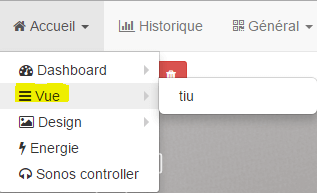
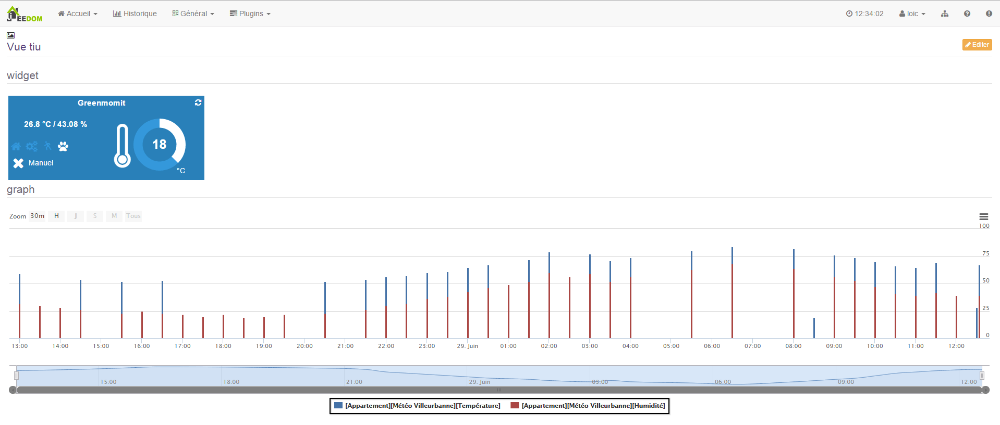

Les vues permettent simplement de créer un affichage personnalisé. Ce n’est pas aussi puissant que les designs mais cela permet en quelques minutes d’avoir un affichage plus personnalisé.

Les vues sont accessibles à partir du menu Accueil → Vue :

> **Tip**
>
> Comme vous pouvez le voir sur la capture, il est possible d’aller directement sur une vue grâce au sous-menu.

> **Tip**
>
> Vous pouvez dans votre profil choisir la vue par défaut lors du clic sur le menu des vues.

Las vistas
==========

Voilà un exemple de vue :

Comme le montre la capture sur les vues, on peut mettre aussi bien des widgets que des graphiques (qui peuvent être composés de plusieurs données).

Sur cette page, on retrouve un bouton en haut à gauche pour montrer ou masquer la liste des vues ainsi que le bouton pour en ajouter une (Jeedom vous demandera son nom et vous enverra sur la page d'édition) :

> **Tip**
>
> Vous pouvez dans votre profil modifier cette option pour que la liste des vues soit visible par défaut.

Un bouton en haut à droite vous permet d'éditer la vue courante.

Ajout/Edition d’une vue
=======================

Voici la page d’ajout/édition d’une vue :

Principe  
Le principe est assez simple : une vue est composée de zones (on peut en mettre autant que l’on veut). Chaque zone est de type graphique ou widget : en fonction du type vous pourrez mettre des widgets ou des graphiques dedans.

> **Tip**
>
> Il est possible de déplacer l’ordre des zones en les glissant/déposant.

Sur la gauche de la page on retrouve la liste des vues ainsi qu’un bouton d’ajout.

Au centre vous avez un bouton pour renommer une vue, le bouton d’ajout de zone, un bouton pour voir le résultat, un bouton pour sauvegarder (ne pas oubliez de le faire avant de cliquer sur "voir le résultat") et un bouton pour supprimer la vue.

Après avoir cliqué sur le bouton d’ajout de zone, Jeedom vous demande son nom et le type :

Zone de type widget
-------------------

Une zone de type widget permet d’ajouter des widgets, elle a 3 boutons sur la droite :

-   **Largeur** : définit la largeur de la zone (en mode desktop seulement)

-   **Ajouter/Editer widget** : permet d’ajouter/modifier des widgets à afficher dans la zone

-   **Editer** : permet de changer le nom de la zone

-   **Supprimer** : permet de supprimer la zone

> **Tip**
>
> Vous pouvez supprimer un widget directement en cliquant sur la poubelle devant celui-ci.

> **Tip**
>
> Il est possible de modifier l’ordre des widgets dans la zone en les glissant/déposant.

Une fois le bouton d’ajout/edition de widget pressé, vous obtenez :

Sur cette fenêtre vous avez juste à choisir les équipements/widgets à ajouter à la zone et à valider.

Zone de type graphique
----------------------

Une zone de type graphique permet d’ajouter des graphiques à votre vue, elle possède les options suivantes :

-   **Periode** : permet de choisir la période d’affichage des graphiques (30 min, 1 jour, 1 semaine, 1 mois, 1 année ou tout)

-   **Largeur** : définit la largeur de la zone (en mode desktop seulement)

-   **Ajouter/Editer widget** : permet d’ajouter/modifier des graphiques

-   **Editer** : permet de changer le nom de la zone

-   **Supprimer** : permet de supprimer la zone

> **Tip**
>
> Vous pouvez supprimer une donnée à grapher directement en cliquant sur la poubelle devant celui-ci.

> **Tip**
>
> Il est possible de modifier l’ordre des graphiques dans la zone en les glissant/déposant.

Une fois le bouton d’ajout/édition des graphiques pressé, vous obtenez :

Une fois ajouté vous avez accès à des options de configuration : les différentes options sont expliquées [ici](https://jeedom.com/doc/documentation/core/fr_FR/doc-core-history.html#_graphique_sur_les_vues_et_les_designs)

