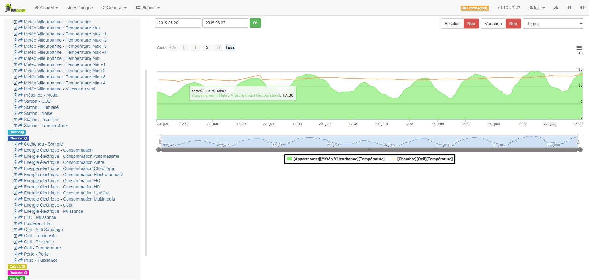
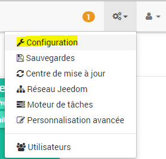
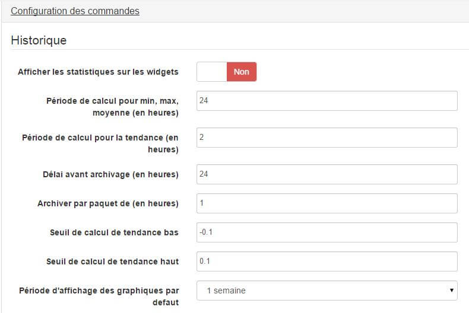
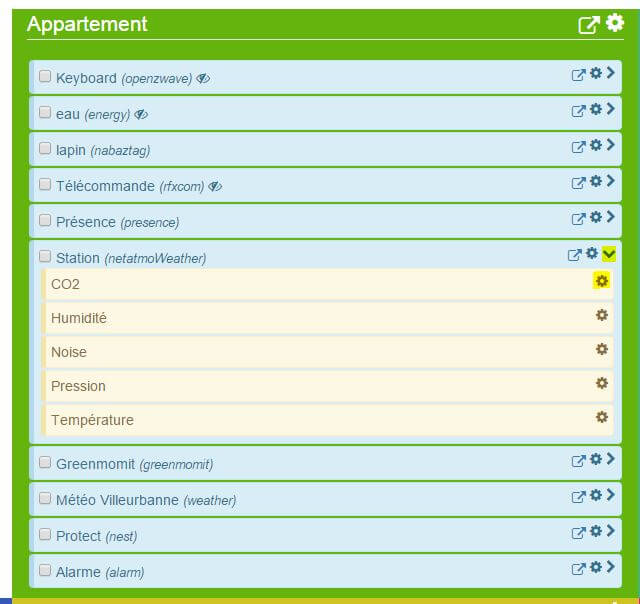
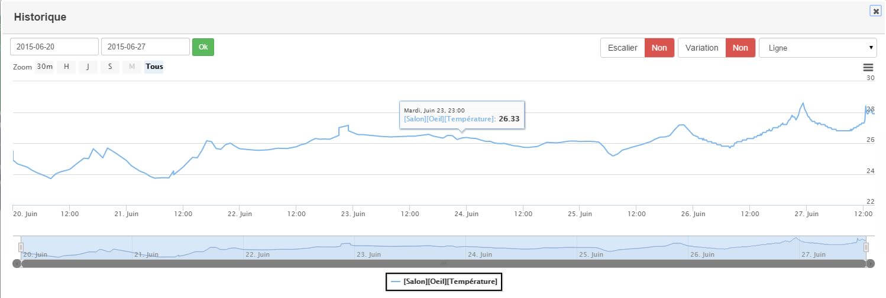
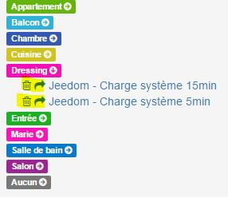

Partie importante dans un logiciel : la partie historisation, véritable mémoire de celui-ci. Il est possible dans Jeedom d’historiser n’importe quelle commande de type information (binaire ou numérique). Cela vous permettra donc par exemple d’historiser une courbe de température, de consommation ou les ouvertures d’une porte…

Principe
========

Ici est décrit le principe d’historisation de Jeedom. Il n’est nécessaire de le comprendre que si vous rencontrez des soucis d’historisation ou que vous voulez modifier les réglages de l’historisation. Les réglages par défaut conviennent dans la plupart des cas.

Méthode d’historisation
-----------------------

Un des premiers éléments est de savoir si la commande que vous historisez est de type évènement ou non :

-   **Non évènement** : c’est le cas le plus simple. Jeedom va collecter toutes les 5mn la valeur de la commande et historiser le résultat.

-   **Evènement** : Jeedom sait qu’il ne peut récupérer la valeur. Il attend donc que le plugin (et indirectement le module) la lui transmette. Ensuite, en fonction de la fréquence et de vos réglages, il se peut qu’un premier lissage intervienne. En effet, si Jeedom reçoit 2 valeurs à moins de 5mn d’intervalle, il va par défaut en faire la moyenne pour n’en stocker qu’une. Vous pouvez bien sûr changer ce réglage pour qu’au lieu de la moyenne il prenne le maximum, le minimum ou au contraire qu’il garde les deux. Nous verrons par la suite comment changer ce réglage.

Archivage
---------

L’archivage de données permet à Jeedom de réduire la quantité de données conservées en mémoire. Cela permet de ne pas utiliser trop de place et de ne pas ralentir le système. En effet, si vous conservez toute les mesures, cela fait d’autant plus de points à afficher et donc peut considérablement allonger les temps pour rendre un graphique. En cas d’un nombre trop important de points, cela peut même faire planter l’affichage du graphique.

L’archivage est une tâche qui se lance dans la nuit et compacte les données récupérées dans la journée. Par défaut Jeedom récupère toutes les données plus vieilles de 2h et en fait des paquets de 1h (soit une moyenne, un minimum ou un maximum en fonction des réglages). On a donc ici 2 paramètres, un pour la taille des paquets et un autre pour savoir à partir de quand en faire (pour rappel par défaut ce sont des paquets de 1h avec des données qui ont plus de 2h d’ancienneté).

> **Tip**
>
> Si vous avez bien suivi vous devriez avoir une haute précision sur les 2 dernières heures seulement. Pourtant quand je me connecte à 17h, j’ai une précision sur les 17 dernières heures. Pourquoi ? En fait, pour éviter de consommer des ressources inutilement, la tâche qui fait l’archivage ne se déroule qu’une fois par jour, le soir.

> **Important**
>
> Bien sûr, ce principe d’archivage ne s’applique qu’aux commandes de type numérique ; sur les commandes de type binaire, Jeedom ne conserve que les dates de changement d'état.

Tendances et statistiques
-------------------------

Il est possible d’activer sur les widgets l’affichage du minimum, de la moyenne, du maximum et de la tendance (par défaut ceci est désactivé car cela a une tendance à allonger le temps d’affichage du dashboard à cause des calculs).

Si vous activez cette option, par défaut, Jeedom se fonde sur les données des dernières 24h pour calculer ces statistiques. Les tendances sont par défaut calculées sur 2h. Ce paramètre est bien sûr modifiable (voir plus bas).

La méthode de calcul de tendance est fondée sur le calcul des moindres carrés (voir [ici](https://fr.wikipedia.org/wiki/M%C3%A9thode_des_moindres_carr%C3%A9s) pour le détail).

Configuration générale de l’historique
======================================

La configuration générale de l’historique se passe sur la page Administration → Configuration.

Nous allons voir ici les détails de la partie configuration des commandes, qui contient toute une branche concernant l’historique.

On retrouve ici :

-   **Afficher les statistiques sur les widgets** : permet d’afficher ou non les statistiques sur les widgets ; il faut que le widget soit compatible, ce qui est le cas pour la plupart ; il faut aussi que la commande soit de type numérique

-   **Période de calcul pour min, max, moyenne (en heures)** : période de calcul des statistiques (par défaut 24h), il n’est pas possible de mettre moins d’une heure

-   **Période de calcul pour la tendance (en heures)** : période de calcul des tendances (par défaut 2h), il n’est pas possible de mettre moins d’une heure

-   **Délai avant archivage (en heures)** : donne le délai avant archivage, par défaut la valeur est de 24h, c’est-à-dire que les données historisées doivent avoir plus de 24h pour être archivées (pour rappel, l’archivage va soit moyenner, soit prendre le maximum ou le minimum de la donnée sur une période qui correspond à la taille des paquets)

-   **Archiver par paquet de (en heures)** : ce paramètre donne justement la taille des paquets, par defaut 1h ; cela signifie que Jeedom va prendre des périodes de 1h, moyenner (par exemple, suivant le réglage de la commande) et stocker cette nouvelle valeur (en supprimant les valeurs moyennées).

-   **Seuil de calcul de tendance basse** : cette valeur correspond au seuil de tendance basse (Jeedom indique que la valeur est en baisse), il doit être négatif (par défaut -0.1).

-   **Seuil de calcul de tendance haut** : idem mais à la tendance haute.

-   **Période d’affichage des graphiques par defaut** : pour des questions de performance lors de l’affichage à la volée (en cliquant sur le widget ou par la page historique) Jeedom n’affiche qu’une période restreinte de l’historique (cela permet un affichage plus rapide) ; il est ici possible de régler cette valeur.

Configuration spécifique par commande
=====================================

Pour accèder à ces réglages, il faut aller dans la configuration avancée des commandes, en passant par Outils → Résumé domotique :

Puis en dépliant la liste des commandes d’un équipement (petite flèche à droite) en double-cliquant sur la commande ou en cliquant sur la petite roue :

> **Tip**
>
> Vous pouvez aussi utiliser le champ de recherche à droite en tapant le nom de la commande que vous voulez.

Vous pouvez également y accèder par la page de l'équipement en question et en cliquant sur la petite roue à droite sur la ligne de la commande (si le plugin a intégré cette option) :

A partir de là, vous devez avoir une fenêtre qui apparait, il faut cliquer sur "Configuration avancée" :

A partir de là, vous avez plusieurs possibilités de réglages. En ce qui concerne l’historique, il y a :

-   **Historiser** : permet de définir si vous voulez historiser ou non cette commande.

-   **Mode de lissage** : mode de lissage ou d’archivage permet de choisir la manière d’archiver la donnée ; par défaut c’est une moyenne ; il est aussi possible de choisir le maximum, le minimum, ou aucun ; aucun permet de dire à Jeedom qu’il ne doit pas réaliser d’archivage sur cette commande (aussi bien sur la première période des 5 mn qu’avec la tâche d’archivage). Cette option est dangereuse car Jeedom conserve tout : il va donc y avoir beaucoup plus de données conservées.

-   **Purger l’historique si plus vieux de** : cette option permet de dire à Jeedom de supprimer toutes les données plus vieilles qu’une certaine période. Peut être pratique pour ne pas conserver de données si ça n’est pas nécessaire et donc limiter la quantité d’informations enregistrées par Jeedom.

Affichage d’un graphique
========================

Il existe plusieurs moyens d’accéder à l’historique :

-   en mettant une zone graphe dans une vue (voir plus bas),

-   en cliquant sur la commande voulue dans un widget,

-   en allant dans la page historique qui permet de superposer différentes courbes et de combiner les styles (aire, courbe, barre).

Si vous affichez un graphique par la page historique ou en cliquant sur le widget, vous avez accès à plusieurs options d’affichage :

On retrouve en haut à droite la période d’affichage (ici sur la dernière semaine car, par défaut je veux que ça soit seulement une semaine - voir 2 paragraphes au-dessus), ensuite viennent les paramètres de la courbe (ces paramètres sont gardés d’un affichage à l’autre ; vous n’avez donc qu’a les configurer une fois).

-   **Escalier** : permet d’afficher la courbe sous la forme d’un escalier ou d’un affichage continu.

-   **Variation** : affiche la différence de valeur par rapport au point précédent.

-   **Ligne** : affiche le graphique sous forme de lignes.

-   **Aire** : affiche le graphique sous forme d’une aire.

-   **Colonne**\* : affiche le graphique sous forme de barres.

Voici quelques exemples :

Sur ce dernier, on remarque une plus grande précision sur les dernières données (principe de l’archivage).

Graphique sur les vues et les designs
=====================================

Vous pouvez aussi afficher les graphiques sur les vues (nous verrons ici les options de configuration et non comment faire, pour cela il faut se rendre sur la documention des vues ou des designs en fonction). Voici les options :

Une fois une donnée activée, vous pouvez choisir :

-   **Couleur** : la couleur de la courbe.

-   **Type** : le type de graphique (aire, ligne ou colonne).

-   **Echelle** : vu que vous pouvez mettre plusieurs courbes (données) sur le même graphique, il est possible de distinguer les échelles (droite ou gauche).

-   **Escalier** : permet d’afficher la courbe sous la forme d’un escalier ou d’un affichage continu

-   **Empiler** : permet d’empiler les valeurs des courbes (voir en dessous pour le résultat).

-   **Variation** : affiche la différence de valeur par rapport au point précédent.

Voici un exemple de courbes empilées :

Option sur la page d’historique
===============================

La page d’historique donne accès à quelques options supplémentaires :

> **Tip**
>
> Il suffit de cliquer sur le nom de l’objet pour le déplier ; apparaissent les commandes historisées qui peuvent être graphées.

> **Tip**
>
> La couleur d’arrière-plan des objets de cette liste peuvent être modifiées à partir de la configuration de l’objet.

Devant chaque donnée pouvant être graphée, vous retrouvez deux icônes :

-   **Poubelle** : permet de supprimer les données enregistrées ; lors du clic, Jeedom demande s’il faut supprimer les données avant une certaine date ou toutes les données.

-   **Flèche** : permet d’avoir un export CSV des données historisées.

Suppression de valeur incohérente
=================================

Parfois, il se peut que vous ayez des valeurs incohérentes sur les graphiques. Cela est souvent dû à un souci d’interprétation de la valeur. Il est possible de supprimer ou changer la valeur du point en question, en cliquant sur celui-ci directement sur le graphique ; de plus, vous pouvez régler le minimum et le maximum autorisés afin d'éviter des problèmes futurs.

