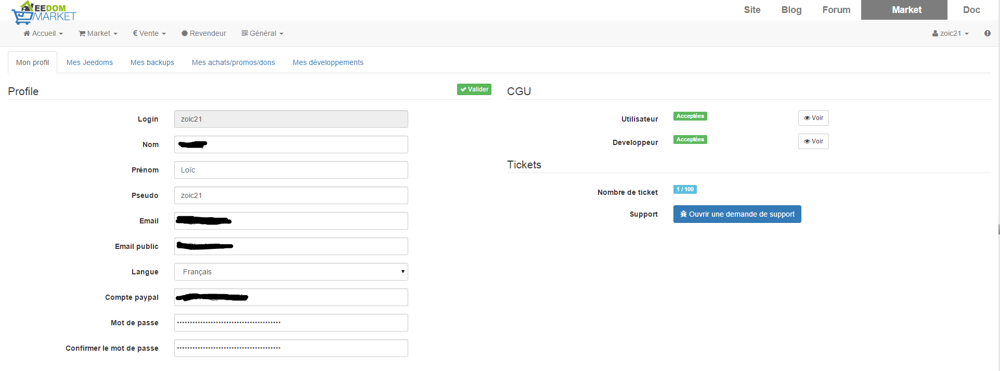

Doc un peu particulière car elle va traiter uniquement de votre page profil du market.

Disponible en allant sur votre nom d’utilisateur puis profil à partir du market (un peu comme sur Jeedom) :

Celle-ci se décompose en plusieurs parties :

Mon profil
==========

C’est ici que vous allez pouvoir régler différents paramètres de votre profil :

-   **Profil**

    -   **Login** : Votre login sur le market, il ne peut être changé

    -   **Nom** : Votre nom (cette information n’est utile que pour rendre les mails plus sympa)

    -   **Prénom** : Votre prénom (cette information n’est utile que pour rendre les mails plus sympa)

    -   **Pseudo** : Votre pseudo (uniquement pour les développeurs)

    -   **Email** : Votre mail

    -   **Email public** : Non utilisé pour le moment mais ça pourrait être un email de contact pour les développeurs si un jour on met en place ce genre de service

    -   **Langue** : Votre langue

    -   **Compte paypal** : Votre mail de compte Paypal (uniquement utilisé pour payer les developpeurs)

    -   **Mot de passe && Confirmer le mot de passe** : permet de changer votre mot passe

-   **CGU**

    -   **Utilisateur** : conditions générales d’utilisation (attention à bien les lire car elles vous engage)

    -   **Developpeur** : conditions générales d’utilisation pour les développeurs

-   **Tickets**

    -   **Nombre de tickets** : Nombre de tickets pour le mois en cours ainsi que votre limite

    -   **Support** : bouton pour envoyer une demande de support (accessible aussi par le point d’exclamation en haut à droite sur le market ou sur votre Jeedom)

> **Tip**
>
> N’oubliez pas de sauvegarder

Mes Jeedoms
===========

Ici vous pouvoir :

-   **Niveau**

    -   **Jeedom** : votre niveau de service pack

    -   **Entrer un numéro de service pack** : permet d’entrer votre numéro de service pack (il se trouve dans le mail envoyé par Jeedom lors de votre commande)

-   **Clef d’installation**

    -   **Nombre de clefs d’installation** : affiche le nombre d’installations Jeedom actuellement liées à votre compte ainsi que la limite autorisée

    -   **Clef d’installation** : vous pouvez demander ici une réinitialisation des clefs Jeedom liées à votre compte. Attention, dépassé les 2 demandes dans le mois, une vérification manuelle a lieu, la demande peut donc prendre plus de temps.

> **Tip**
>
> Il est possible que le market vous demande parfois de remettre à zéro vos clefs d’installation, c’est normal, il suffit de suivre ce qu’il vous demande \* **Mes Jeedoms** : c’est ici que sont listés tous vos Jeedom ****Nom** : le nom que vous voulez donner à votre Jeedom (se retrouve dans le nom du backup si vous avez l’abonnement de sauvegarde cloud)** **Protocole** : protocole utilisé pour se connecter à votre Jeedom (se configure à partir de Jeedom) ****IP ou adresse** : IP ou addresse de ce Jeedom, se configure dans Jeedom, si vous ne mettez rien ça sera la dernière IP connue** **Port** : port utilisé pour joindre le Jeedom (se configure a partir de Jeedom) ****URL** : liste les différentes URL d’accès au Jeedom ainsi que le port pour le SSH. Attention, si vous n’avez pas de service pack power ou plus, vous n’avez pas le service DNS Jeedom, vous aurez donc moins de valeur dans ce champ** **Accès** : vous indique si le DNS Jeedom est OK ****DNS** : permet de personnaliser votre DNS Jeedom** **Date de création** : date de création de ce Jeedom sur votre compte market (pour rappel cela se fait automatiquement lorsque vous le liez au market) ****Dernière mise à jour** : dernière communication du Jeedom avec le market** **Hardware** : Nom du hardware du Jeedom **\* \*Version** : la version de Jeedom installée

> **Tip**
>
> N’oubliez pas de sauvegarder

Mes backups
===========

Sur cette onglet vous pouvez consulter les backups présents sur le market et en télécharger un. En dessous vous avez accès au lien pour acheter 1,3,6 ou 12 mois d’abonnement à la sauvegarde cloud

Mes achats/promos/dons
======================

Ici vous retrouvez tous vos achats et vous pouvez demander le renvoi du mail de facture ou de reçu

> **Important**
>
> Si vous achetez un plugin officiel vous recevez une facture. En revanche pour un plugin tiers c’est un reçu, pour la facture il faut la demander au développeur

Vous pouvez aussi à partir de cet onglet entrer un code promo (un code pour un plugin par exemple que le développeur a pu vous transmettre) et faire un don.

Mes développments
=================

Si vous êtes développeur vous retrouvez ici la liste de toutes vos ventes sur une période, la liste de vos versements ainsi qu’un résumé du nombre de téléchargements, du nombre de ventes…

