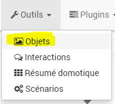

Le sous-menu Objets, permet de définir l’arborescence de sa domotique. Elle se fait en créant des objets. Accessible à partir de là :

Pour laisser libre choix à la personnalisation, vous pouvez nommer ces objets comme vous le voulez. Mais dans la plupart des cas on y définira les différentes parties de sa maison, comme le nom des pièces (c’est d’ailleurs la configuration recommandée).

En arrivant sur la page vous obtenez (ici avec déjà quelques objets) :

> **Tip**
>
> Comme à beaucoup d’endroits sur Jeedom, placer la souris tout à gauche permet de faire apparaître un menu d’accès rapide (vous pouvez, à partir de votre profil, le laisser toujours visible).

Une fois votre objet ajouté ou après un clic sur un objet existant, vous obtenez :

A partir de là vous avez différentes options :

-   **Nom de l’objet** : le nom de votre objet

-   **Père** : l’objet père de l’objet courant, cela permet de définir une hiérarchie type, le salon est le fils de l’appartement. Un objet ne peut avoir qu’un seul père mais il peut avoir autant de fils qu’il le veut.

-   **Visible** : permet de définir si cet objet est visible sur le dashboard ou non

-   **Icône** : vous permet de choisir une icône pour votre objet

-   **Couleur du tag** : permet de choisir la couleur de l’objet (cette couleur est par exemple utilisée sur la page de résumé domotique)

-   **Couleur du texte du tag** : permet de choisir la couleur du texte de l’objet (cette couleur est par exemple utilisée sur la page de résumé domotique)

Si vous mettez votre souris tout à gauche vous pourrez faire apparaître le menu suivant :

Grâce à celui-ci vous pourrez modifier l’ordre de vos objets en maintenant le clic appuyé sur la double flèche au début de la ligne et en glissant l’objet vers la position voulue.

