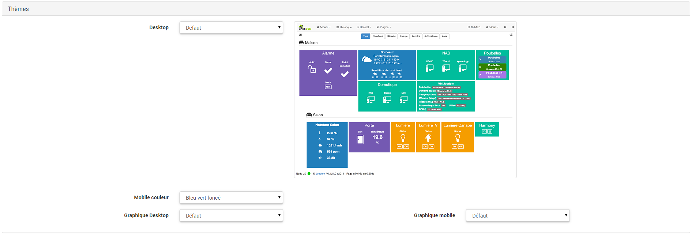

La page profils vous permet de configurer certains comportements de
Jeedom spécifiques à l’utilisateur : page d’accueil, thèmes de la
version desktop, de la version mobile, des graphiques… Elle permet aussi
de changer votre mot de passe et de passer en mode expert permettant une
configuration plus poussée de Jeedom.

Menu profils
============

Vous retrouvez en haut à droite sur chaque page de Jeedom le menu Profil
:

Vous retrouvez à coté de ce menu Profil, une information sur le nombre
de messages dans le centre de messages (ces messages sont importants
sinon Jeedom ne vous les remonterait pas), l’heure Jeedom (attention
c’est bien l’heure de Jeedom et non de votre PC), le menu Profil, une
icône indiquant la connexion (ici filaire, mais il est possible si vous
êtes en wifi d’avoir celle-ci), l’icône pour l’accès à l’aide de la page
en cours et l’icône pour faire une demande de support.

Si vous cliquez sur le menu Profil vous obtenez :

A partir de ce menu vous avez accès à la page Profil, à l’activation ou
non du mode expert, au redémarrage de Jeedom, à l’arrêt de Jeedom, au
passage en version mobile et un bouton pour se déconnecter.

> **Important**
>
> En DIY les actions de redémarrage et d’arrêt ne fonctionnent que si
> vous avez bien réalisé les actions visudo, voir
> link:https://jeedom.com/doc/documentation/installation/fr\_FR/doc-installation.html\#\_etape\_4\_définition\_des\_droits\_root\_à\_jeedom[ici]

Page Profil
===========

La page Profil ressemble à ca :

Vous retrouvez ici différents panneaux qui vous permettront de
configurer Jeedom, tous ces réglages sont uniquement liés à votre
utilisateur, il vous sont donc propres

Thèmes
------

Le panneau thèmes vous permet de régler des paramètres d’interface :

-   **Desktop** : thèmes à utiliser en mode desktop, attention seul le
    thème par défaut est officiellement supporté par Jeedom

-   **Mobile** : permet de légèrement configurer le thème mobile (ici
    tout est supporté), soit clair soit sombre, ainsi que la couleur
    dominante de celui-ci

-   **Graphique Desktop** : permet de définir le thème par défaut des
    graphiques en mode desktop

-   **Graphique Mobile** : permet de définir le thème par défaut des
    graphiques en mode mobile

Interface
---------

Vous permet de définir certains comportements de l’interface :

-   **Général**

    -   **Ne pas masquer les menus automatiquement** : indique à Jeedom
        de ne pas masquer le panneau de gauche, lorsqu’il existe, pour
        rappel ce panneau est disponible sur la plupart des pages des
        plugins, ainsi que la page des scénarios, des interactions, des
        objets….

-   **Page par défaut**

    -   **Desktop** : page par défaut à afficher lors de la connexion en
        desktop

    -   **Mobile** : page par défaut à afficher lors de la connexion en
        mobile

-   **Objet par défaut sur le dashboard** : objet à afficher par défaut
    lors de l’arrivée sur le dashboard

-   **Vue par défaut** : vue à afficher par défaut lors de l’arrivée sur
    le dashboard

-   **Design par défaut** : design à afficher par défaut lors de
    l’arrivée sur le dashboard

    -   **Plein écran** : affichage par défaut en plein écran lors de
        l’arrivée sur les designs

-   **Dashboard**

    -   **Déplier le panneau des scénarios** : permet de rendre visible
        par défaut le menu des scénarios (à droite) sur le dashboard

    -   **Déplier le panneau des objets** : permet de rendre visible par
        défaut le menu des objets (à gauche) sur le dashboard

-   **Vue**

    -   **Déplier le panneau des vues** : permet de rendre visible par
        défaut le menu des vues (à gauche) sur les vues

Notifications
-------------

Ici vous pouvez régler la couleur des notifications qui arrivent sur
l’interface

Sécurité
--------

C’est ici que vous pouvez changer votre mot de passe ainsi que la clef
de sécurité pour les appareils enregistrés (ordinateur,téléphone…). Un
changement de cette clef obligera tous les péripheriques se connectant
automatiquement avec votre compte à se réauthentifier

