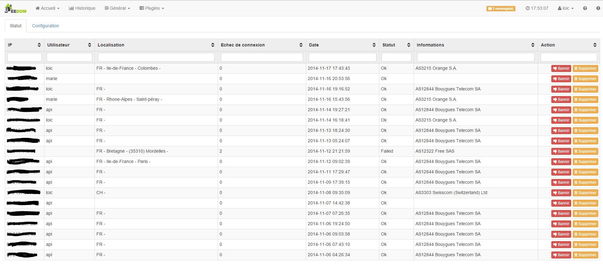
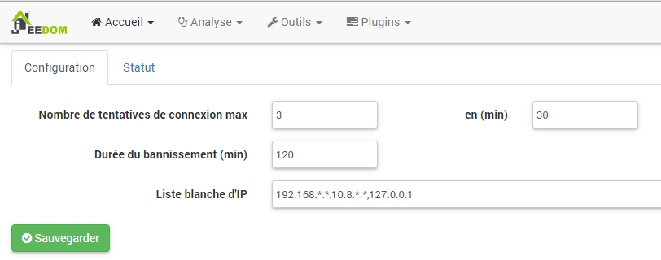

Le menu sécurité permet de configurer le système "Anti-piratage"
primaire de Jeedom. Il n’est disponible qu’en mode Expert. Il s’agit
d’un système de bannissement d’adresses IP, si l’une d’entre elles
essaie de se connecter plusieurs fois à Jeedom sans succès alors elle ne
pourra plus essayer pendant un temps prédefini.

Ce menu permet également de suivre en temps réel les personnes
connectées sur Jeedom. Cette information est disponible sur le premier
onglet "Statut". Il donnera la liste des adresses IP qui se sont
connectées ou ont essayé de se connecter à Jeedom avec certaines
informations. Des actions sont disponibles comme le bannissement des
adresses IP, ou la suppression du bannissement (bouton supprimer).

Le deuxième onglet "Configuration" propose de configurer le système de
surveillance et de bannissement automatique :

Plusieurs options sont disponibles :

-   **Activer la sécurité anti-piratage** : permet d’activer ou non le
    système de bannissement

-   **Nombre de tentatives de connexion max** : nombre maximum de
    tentatives de connexions infructueuses avant banissement par rapport
    à un temps donné (ici si plus de 3 tentatives en 30min)

-   **Durée du bannissement (min)** : la durée du bannissement

-   **Liste blanche d’IP** : Liste blanche des IPs ne pouvant être
    bannies. Par défaut, cette liste est configurée pour accepter toutes
    les connexions depuis votre réseau local (chez vous). Ainsi chez
    vous, vous ne pouvez pas être banni. Toutefois, si votre réseau
    local possède une typologie différente, il faudra paramétrer cette
    liste en fonction.

> **Tip**
>
> Pensez bien à sauvegarder les changements

