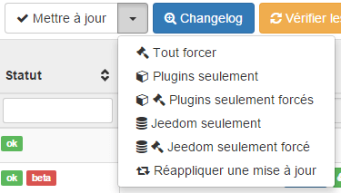
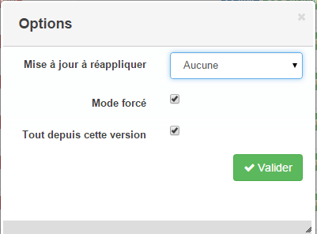

Centre de mise à jour
=====================

Le centre de mise à jour centralise l’ensemble des fonctions de Jeedom, et permet de mettre à jour toutes les fonctionnalités de Jeedom, incluant le logiciel de base, les plugins, les widgets, etc…

Il est accessible par le menu Administration → Centre de mise à jour :

Une fois dessus vous obtenez :

Il présente sous forme de tableau l’ensemble des éléments installés dans Jeedom.

> **Tip**
>
> En mode Expert, on affiche tous les élements, si non, on affiche uniquement les éléments à mettre à jour.

Il y a au total jusqu'à 5 boutons qui peuvent être disponibles par élément :

-   **Voir** : permet de consulter la page du Market correspondant à l'élément sélectionné

-   **Partager** : permet lorsque vous avez créé un élément de le partager sur le Market

-   **Supprimer** : permet de désinstaller un élément

-   **Mettre à jour** : permet de mettre à jour l'élément

> **Tip**
>
> A noter que "core:jeedom" signifie la mise à jour du logiciel de base Jeedom.

En haut du tableau se trouvent les boutons de commande. Jeedom se connecte périodiquement avec le Market pour voir si des mises à jour sont disponibles (la date de dernière vérification est indiquée tout en haut du tableau à gauche). Si vous voulez réaliser une vérification manuelle, vous pouvez appuyer sur le bouton "Vérifier les mises à jour".

Le bouton "Mettre à jour" permet de mettre à jour l’ensemble de Jeedom.

> **Tip**
>
> Sur la branche beta le numéro de version n’est pas toujours mis à jour après chaque modification, il faut donc cliquer sur "Mettre à jour" régulièrement pour être sur d’avoir la dernière version. Ce n’est le cas bien sûr que sur la branche beta.

> **Important**
>
> Avant une mise à jour, Jeedom va par défaut faire une sauvegarde. En cas de souci lors de l’application d’une mise à jour, Jeedom va automatiquement restaurer la sauvegarde faite juste avant. Ce principe n’est bien sûr valable que pour les mises à jour de Jeedom et non des plugins.

En cliquant sur la flêche à côté du bouton "Mettre à jour" on a un certain nombre d’options de mise à jour.

-   **Tout forcer** : met à jour Jeedom et les plugins en mode forcé c’est-à-dire que même s’il y a une erreur Jeedom continue et ne restaurera pas la sauvegarde

-   **Plugins seulement** : met à jour seulement les plugins

-   **Plugins seulement forcés** : met à jour seulement les plugins en mode forcé (continue en cas d’erreur)

-   **Jeedom seulement** : met à jour seulement Jeedom

-   **Jeedom seulement forcés** : met à jour seulement Jeedom en mode forcé c’est-à-dire que même s’il y a une erreur Jeedom continue et ne restaurera pas la sauvegarde

-   **Réappliquer une mise à jour** : permet de réappliquer une mise à jour. Toutes les mises à jour ne peuvent être réappliquées. En cliquant dessus vous obtenez cette fenêtre :

Ici vous choisissez d’abord la mise à jour à réappliquer, si c’est en mode forcé ou non (vivement conseillé dans ce cas là) et s’il faut aussi appliquer les mises à jour suivantes (vivement conseillé aussi).

Enfin à droite de la page, la partie "Informations" permet de suivre l'état de la mise à jour. Ces informations sont à communiquer à l'équipe en cas de problème.

Paramètres de mise à jour
=========================

Il est possible dans Administration → Configuration puis dans la partie "Market et mise à jour" de configurer certains paramètres de mise à jour :

Ici on retrouve :

-   **Adresse** : adresse du Market, à ne surtout jamais changer à moins que cela soit sur demande de l'équipe de support

-   **Nom d’utilisateur** : nom d’utilisateur du Market

-   **Mot de passe** : mot de passe du Market

-   **Installer automatiquement les widgets manquants** : indique à Jeedom d’installer automatiquement les widgets dont il a besoin (attention à bien avoir installé le plugin Widget)

-   **Voir les modules en beta (à vos risques et périls)** : Permet de voir les plugins, widgets… qui sont en beta et de les installer

-   **Faire une sauvegarde avant la mise à jour** : indique à Jeedom de faire une sauvegarde avant chaque mise à jour (vivement recommandé)

-   **Mettre à jour automatiquement** : indique à Jeedom d’installer automatiquement les mises à jour (non recommandé)

-   **Branche** : indique la version de Jeedom à utiliser soit en stable soit en développement (beta)

> **Important**
>
> Il faut éviter de mélanger les plugins beta avec un Jeedom stable et vise versa. De nombreuses erreurs sont remontées à l'équipe de support car cette règle n’est pas respectée.

> **Important**
>
> Il n’est pas possible de choisir l’heure de la vérification des mises à jour ou le moment de la mise à jour en automatique, cela pour permettre une répartition des demandes sur le Market. A noter toutefois que ces deux actions ont forcément lieu entre 6h00 et 7h59.

Mise à jour en ligne de commande
================================

Il est possible de faire une mise à jour de Jeedom directement en SSH, voici comment faire :

    sudo php /usr/share/nginx/www/jeedom/install/install.php

Voilà les paramètres possibles :

-   **mode** : force, pour lancer une mise à jour en mode forcé (ne tiens pas compte des erreurs)

-   **version** : numéro de version, pour réapliquer les changements depuis cette version

Exemple pour faire une mise à jour forcée en réappliquant les changements depuis la 1.188.0 :

    sudo php /usr/share/nginx/www/jeedom/install/install.php mode=force version=1.188.0

Attention, après une mise à jour en ligne de commande, il faut réappliquer les droits sur le dossier Jeedom :

    chown -R www-data:www-data /usr/share/nginx/www/jeedom
