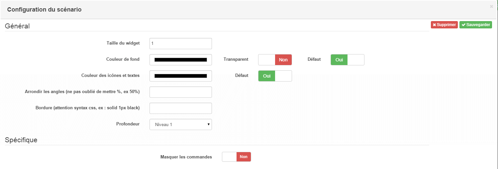
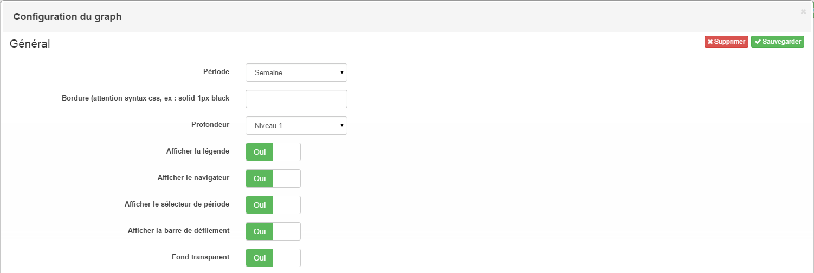

Cette page permet de configurer l’affichage de toute votre domotique de manière très fine. Celle-ci demande du temps mais sa seule limite est votre imagination.

Elle est accessible par

> **Tip**
>
> Comme vous pouvez le voir sur la capture il est possible d’aller directement sur un design grâce au sous-menu

Voici un exemple de design :

Sur cette page on retrouve, en haut (et dans l’ordre) :

-   un menu pour changer de design

-   un menu pour créer un nouveau design

-   un pour le supprimer

-   un bouton pour éditer le design en cours

-   un pour passer en mode plein écran

Il vous suffit donc pour en créer un de cliquer sur le bouton d’ajout, une fenêtre va vous demander le nom de celui-ci :

Vous arrivez donc sur un design vide :

Il faut donc cliquer le bouton d'édition pour passer en mode édition :

Comme on peut le voir il y a un peu plus de boutons maintenant, ainsi que le cadre du design (que l’on peut changer bien sûr).

En haut à gauche on retrouve 2 boutons, celui pour éditer les propriétés du design en cours et celui pour le dupliquer.

> **Tip**
>
> N’oubliez pas de sauvegarder après chaque modification

Edition des proprietés du designs
=================================

On retrouve ici :

-   **Général**

    -   **Nom** : Le nom de votre design

    -   **Icône** : Une icône pour celui-ci (apparait dans le menu de choix de design)

    -   **Disponible sur téléphone** : Rend ce design visible dans la liste des designs en version mobile

    -   **Image** : permet d’ajouter une image de fond au design

    -   **Ne pas afficher la flèche de retour lors de la mise en plein écran** : en mode plein écran cette option masque le bouton de retour au mode fenêtré (idéal pour une tablette murale)

-   **Tailles**

    -   **Taille (LxH)** : Permet de fixer la taille de votre design (cadre gris en mode édition)

    -   **Proportion tablette (ex : 0.7)** : permet de changer la proportion du design sur tablette (pour le reduire par exemple tout en maitrisant encore la taille)

    -   **Proportion téléphone (ex 0.5)** : permet de changer la proportion du design sur téléphone (pour le reduire par exemple tout en maitrisant encore la taille)

Ajout d’un widget
=================

Ensuite il faut ajouter des widgets à votre design, pour cela il faut cliquer sur le bouton d’ajout de widget :

Une fois cliqué il vous faut choisir le widget :

Vous voyez apparaître votre widget :

> **Tip**
>
> Vous pouvez le déplacer en cliquant/glissant le widget

Vous avez accès a la configuration avancée de l’affichage du widget en double cliquant sur celui-ci :

Ici on a :

-   **Général**

    -   **Taille du widget** : permet de definir un ratio de taille de widget, par exemple ici il ne fera que 65% de sa taille

    -   **Couleur de fond** : permet de changer la couleur de fond ou de le mettre transparent, ne pas oublier de passer "Défaut" sur NON

    -   **Couleur des icônes et textes** : permet de changer la couleur des icônes et des textes (attention à bien passer Défaut sur Non)

    -   **Arrondir les angles (ne pas oublier de mettre %, ex 50%)** : permet d’arrondir les angles du widget, ne pas oublier de mettre le %

    -   **Bordure (attention syntaxe css, ex : solid 1px black)** : permet d’ajouter une bordure, attention la syntaxe est HTML

    -   **Profondeur** : permet de choisir le niveau de la profondeur, pour par exemple passer un widget par dessus un autre

    -   **Ne pas afficher le nom de l'équipement** : masque le nom du widget, s’applique uniquement sur le design

-   **Spécifique** : permet de masquer certaines commandes du widget uniquement sur le design

> **Important**
>
> En fonction des plugins certaines options peuvent ne pas fonctionner

> **Tip**
>
> Vous pouvez en bas à droite redimensionner les widgets

Ajout texte/html
================

Permet d’ajouter un texte ou du code html/javascript, une fois cliqué dessus vous obtenez :

Un double clic dessus vous ammène à la fenêtre de configuration :

-   **Nom** : permet de rentrer le texte ou le code html/javascript

-   **Icone** : permet de mettre une icône à la place du texte

-   **Couleur de fond** : permet de changer la couleur de fond ou de le mettre transparent, ne pas oublier de passer "Défaut" sur NON

-   **Couleur du textes** : permet de changer la couleur des icônes et des textes (attention à bien passer Défaut sur Non)

-   **Arrondir les angles (ne pas oublier de mettre %, ex 50%)** : permet d’arrondir les angles, ne pas oublier de mettre le %

-   **Bordure (attention syntax css, ex : solid 1px black)** : permet d’ajouter une bordure, attention la syntaxe est HTML

-   **Taille de la police (ex 50%, il faut bien mettre le signe %)** : permet de modifier la taille de la police

-   **Ne pas prendre en compte la taille prédéfinie** : permet d’ignorer la taille prédéfinie du widget

-   **Profondeur** : permet de choisir le niveau de la profondeur

-   **Gras** : met le texte en gras

> **Tip**
>
> Vous pouvez en bas à droite le redimensionner

Ajout d’un scénario
===================

Un clic dessus et Jeedom vous demandera le scénario en question :

Une fois choisi celui-ci apparait sur le design :

Un double clic dessus vous amènera à la configuration de cet élément scénario :

-   **Général**

    -   **Taille du widget** : permet de definir un ratio de taille de widget, par exemple ici il ne fera que 65% de sa taille

    -   **Couleur de fond** : permet de changer la couleur de fond ou de le mettre transparent, ne pas oublier de passer "Défaut" sur NON

    -   **Couleur des icônes et textes** : permet de changer la couleur des icônes et des textes (attention à bien passer Défaut sur Non)

    -   **Arrondir les angles (ne pas oublier de mettre %, ex 50%)** : permet d’arrondir les angles du widget, ne pas oublier de mettre le %

    -   **Bordure (attention syntaxe css, ex : solid 1px black)** : permet d’ajouter une bordure, attention la syntaxe est HTML

    -   **Profondeur** : permet de choisir le niveau de la profondeur, pour par exemple passer un widget par dessus un autre

-   **Spécifique** : permet de masquer les commandes d’action sur le scénario

> **Tip**
>
> Vous pouvez en bas à droite le redimensionner

Ajout d’un lien
===============

Permet d’ajouter un lien vers une vue ou un autre design :

Celui-ci apparaît ensuite sur le design :

Un double clic dessus vous amène sur la configuration avancée :

On retrouve ici :

-   **Nom** : permet de changer le nom du lien

-   **Lien** : destination du lien

-   **Position** : permet de régler finement la position du lien sur la destination (pour par exemple arriver directement sur la cuisine)

-   **Icone** : permet de mettre une icône à la place du texte

-   **Couleur de fond** : permet de changer la couleur de fond ou de le mettre transparent, ne pas oublier de passer "Défaut" sur NON

-   **Couleur du textes** : permet de changer la couleur des icônes et des textes (attention à bien passer Défaut sur Non)

-   **Arrondir les angles (ne pas oublier de mettre %, ex 50%)** : permet d’arrondir les angles, ne pas oublier de mettre le %

-   **Bordure (attention syntax css, ex : solid 1px black)** : permet d’ajouter une bordure, attention la syntaxe est HTML

-   **Profondeur** : permet de choisir le niveau de la profondeur

-   **Taille de la police (ex 50%, il faut bien mettre le signe %)** : permet de modifier la taille de la police

-   **Ne pas prendre en compte la taille prédéfinie** : permet d’ignorer la taille prédéfinie du widget

-   **Gras** : met le texte en gras

> **Tip**
>
> Vous pouvez en bas à droite le redimensionner

Ajout d’un graph
================

Une fois cliqué dessus vous obtenez :

Un double clic dessus vous amène à la configuration de l'élement graph

Ici on retrouve :

-   **Période** : permet de choisir la période d’affichage

-   **Bordure (attention syntaxe css, ex : solid 1px black)** : permet d’ajouter une bordure, attention la syntaxe est HTML

-   **Profondeur** : permet de choisir le niveau de la profondeur

-   **Afficher la légende** : permet d’afficher ou non la légende

-   **Afficher le navigateur** : permet d’afficher ou non le navigateur (deuxième graph plus léger en dessous du premier)

-   **Afficher le sélecteur de période** : affiche ou non le sélecteur de période en haut à gauche

-   **Afficher la barre de défilement** : affiche ou non la barre de défilement

-   **Fond transparent** : rend le fond transparent

Pour choisir les données à afficher il faut cliquer sur les 3 roues crantées :

Vous obtenez (ça peut être un peu long à charger) :

-   **Activer** : le premier bouton permet d’activer ou non l’affichage de la donnée sur le graphique

-   **Couleur** : la couleur de la courbe

-   **Type** : le type de graph (aire, ligne ou colonne)

-   **Escalier** : permet d’afficher la courbe sous la forme d’un escalier au d’un affichage continue

-   **Empiler** : permet d’empiler les valeurs des courbes (voir en dessous pour le résultat)

-   **Variation** : affiche la différence de valeur par rapport au point précédent

-   **Echelle** : vu que vous pouvez mettre plusieurs courbes (données) sur le même graphe il est possible de distinguer les échelles (droite ou gauche)

> **Tip**
>
> Vous pouvez en bas à droite le redimensionner

